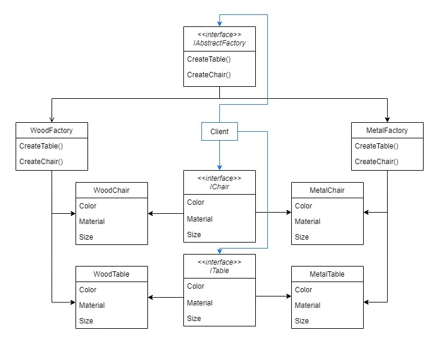

# Abstract Factory

The Abstract Factory Pattern is a creational design pattern that provides a interface to encapsulate the creation of related objects  families without specifying their concrete classes.

## Problem

Suppose a home and kitchen utilities store. The store catalog is composed by differents products manufactured from differents materials. For a simple example, consider the catalog contains two products, tables and chairs, made from two materials, wood and metal.

Let's exemplify the Abstract Factory pattern.

- List all products families and all products they must contain
Families: Wood Products & Metal Products
Products: Chairs & Tables

 -  Matrix of products and families

|       			| Wood      		| Metal      	|
|-------			|-----------		|------------	|
| **Chair** 	| WoodChair 	| MetalChair 	|
| **Table** 	| WoodTable 	| MetalTable 	|

 - Make a diagram with abstract and concretes factories and products




## Show me the code

- The **Abstract Product** is an interface or an abstract class that contains the properties and behaviours of the concrete products.

```
public abstract class Chair
{
    public Color Color { get; set; }
    public ProductSize Size { get; set; }
    public ProductMaterial Material { get; set; }
}
```
```
public abstract class Table
{
    public Color Color { get; set; }
    public ProductSize Size { get; set; }
    public ProductMaterial Material { get; set; }
}
```

- **Concrete products** classes must implement or derive from the abstract products.

```
public class WoodChair : Chair
{
    public WoodChair(Color color, ProductSize size)
    {
        Color = color;
        Size = size;
        Material = ProductMaterial.Wood;
    }
}

public class MetalChair : Chair
{
    public MetalChair(Color color, ProductSize size)
    {
        Color = color;
        Size = size;
        Material = ProductMaterial.Metal;
    }
}
```
```
public class WoodTable : Table
{
    public WoodTable(Color color, ProductSize size)
    {
        Color = color;
        Size = size;
        Material = ProductMaterial.Wood;
    }
}

public class MetalTable : Table
{
    public MetalTable(Color color, ProductSize size)
    {
        Color = color;
        Size = size;
        Material = ProductMaterial.Metal;
    }
}
```

- The **Abstract Factory** is an interface or abstract class that contains de methods signatures needed to create the products

```
public interface IHomeAndKitchenFactory
{
    Chair CreateChair(Color color, ProductSize size);
    Table CreateTable(Color color, ProductSize size);
}
```

- For each product family there is a **Concrete Factory** that implements or override the Abstract Factory methods with the products creation instructions.

```
public class WoodFactory : IHomeAndKitchenFactory
{
    public Chair CreateChair(Color color, ProductSize size)
    {
        return new WoodChair(color, size);
    }

    public Table CreateTable(Color color, ProductSize size)
    {
        return new WoodTable(color, size);
    }
}
```
```
public class MetalFactory : IHomeAndKitchenFactory
{
    public Chair CreateChair(Color color, ProductSize size)
    {
        return new MetalChair(color, size);
    }

    public Table CreateTable(Color color, ProductSize size)
    {
        return new MetalTable(color, size);
    }
}
```

- At the client side, the application chooses products family according to the configuration or system environment. So, it initializes the concrete factory of this family.

```
static void Main(string[] args)
{
    Console.WriteLine("Abstract Factory");
    Console.WriteLine("Home and Kitchen Example");

    var metalFactory = new MetalFactory();
    var woodFactory = new WoodFactory();

    Console.WriteLine("\nBlue, small and wood chair:");
    CreateChair(woodFactory, Color.Blue, ProductSize.Small);
    Console.WriteLine("\nBlack, medium and wood table:");
    CreateTable(woodFactory, Color.Black, ProductSize.Medium);

    Console.WriteLine("\nRed, small and metal chair:");
    CreateChair(metalFactory, Color.Red, ProductSize.Small);
    Console.WriteLine("\nWhite, large and metal table:");
    CreateTable(metalFactory, Color.White, ProductSize.Large);
}

private static void CreateChair(IHomeAndKitchenFactory factory, Color color, ProductSize size)
{
    var chair = factory.CreateChair(color, size);
    PrintProductDetails(chair.Color, chair.Material, chair.Size);
}

private static void CreateTable(IHomeAndKitchenFactory factory, Color color, ProductSize size)
{
    var table = factory.CreateTable(color, size);
    PrintProductDetails(table.Color, table.Material, table.Size);
}

private static void PrintProductDetails(Color color, ProductMaterial material, ProductSize size)
{
    Console.WriteLine($"Color: {color.Name} - Size: {size} - Material: {material}");
}
```

## Use cases

Use an Abstract Factory when:

You can have multiple product families creation.
The application should use only one of these families at a given time.
Products from differents families should not be used together and should be unrelated.
Factory implementation details are not relevant for the factories client.

## Advantages

The Abstract Factory encapsultes details of product creation and clients deal only with abstractions.
Avoids coupling between concrete products creation and client code.
Open/Closed Principle: new product families can be introduced by adding a new Concrete Factory that implements or derives from the Abstract Factory.
Single Responsibility Principle: each Concrete Product creation is extracted to a single place, the Concrete Factory. Any necessary change would be performed at this place.

## Disadvantages

Product creation methods parameters must be the same for all the families. The method `WoodFactory.CreateChair` must have the same parameters as `MetalFactory.CreateChair`.
A large number of concrete products would result in complexity when adding a new product family.
New products requires all factories, including the abstract, to have a new method for their creation.

## Tips
If our application requires a single instance of a ConcreteFactory, we should implement it as Singleton, in order to reuse the same instance.

## References

https://medium.com/@hitherejoe/design-patterns-abstract-factory-39a22985bdbf

https://refactoring.guru/design-patterns/abstract-factory

Pluralsight Course: *Tactical Design Patterns in .NET: Creating Objects*. By Zoran Horvat.

## TODOs

Topic "Relations with Other Patterns" from https://refactoring.guru/design-patterns/abstract-factory

Last tip from https://medium.com/@hitherejoe/design-patterns-abstract-factory-39a22985bdbf talks about prototype pattern