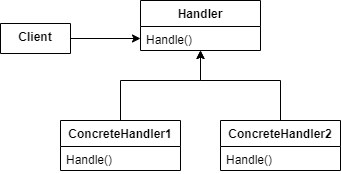
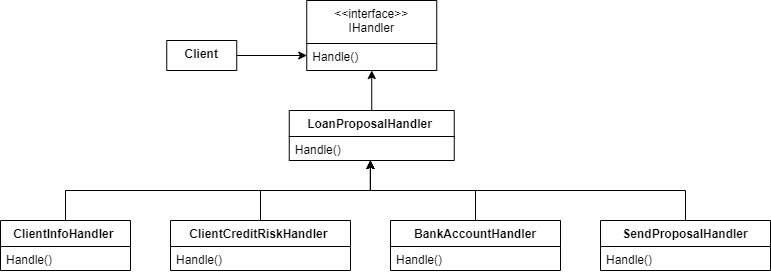

# Chain Of Responsibility

Avoid coupling the sender of a request to its receiver by giving more than one object a chance to handle the request. Chain the receiving objects and pass the request along the chain until an object handles it.



## Problem

Suppose a financial institution needs to send a loan contract proposal to its client. The steps to create this proposal are:
- Fill all the client personal information.
- Gets the loan rate defined by the client credit risk, that is informed by a third-party service.
- Verify if the client bank account balance satisfies loans threashold.
- Send a file with the created proposal.

So, these steps can be implemented satisfying their sequencial order using a chain of resposibility as presented by the below diagram.



## Show me the code

- First of all, let's implement all necessaries entities for these flows.

```csharp
public class Client
{
    public Guid Id { get; set; }
    public string Name { get; set; }
    public Document Document { get; set; }
    public string Address { get; set; }
    public string Phone { get; set; }
    public CreditRisk CreditRisk { get; set; }

    public Client(Guid id, string name, Document document, string address, string phone, CreditRisk creditRisk)
    {
        Id = id;
        Name = name;
        Document = document;
        Address = address;
        Phone = phone;
        CreditRisk = creditRisk;
    }
}
```
```csharp
public enum CreditRisk
{
    A,
    B,
    C,
    D
}
```
```csharp
public class Document
{
    public DocumentType Type { get; set; }
    public string Value { get; set; }

    public Document(DocumentType type, string value)
    {
        Type = type;
        Value = value;
    }
}

public enum DocumentType
{
    CPF = 1,
    CNPJ = 2
}
```
```csharp
public class BankAccount
{
    public Guid ClientId { get; set; }
    public int BankIdentifier { get; set; }
    public string Account { get; set; }
    public string Agency { get; set; }
    public decimal Balance { get; set; }

    public BankAccount(Guid clientId, int bankIdentifier, string account, string agency, decimal balance)
    {
        ClientId = clientId;
        BankIdentifier = bankIdentifier;
        Account = account;
        Agency = agency;
        Balance = balance;
    }
}
```
```csharp
public class LoanProposal
{
    public Guid ClientId { get; set; }
    public Client ClientPersonalInfo { get; set; }
    public decimal Amount { get; set; }
    public decimal Rate { get; set; }

    public LoanProposal(Guid clientId, decimal amount)
    {
        ClientId = clientId;
        Amount = amount;
    }

    public override string ToString()
    {
        var serializedLoanProposal = JsonConvert.SerializeObject(this, new StringEnumConverter());

        var loanProposalAsJToken = JToken.Parse(serializedLoanProposal);

        return loanProposalAsJToken.ToString(Formatting.Indented);
    }
}
```

Remember we told you about getting client personal information and getting its bank account balance? This information will be stored at a simplified ClientRepository and a BankAccountRepository, which both implement IRepository interface.

```csharp
public interface IRepository<T>
{
    IEnumerable<T> Find(Func<T, bool> filter);
}
```
```csharp
public class ClientRepository : IRepository<Client>
{
    private static IQueryable<Client> _clients = GetClients();

    public IEnumerable<Client> Find(Func<Client, bool> filter)
    {
        return _clients.Where(filter);
    }

    private static IQueryable<Client> GetClients() => 
        new List<Client> 
        {
            new Client(
                new Guid("406acba3-4b4c-4879-b13c-1a019f0c27f1"),
                "My First Client Name",
                new Document(DocumentType.CPF, "123456789-00"),
                "Street Name, 123.",
                "+55 11 91234-5678",
                CreditRisk.B),
            new Client(
                new Guid("123acba3-5b6c-4879-b13c-1a019f0c27a4"),
                "My Second Client Name",
                new Document(DocumentType.CPF, "987654321-00"),
                "Street Name, 456.",
                "+55 11 98765-4321",
                CreditRisk.D)
        }
        .AsQueryable();
}
```
```csharp
public class BankAccountRepository : IRepository<BankAccount>
{
    private static IQueryable<BankAccount> _bankAccounts = GetBankAccounts();

    public IEnumerable<BankAccount> Find(Func<BankAccount, bool> filter)
    {
        return _bankAccounts.Where(filter);
    }

    private static IQueryable<BankAccount> GetBankAccounts() =>
        new List<BankAccount>
        {
            new BankAccount(
                new Guid("406acba3-4b4c-4879-b13c-1a019f0c27f1"),
                001,
                "0000-1",
                "0001",
                1000),
            new BankAccount(
                new Guid("123acba3-5b6c-4879-b13c-1a019f0c27a4"),
                002,
                "0000-2",
                "0002",
                500)
        }
        .AsQueryable();
}
```

Now, we start implementing the Chain of Responsibility pattern. We will create a chain, that has multiple nodes. Each node knows the next node of the chain, similar to a linked list structure. A node is called handler and has a Handle method that contains the instructions to handle a request.

When the chain receives a request the first handler will handler it. So, unless it brakes the chain, the request is passed to the next handler and so on.

An ```IHandler<T>``` interface defines Handle and the method SetNext method that is the one who allows appending a sucessor for the current handler.

```csharp
public interface IHandler<T>
{
    T Handle(T request);
    IHandler<T> SetNext(IHandler<T> handler);
}
```

The LoanProposalHandler will be an abstraction and each node of the chain will inherit from this. As SetNext method has the same behavior for all handler, it'll not be necessary to override it.

```csharp
public abstract class LoanProposalHandler : IHandler<LoanProposal> 
{
    private IHandler<LoanProposal> _next;

    public virtual LoanProposal Handle(LoanProposal request)
    {
        if (_next != null)
            return _next.Handle(request);
        
        return request;
    }

    public IHandler<LoanProposal> SetNext(IHandler<LoanProposal> handler)
    {
        _next = handler;
        return _next;
    }
}
```

The next code snippets will show you how each handler process the request. Each one has a single responsibility and all together ensures a proposal creation.

Given a client id defined at the LoanProposal request, the ClientInfoHandler search for client personal information at the ClientRepository and set it to the loan proposal.

The last instruction ```base.Handle(request)``` will call the next handler.

```csharp
public class ClientInfoHandler : LoanProposalHandler
{
    public override LoanProposal Handle(LoanProposal request)
    {
        Console.WriteLine("\nGetting client personal information.");
        var clientId = request.ClientId;

        var repo = new ClientRepository();
        
        var clientPersonalInfo = repo.Find(x => x.Id == clientId).FirstOrDefault();

        request.ClientPersonalInfo = clientPersonalInfo;

        return base.Handle(request);
    }
}
```

Then, ClientCreditRiskHandler will define the loan rate based on the client credit risk, that is defined by a third-party service.

```csharp
public class ClientCreditRiskHandler : LoanProposalHandler
{
    private static Dictionary<CreditRisk, decimal> _loanRates = GetLoanRates();

    public override LoanProposal Handle(LoanProposal request)
    {
        Console.WriteLine("\nGetting credit risk rate.");

        var creditRisk = request.ClientPersonalInfo.CreditRisk;

        var foundCreditRisk = _loanRates.TryGetValue(creditRisk, out var rate);

        if (!foundCreditRisk)
            throw new Exception($"No loan rate found to credit risk {creditRisk.ToString()}");

        request.Rate = rate;

        return base.Handle(request);
    }

    private static Dictionary<CreditRisk, decimal> GetLoanRates()
    {
        return new Dictionary<CreditRisk, decimal>
        {
            { CreditRisk.A, 0.8m},
            { CreditRisk.B, 1.5m},
            { CreditRisk.C, 3.0m},
            { CreditRisk.D, 5.0m},
        };
    }
}
```

The last validation checks the client bank account balance and assert that it's sufficient to satisfy the threashold. We defined a random threashold to simplify the example.

```csharp
public class BankAccountHandler : LoanProposalHandler
{
    public override LoanProposal Handle(LoanProposal request)
    {
        Console.WriteLine("\nValidating bank account balance.");

        var clientId = request;

        var repo = new BankAccountRepository();

        var bankAccount = repo.Find(x => x.ClientId == request.ClientId).FirstOrDefault();

        if (bankAccount.Balance < request.Amount * 0.5m)
            throw new Exception($"The client bank account must have at least 50% of the required loan amount.");

        return base.Handle(request);
    }
}
```

Finally, we finalize the proposal and send it. Let's suppose that the receiver waits for a file stored in a specified directory. 

This handler receives the loan proposal and write it to a file and save it. 

The last instruction would call the ```base.Handle(request)``` if exists, but we'll not append any handler after this node, so the chain has come to its end.

```csharp
public class SendProposalHandler : LoanProposalHandler
{
    public override LoanProposal Handle(LoanProposal request)
    {
        Console.WriteLine("\nCreating loan proposal file.\n");

        var filePath = CreatesFilePath();

        using (StreamWriter outputFile = new StreamWriter(filePath, false))
        {
            var serializedRequest = JsonConvert.SerializeObject(request, new StringEnumConverter());
            outputFile.Write(serializedRequest);
        }
        
        return base.Handle(request);
    }

    private string CreatesFilePath()
    {
        var currentDirectiory = Environment.CurrentDirectory;
        var fileDirectory = Path.Combine(currentDirectiory, "Files");
        Directory.CreateDirectory(fileDirectory);

        var today = DateTime.UtcNow.ToString("yyyyMMddHHmmss");
        var fileName = $"{today}Proposal.txt";
        return Path.Combine(fileDirectory, fileName);

    }
}
```

## Disposable Handlers

The limitation of the previous example is that if you want to remove a handler, you'll need to manually reconfigure the _next value of the previous node. The next example will show you a chain based on events that automatically dispose some of its nodes.

Consider a fashion shop that sells the three items: shirt, jeans and sunglasses. At the price of each item can be applied accumulative discounts. The discounts application will be performed in a chain which nodes represents each discount.

Discounts are applied by DiscountApplier.

```csharp
public class DiscountApplier
{
    public event EventHandler<DiscountEventArgs> DiscountsEvent;

    public void Apply(object sender, DiscountEventArgs discount) => DiscountsEvent?.Invoke(sender, discount);
}
```
```csharp
public class DiscountEventArgs
{
    public ItemNames _itemName;
    public decimal _finalPrice;

    public DiscountEventArgs(ItemNames itemName, decimal finalPrice)
    {
        _itemName = itemName;
        _finalPrice = finalPrice;
    }
}
```
The below Discount class is an abstraction inherited by the nodes of the chain.

When the discount applier raises an discount event, every class that derives from Discount will execute OnDiscountEvent method. This method applies the discount rate at _finalPrice field from DiscountEventArgs. 

So, the event handling will result in consecutives discounts and, after all nodes handle the event, the final price will be available at DiscountEventArgs.

```csharp
public abstract class Discount
{
    private readonly DiscountApplier _discountApplier;
    protected decimal _rate = 0.1m;

    public Discount(DiscountApplier discountApplier)
    {
        _discountApplier = discountApplier;
    }

    public void Add()
    {
        _discountApplier.DiscountsEvent += OnDiscountEvent;
    }

    public virtual void OnDiscountEvent(object sender, DiscountEventArgs discountEventArgs)
    {
        discountEventArgs._finalPrice *= (1 - _rate);
    }

    protected void OnDiscountExpiration(object sender, ElapsedEventArgs e)
    {
        _discountApplier.DiscountsEvent -= OnDiscountEvent;
    }
}
```

The next code snippet show us the abstraction of items that will have their price discounted. When we get the item price, it creates an DiscountEventArgs with its initial price and send it to discount applier raise the event and apply all discounts. Then, final price from the DiscountEventArgs object will be returned.

```csharp
public abstract class Item
{
    private DiscountApplier _discountApplier;
    protected decimal _price;
    public ItemNames _name;

    public Item(DiscountApplier discountApplier)
    {
        _discountApplier = discountApplier;
    }

    public decimal Price
    {
        get
        {
            var discount = new DiscountEventArgs(_name, _price);
            _discountApplier.Apply(this, discount);
            return discount._finalPrice;
        }
    }
}
```

Now, we have prepared our chain that handles all discounts. So let's create some implementations.

As introduced before, we'll have three items.

```csharp
public enum ItemNames { Shirt, Jeans, Sunglasses }

public class Shirt : Item
{
    public Shirt(DiscountApplier discountApplier, decimal price) : base(discountApplier)
    {
        _price = price;
        _name = ItemNames.Shirt;
    }
}

public class Jeans : Item
{
    public Jeans(DiscountApplier discountApplier, decimal price) : base(discountApplier)
    {
        _price = price;
        _name = ItemNames.Jeans;
    }
}

public class Sunglasses : Item
{
    public Sunglasses(DiscountApplier discountApplier, decimal price) : base(discountApplier)
    {
        _price = price;
        _name = ItemNames.Sunglasses;
    }
}
```

We'll also have three types of discount. 
- A first purchase discount of 20%. 
- A discount of 50% with expiration time in one day.
- A flash sale discount of 5%.

```csharp 
public class FirstPurchaseDiscount : Discount
{
    public FirstPurchaseDiscount(DiscountApplier discountApplier) : base(discountApplier)
    {
        _rate = 0.20m;
    }
}
```
```csharp
public class DailySale : Discount
{
    private readonly Timer _timer;

    public DailySale(DiscountApplier discountApplier) : base(discountApplier)
    {
        _rate = 0.50m;

        _timer = new Timer(15000);      // Ten seconds just to visualize the funcionallity.
        _timer.Elapsed += OnDiscountExpiration;
        _timer.Start();
    }
} 
```
```csharp
public class FlashSale : Discount
{
    private readonly Timer _timer;

    public FlashSale(DiscountApplier discountApplier, int expirationInMilliseconds) : base(discountApplier)
    {
        _rate = 0.05m;
        _timer = new Timer(expirationInMilliseconds);
        _timer.Elapsed += OnDiscountExpiration;
        _timer.Start();
    }
}
```

So, let's simulate a scenario where we accumulate all discounts. 
Shortly after, the flash sale discounts expires. 
Then, some time after, the discount of one day expires.
So, the only remaining discount is first purchased discount.

```csharp
static void Main(string[] args)
{
    var discountApplier = new DiscountApplier();
    AddDiscounts(discountApplier);

    var shirt = new Shirt(discountApplier, 10m);
    var jeans = new Jeans(discountApplier, 30m);
    var sunglasses = new Sunglasses(discountApplier, 35m);

    PrintPrice();

    void PrintPrice()
    {
        var sw = new Stopwatch();
        sw.Start();

        while (sw.ElapsedMilliseconds < 20000)
        {
            Console.SetCursorPosition(0, 3);
            Console.WriteLine($"\r{shirt._name} price: $ {shirt.Price}  ");
            Console.WriteLine($"\r{jeans._name} price: $ {jeans.Price}  ");
            Console.WriteLine($"\r{sunglasses._name} price: $ {sunglasses.Price}  ");

            Thread.Sleep(500);
        }
        sw.Stop();
    }
}

private static void AddDiscounts(DiscountApplier discountApplier)
{
    var firstPurchaseDiscount = new FirstPurchaseDiscount(discountApplier);
    firstPurchaseDiscount.Add();

    var flashSale = new FlashSale(discountApplier, 5000);
    flashSale.Add();

    var dailySale = new DailySale(discountApplier);
    dailySale.Add();
}
```

## Use cases

Use a Chain of Responsibilities when:

- More than one object must handle a request.
- The application does not know a priori which object will handle the request.
- The order of handlers execution is relevant.
- The request does not have to know which objects will handle.

## Advantages

- It's easy to add a know handler to the chain and can be done at runtime.
- It allows specifying the handlers execution order and it can be done at runtime.
- If well designed it satisfies Single Responsibility Principle.

## Disadvantages

- This pattern does not ensure that a request will be handled. It can arrive at the end of the chain without being handled (sometimes it's a desired behavior).

## References

https://refactoring.guru/design-patterns/chain-of-responsibility

Pluralsight Course: *Design Patterns in Java: Behavioral - Chain of Responsibility Pattern*. By Bryan Hansen.

Pluralsight Course: *Design Patterns On-Ramp - Patterns You Already Use: Chain of Responsibility and Facade*. By Jeremy Clark.

Pluralsight Course: *C# Design Patterns: Chain of Responsibility*. By Filip Ekberg.

Udemy Course: *Design Patterns in C# and .NET - Chain of Responsibility*. By Dmitri Nesteruk.