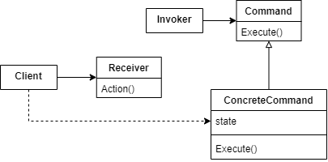
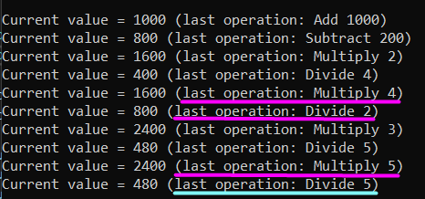

# Command

Encapsulate a request as an object, thereby letting you parameterize clients with different requests, queue or log requests, and support undoable operations.

## Problem

The Command Pattern is very useful when you want to queue a request and keep track of the operations, what makes possible to undo and redo them.

This pattern is structured with four participants: the command (abstraction), concrete command, invoker and the receiver.



- The invoker receives a command instance and stores it. It's responsible for triggering the command execution. 
- The concrete command contains all the necessary parameters related to the request and stores a reference to the respective receiver. It implements the Command Execute method, that defines how the request will be sent to the receiver. 
- The receiver gets the requests and handle it.
- The Client creates and configures commands and relate it with a receiver. Then, it passes the command to a invoker.

The next example shows how a calculator can be implemented using the Command Pattern to execute its math operations and allow undo/redo them. 

## Show me the code

In this example, a calculator instance is the receiver of the commands, because it handles the math operations requested by the client. It is very simple and performs only addition, subtraction, multiplication and division operations.

```csharp
public enum MathOperation
{
    Add,
    Subtract,
    Multiply,
    Divide
}
```
```csharp
public class Calculator
{
    private double _cachedValue = 0;

    public void Operation(MathOperation operation, double value)
    {
        var foundOperation = MathOperations.TryGetValue(operation, out var operationFunc);

        if (foundOperation)
        {
            _cachedValue = operationFunc(_cachedValue, value);
            Console.WriteLine($"Current value = {_cachedValue} (last operation: {operation} {value})");
        }
    }

    public static ReadOnlyDictionaryOfOperations MathOperations =
        new ReadOnlyDictionaryOfOperations(
            new DictionaryOfOperations
            {
                { Add, (first, second) => first + second },
                { Subtract, (first, second) => first - second},
                { Multiply, (first, second) =>  first * second },
                { Divide, (first, second) =>  first / second}
            });
}
```

The calculator will handler a request that is sent by a CalculatorOperation command. This is the concrete command that stores a reference to the Calculator instance. It also overrides the Execute and Undo methods declared by the Command abstraction.

```csharp
public abstract class Command
{
    public abstract void Execute();
    public abstract void Undo();
}
```
```csharp
public class CalculatorOperation : Command
{
    private MathOperation _operation;
    private double _operand;
    private Calculator _calculator;

    public CalculatorOperation(Calculator calculator, MathOperation operation, double operand)
    {
        _calculator = calculator;
        _operation = operation;
        _operand = operand;
    }

    public override void Execute()
    {
        _calculator.Operation(_operation, _operand);
    }

    public override void Undo()
    {
        var oppositeOperation = OppositeOperations[_operation];

        _calculator.Operation(oppositeOperation, _operand);
    }

    private static ReadOnlyDictionary<MathOperation, MathOperation> OppositeOperations =
        new ReadOnlyDictionary<MathOperation, MathOperation>(
            new Dictionary<MathOperation, MathOperation>
            {
                { Add, Subtract },
                { Subtract, Add },
                { Multiply, Divide },
                { Divide, Multiply },
            });
}
```

So now we know how a command requests a operation to the calculator. The next class represents the invoker that triggers the command execution, the CalculatorManager. It stores all commands received from the client at a private field called _calculatorHistory.

```csharp
public class CalculatorManager
{
    private readonly List<Command> _calculatorHistory = new List<Command>();
    private int _current = 0;

    public void Execute(Command operationCommand)
    {
        operationCommand.Execute();

        _calculatorHistory.RemoveFrom(_current - 1);
        _calculatorHistory.Add(operationCommand);
        _current++;
    }

    public void Undo()
    {
        if (_current > 0)
        {
            var lastCommand = _calculatorHistory[_current - 1];
            lastCommand.Undo();
            _current--;
        }
    }

    public void Redo()
    {
        if (_current < _calculatorHistory.Count)
        {
            var nextCommand = _calculatorHistory[_current];
            nextCommand.Execute();
            _current++;
        }
    }
}
```

The undo method calls the previous executed command and moves the _current cursor one position back. The redo performs the opposite, it calls the following executed command and moves the _current cursor one position forward.
The Execute method invokes the received command execution. After that, it clears all following commands and adds the current one to cache, moving the _current cursor forward.

Now we can simulate a client interation and show the calculator output.

```csharp
var calculator = new Calculator();
var calculatorManager = new CalculatorManager();

calculatorManager.Execute(new CalculatorOperation(calculator, Add, 1000));
calculatorManager.Execute(new CalculatorOperation(calculator, Subtract, 200));
calculatorManager.Execute(new CalculatorOperation(calculator, Multiply, 2));
calculatorManager.Execute(new CalculatorOperation(calculator, Divide, 4));

calculatorManager.Undo();
calculatorManager.Undo();
calculatorManager.Execute(new CalculatorOperation(calculator, Multiply, 3));
calculatorManager.Execute(new CalculatorOperation(calculator, Divide, 5));
calculatorManager.Undo();
calculatorManager.Redo();
```

Output:

The pink lines highlight the undo operations and blue the redo operations.



## Real World Example

Let's see another example that can be implemented in a real world problem.

Suppose you have a bank account in which can be executed two operations, deposit and withdraw. Both operations can be cancel any time after their execution.

The Bank Account will be designed as the Command Pattern receiver. The methods have simple instructions, but they could be more complex in a real world implementation.

```csharp
public class BankAccount
{
    public double Balance { get; private set; }

    public void Deposit(double volume) => Balance += volume;

    public bool Withdrawl(double volume)
    {
        if (Balance < volume)
            return false;

        Balance -= volume;
        return true;
    }

    public void CancelDeposit(double volume) => Balance -= volume;

    public void CancelWithdrawl(double volume) => Balance += volume;
}
```

To perform any of these operations, the client must create a command, called Transaction. This command specifies the transaction receiver (bank account instance), the transaction category, the volume to be transacted and the transaction identifier.

```csharp
public class BasicTransaction : Transaction
{
    public BasicTransaction(BankAccount bankAccount, Transactions transactions, double volume, Guid identifier) 
        : base(bankAccount, transactions, volume, identifier)
    {
    }
}
```
```csharp
public abstract class Transaction
{
    private readonly BankAccount _bankAccount;
    private readonly Transactions _transaction;
    private readonly double _volume;
    public readonly Guid _identifier;
    public bool _isExecuted;

    public Transaction(BankAccount bankAccount, Transactions transaction, double volume, Guid identifier)
    {
        _bankAccount = bankAccount;
        _transaction = transaction;
        _volume = volume;
        _identifier = identifier;
    }

    public void Execute() 
    {
        if (_transaction == Transactions.Withdrawal)
            _isExecuted = _bankAccount.Withdrawl(_volume);

        if (_transaction == Transactions.Deposit)
        {
            _bankAccount.Deposit(_volume);
            _isExecuted = true;
        }

        if (_isExecuted == true)
        {
            Console.WriteLine($"Processed Transaction: {_transaction} $ {_volume} ({_identifier})");
            Console.WriteLine($"New Balance: $ {_bankAccount.Balance}\n");
        }
    }

    public void Cancel()
    {
        if (_transaction == Transactions.Withdrawal)
            _bankAccount.CancelWithdrawl(_volume);

        if (_transaction == Transactions.Deposit)
            _bankAccount.CancelDeposit(_volume);

        Console.WriteLine($"Cancelled Transaction: {_transaction} $ {_volume} ({_identifier})");
        Console.WriteLine($"New Balance: $ {_bankAccount.Balance}\n");
    }
}
```
```csharp
public enum Transactions
{
    Deposit,
    Withdrawal
}
```

In this example, the invoker is the TransactionManager, responsible for caching the executed transactions. When a transaction cancellation is requested, the Transaction Manager searches for its instance and invokes the transaction Cancel method.

```csharp
public class TransactionManager
{
    private readonly IList<Transaction> _transactions = new List<Transaction>();

    public void SendTransaction(Transaction transaction)
    {
        _transactions.Add(transaction);
        transaction.Execute();
    }

    public void CancelTransaction(Guid guid)
    {
        var transaction = _transactions.Single(t => t._identifier == guid);

        if (transaction._isExecuted == true)
        {
            transaction.Cancel();
            transaction._isExecuted = false;
        }
    }
}
```

So, the client can create Transaction commands related to a Bank Account instance, and send them to Transaction Manager. 

```csharp
var transactionmanager = new TransactionManager();
var bankAccount = new BankAccount();

var firstTransaction = new BasicTransaction(bankAccount, Deposit, 5000, Guid.NewGuid());
var lastTransaction = new BasicTransaction(bankAccount, Deposit, 2000, Guid.NewGuid());

transactionmanager.SendTransaction(firstTransaction);
transactionmanager.SendTransaction(new BasicTransaction(bankAccount, Deposit, 10000, Guid.NewGuid()));
transactionmanager.SendTransaction(new BasicTransaction(bankAccount, Withdrawal, 3000, Guid.NewGuid()));
transactionmanager.SendTransaction(lastTransaction);

transactionmanager.CancelTransaction(firstTransaction._identifier);
transactionmanager.CancelTransaction(lastTransaction._identifier);
```

Output:


# Use cases

Use Command Pattern when:

- You want to pass commands as methods arguments and store them.
- The application needs to undo or redo operations.
- A client action must trigger one or many commands.
- A command needs to be queued, saved in database, scheduled or logged.

# Advantages

- The instructions to send requests to receivers are encapsulated inside the commands, so the client does not know them.
- All executed commands can be reverted.
- Commands can be aggregate in a single one.
- The instructions to invoke an operation are separated from the ones to perform them, satisfying Single Responsibility Principle.
- To add a new command is simple as creating a new class that inherits from abstract command.
- Client can creates new commands at run-time.
- A concrete command can be created, stored and invoked using its command abstraction. This satisfies Liskov Substitution Principle.

# Disadvantages

- The commands cached history may cause a high memory consume.
- It's an overkill for scenarios when the invoker is not so necessary.

# Tips

- A single invoker can handle many commands
- A single command can have multiple receivers
- A single command can be invoked by multiple invokers.

## References

https://www.dofactory.com/net/command-design-pattern

https://refactoring.guru/design-patterns/command

Pluralsight Course: *Design Patterns in Java: Behavioral - Command Pattern*. By Bryan Hansen.

Pluralsight Course: *C# Design Patterns: Command*. By Filip Ekberg.

Udemy Course: *Design Patterns in C# and .NET - Command*. By Dmitri Nesteruk.