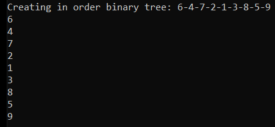

# Iterator

Provide a way to access the elements of an aggregate object sequentially without exposing its underlying representation.

An aggregate should provide a way for the client to access elements, without having to know its internal structure. Additionally, it should be able to traverse an aggregate in differents ways.

The Iterator Pattern states that the iteration rules should be concentrated in an Iterator object. The iterator implements an interface that allows the client to traverse the aggregate without knowing its structure.

An Iterator should store data like the current state of the iteration and the logics for moving on to the next item. When a client decides to iterate through an aggregate, it uses the iterator to manage the traversal. When a new way to traverse is necessary, just create a new iterator.

The below diagram shows the relationship between iterable collections and its iterators, with respective abstractions.

TODO: Iterator Pattern Diagram. 

## Problem

The most common abstraction used to implement Iterator Pattern is the IEnumerator used by IEnumerable. This iterator interface defines a property that references the value stored at the current position. It also provides methods that perform algorithms to move on to the next element and to reset the traversal. Many collections like Lists, Dictionaries and Arrays use this interface to generate their iterators.

```csharp
public interface IEnumerator
{
    object? Current { get; }

    bool MoveNext();

    void Reset();
}
```

Let's see an example that implements a bidirectional collection. In other words, we'll create a collection which iterator provides a forward and also a backward traversal. 

First we created an generic abstract iterator that implements generic IEnumerable. So, the collection will require a GetEnumerator implementation. We're enforcing this rule in order to make the collection able to be traversed in a foreach statement.

```csharp
    public abstract class IterableCollection<T> : IEnumerable<T>
    {
        public abstract IEnumerator<T> GetEnumerator();

        IEnumerator IEnumerable.GetEnumerator() => GetEnumerator();
    }
```

The collection stores a list of T elements. It could be used any data structure for the items, we used List just to make it easy. The collection is instantiated with a _reverse value that indicates whether it should be traversed forward or backward. It also contains Add, GetSize and GetItemAt methods that will be useful for its Iterator.

```csharp
public class BidirectionalCollection<T> : IterableCollection<T>
{
    private readonly IList<T> _items = new List<T>();
    private readonly bool _reverse;

    public BidirectionalCollection(bool reverse = false)
    {
        _reverse = reverse;
    }

    public void Add(T item) => _items.Add(item);

    public int GetSize() => _items.Count;

    public T GetItemAt(int position) => _items[position];

    public override IEnumerator<T> GetEnumerator() => new CustomIterator<T>(this, _reverse);
}
```

Then, we have the CustomIterator which implements the IEnumerator interface previously presented. Note that we've implemented the MoveNext and Reset methods. We also defined the Current properties. We have both ```public T Current``` and ```object IEnumerator.Current``` because we need to provide implementations for both ```IEnumerator``` and ```IEnumerator<T>``` as we're using generics. The iterator stores a reference to its collection, so it can access all its elements.

```csharp
public class CustomIterator<T> : IEnumerator<T>
{
    private readonly BidirectionalCollection<T> _iterableCollection;
    private int _position = -1;
    private readonly bool _reverse;

    public T Current => _iterableCollection.GetItemAt(_position);

    object IEnumerator.Current => _iterableCollection.GetItemAt(_position);

    public CustomIterator(BidirectionalCollection<T> iterableCollection, bool reverse)
    {
        _iterableCollection = iterableCollection;
        _reverse = reverse;

        if (_reverse)
            _position = iterableCollection.GetSize();
    }

    public bool MoveNext()
    {
        var nextPosition = _reverse ? _position - 1 : _position + 1;

        if (nextPosition < 0 || nextPosition >= _iterableCollection.GetSize())
            return false;

        _position = nextPosition;
        return true;
    }

    public void Reset()
    {
        _position = _reverse ? _iterableCollection.GetSize() : -1;
    }

    public void Dispose()
    {
    }
}
```

To present the iterator usage, we'll create different data structures and traverse all of them using a Foreach method we've implemented. This method performs the same instructions that would be performed by a foreach statement. Note that this method has no knowledge about the collection structure and the enumerator. It knows just the IEnumerable and IEnumerator abstractions.

```csharp
private static void Foreach<T>(IEnumerable<T> collection)
{
    Console.WriteLine($"\nExecuting iteration through collection of type { collection.GetType().Name }.");
    var enumerator = collection.GetEnumerator();

    while (enumerator.MoveNext())
    {
        Console.WriteLine(enumerator.Current);
    }
}
```

So now, we can traverse any collection that implements IEnumerable interface.

```csharp
var array = new int[] { 1, 2, 3, 4, 5 };
var list = new List<int> { 1, 2, 3, 4, 5 };
var sortedDictionary = new SortedDictionary<int, string>
{
    { 5, "five" },
    { 2, "two" },
    { 1, "one" },
    { 4, "four" },
    { 3, "three" }
};
var forwardList = new BidirectionalCollection<Person>()
{
    new Person("Anna"),
    new Person("Bob"),
    new Person("Clarice"),
};
var reversedList = new BidirectionalCollection<Person>(true)
{
    new Person("Anna"),
    new Person("Bob"),
    new Person("Clarice"),
};

Foreach(array);
Foreach(list);
Foreach(sortedDictionary);
Foreach(forwardList);
Foreach(reversedList);
```

Output:


## Generic Binary Tree

In this example we'll implement a generic Binary Tree with its respective iterator.

First, let's introduce the Node class. It has a value and contains reference for both left and right children nodes and also to its parent node.

```csharp
public class Node<T>
{
    public T Value;
    public Node<T> Left;
    public Node<T> Right;
    public Node<T> Parent;

    public Node(T value, Node<T> left, Node<T> right)
    {
        Value = value;
        Left = left;
        Right = right;

        if (left != null) left.Parent = this;
        if (right != null) right.Parent = this;
    }
}
```

The generic Binary Tree collection implements the generic IEnumerable interface. It also contais a reference for the root node, from which is the node located at the top of the tree.

```csharp
public class BinaryTree<T> : IEnumerable<T>
{
    private readonly Node<T> _root;

    public BinaryTree(Node<T> root)
    {
        _root = root;
    }

    public IEnumerator<T> GetEnumerator() => new InOrderIterator<T>(_root);

    IEnumerator IEnumerable.GetEnumerator() => GetEnumerator();
}
```

A Binary Tree can be traversed in three ways: in-order, pre-order and post-order. In this example we'll present only in-order. The intention is not to present a binary tree traversal algorithm, but the way an Iterator and an IEnumerable collection can be related to allow the client to use them. 

The Iterator will store a reference for both the root node and the current node. Note that all the traversal necessary instructions are set at the constructor, Reset and MoveNext methods. So, the client will consume the IEnumerator interface without getting in touch with these logics.

```csharp
public class InOrderIterator<T> : IEnumerator<T>
{
    public Node<T> CurrentNode { get; set; }
    private readonly Node<T> _root;
    private bool yieldedStart;

    public InOrderIterator(Node<T> root)
    {
        _root = CurrentNode = root;

        while (CurrentNode.Left != null)
            CurrentNode = CurrentNode.Left;
    }

    public void Reset()
    {
        CurrentNode = _root;
        yieldedStart = true;
    }

    public bool MoveNext()
    {
        if (!yieldedStart)
        {
            yieldedStart = true;
            return true;
        }

        if (CurrentNode.Right != null)
        {
            CurrentNode = CurrentNode.Right;
            MoveToLeftChild(CurrentNode.Left);
            return true;
        }

        var parentOfLastParent = MoveToParent(CurrentNode.Parent);

        CurrentNode = parentOfLastParent;

        return CurrentNode != null;
    }

    private void MoveToLeftChild(Node<T> node)
    {
        if (CurrentNode.Left != null)
        {
            CurrentNode = CurrentNode.Left;
            MoveToLeftChild(node.Left);
        }
    }

    private Node<T> MoveToParent(Node<T> currentParent)
    {
        if (currentParent != null && CurrentNode == currentParent.Right)
        {
            CurrentNode = currentParent;
            MoveToParent(currentParent.Parent);
        }
        return CurrentNode.Parent;
    }

    object IEnumerator.Current => CurrentNode.Value;
    T IEnumerator<T>.Current => CurrentNode.Value;

    public void Dispose()
    {
    }
}
```

So, we can create a Binary Tree and traverse it, printing each value to the console.

```csharp
//         1
//        / \
//       2   3
//      /     \
//     4       5
//    / \     / \
//   6   7   8   9

Console.WriteLine($"\nCreating in order binary tree: 6-4-7-2-1-3-8-5-9");

var six = new Node<int>(6, null, null);
var seven = new Node<int>(7, null, null);
var eight = new Node<int>(8, null, null);
var nine = new Node<int>(9, null, null);
var four = new Node<int>(4, six, seven);
var five = new Node<int>(5, eight, nine);
var two = new Node<int>(2, four, null);
var three = new Node<int>(3, null, five);
var one = new Node<int>(1, two, three);

var binaryTree = new BinaryTree<int>(one);

foreach (var node in binaryTree)
    Console.WriteLine(node);
```

Output:



## Use Cases

Use Iterator Pattern when:

- You need to traverse a collection which type is unknown at compile time.
- A collection can perform traversals in many ways.
- To perform multiple traversal at the same time (each iterator stores its respective state)

## Advantages

- Decouples the client from the traverse logic, which allows iteration through aggregates which type is defined at runtime.
- Satisfies Single Responsibility Principle as the traversal instructions are moved to a single place, the iterator.
- Satisfies Open/Closed Principle as a new collection and its respective Iterator can be handled by existing code without modifying anything.
- Allows customizing the traversal rules.
- The Iterator relies on Factory Methods to create different kind of iterations.

## Disadvantages

- Simple structures may not need to use this pattern, it could result in an overkill complexity.
- You can not update the collection you are iterating through, it's not a good idea.

## References

https://refactoring.guru/design-patterns/iterator

https://jacekrojek.github.io/JacekRojek/2016/c-iterator-design-pattern/

https://www.geeksforgeeks.org/tree-traversals-inorder-preorder-and-postorder/

Pluralsight Course: *Design Patterns in Java: Behavioral - Iterator Pattern*. By Bryan Hansen.

Pluralsight Course: *Tactical Design Patterns in .NET: Control Flow - Iterator Pattern and Sequences*. By Zoran Horvat.

Udemy Course: *Design Patterns in C# and .NET - Iterator*. By Dmitri Nesteruk.