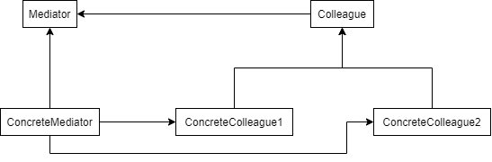
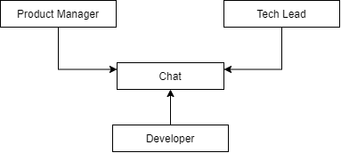
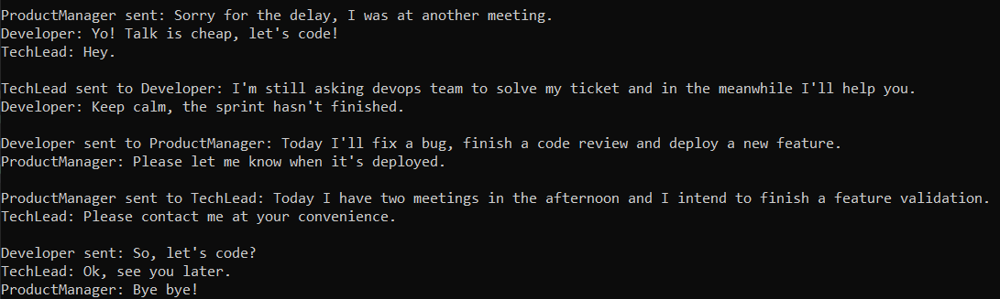
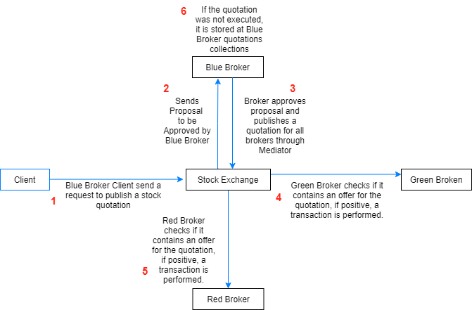
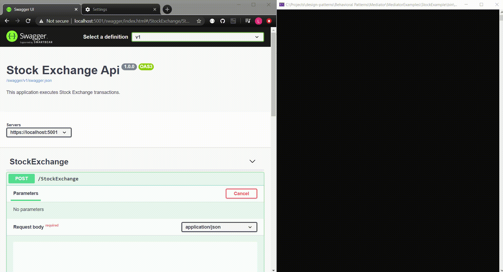

# Mediator

Define an object that encapsulates how a set of objects interact. Mediator promotes loose coupling by keeping objects from referring to each other explicitly, and it lets you vary their interaction independently.

Object-oriented design defines that the application behavior must be distributed among objects. Such distribution results in objects relationships that tends to create dependencies between them. As the application gains complexity, a behavior modification implies modifying many objects, because they tend to know too much about each other.

The Mediator Pattern defines an object called Mediator which controls and coordinates the interactions between a group of objects. Instead of each object communicates another one, they will communicate Mediator which will perform the rest of the communication.



## Problem

Suppose a tech team communicates through a corporate chat. When a team member sends a message the whole team must receive it. So, the chat should contain a mediator that coordinates the communication between all members.

In this example, consider the team contains a developer, a tech lead and a product manager. 



The corporate chat will be an implementation of the following Mediator interface. It allows members to be registered and send messages to all chat members or to receivers of type T.

```csharp
public interface IMediator<TColleague, TData>
{
    void Register(params TColleague[] colleagues);
    void Send(TColleague from, TData colleague);
    void Send<T>(TColleague from, TData colleague) where T : TColleague;
}
```

Each member will implement the following abstraction. 
- It contains a reference for the corporate chat.
- All messages and response that a member can send are stored with him (this limitation is just to simplify the example).
- It can register to a chat and can send messages through it.
- It also has the instructions that must be performed when a message arrives.

```csharp
public abstract class Member
{
    private IMediator<Member, MessageType> _chat;

    public Dictionary<MessageType, string> Messages { get; protected set; }
    public Dictionary<MessageType, string> Responses { get; protected set; }

    public void RegisterChat(IMediator<Member, MessageType> chat) => _chat = chat;
    public void Send(MessageType messageType) => _chat.Send(this, messageType);
    public void Send<T>(MessageType messageType) where T : Member => _chat.Send<T>(this, messageType);

    public abstract void Receive(MessageType messageType);
}

public enum MessageType
{
    Greetings,
    Tasks,
    Goodbyes
}
```

So, now we can see the mediator interface implementation, the chat.
- It contains stores a reference for each one of the team members.
- It can register new members.
- It coordinates all messages sent from members. When a member sends a message, this mediator will look up for all receivers and send them the message.

```csharp
public class Chat : IMediator<Member, MessageType>
{
    private readonly List<Member> _members = new List<Member>();

    public void Register(params Member[] members)
    {
        foreach (var member in members)
        {
            _members.Add(member);
            member.RegisterChat(this);
        }
    }

    public void Send(Member from, MessageType messageType)
    {
        var message = from.Messages[messageType];
        Console.WriteLine($"\n{from.GetType().Name} sent: {message}");

        var receivers = _members.Where(member => member != from).ToList();

        receivers.ForEach(m => m.Receive(messageType));
    }

    public void Send<T>(Member from, MessageType messageType) where T : Member
    {
        var message = from.Messages[messageType];
        Console.WriteLine($"\n{from.GetType().Name} sent to {typeof(T).Name}: {message}");

        _members.OfType<T>().ToList().ForEach(m => m.Receive(messageType));
    }
}
```

Finally, each member has its own messages and receiver instructions as below.

```csharp
public class Developer : Member
{
    public Developer()
    {
        Messages = new Dictionary<MessageType, string>
        {
            { MessageType.Greetings, "Hi." },
            { MessageType.Tasks, "Today I'll fix a bug, finish a code review and deploy a new feature." },
            { MessageType.Goodbyes, "So, let's code?" }
        };

        Responses = new Dictionary<MessageType, string>
        {
            { MessageType.Greetings, "Yo! Talk is cheap, let's code!" },
            { MessageType.Tasks, "Keep calm, the sprint hasn't finished." },
            { MessageType.Goodbyes, "Bye!" }
        };
    }
        
    public override void Receive(MessageType messageType)
    {
        var response = Responses[messageType];
        Console.WriteLine($"Developer: {response}");
    }
}
```
```csharp
public class ProductManager : Member
{
    public ProductManager()
    {
        Messages = new Dictionary<MessageType, string>
        {
            { MessageType.Greetings, "Sorry for the delay, I was at another meeting." },
            { MessageType.Tasks, "Today I have two meetings in the afternoon and I intend to finish a feature validation." },
            { MessageType.Goodbyes, "Sorry I must leave now, client is calling me." }
        };

        Responses = new Dictionary<MessageType, string>
        {
            { MessageType.Greetings, "Hello" },
            { MessageType.Tasks, "Please let me know when it's deployed." },
            { MessageType.Goodbyes, "Bye bye!" }
        };
    }

    public override void Receive(MessageType messageType)
    {
        var response = Responses[messageType];
        Console.WriteLine($"ProductManager: {response}");
    }
}
```
```csharp
public class TechLead : Member
{
    public TechLead()
    {
        Messages = new Dictionary<MessageType, string>
        {
            { MessageType.Greetings, "Hello everyone!" },
            { MessageType.Tasks, "I'm still asking devops team to solve my ticket and in the meanwhile I'll help our devs." },
            { MessageType.Goodbyes, "See you later!" }
        };
        
        Responses = new Dictionary<MessageType, string>
        {
            { MessageType.Greetings, "Hey." },
            { MessageType.Tasks, "Please contact me at your convenience." },
            { MessageType.Goodbyes, "Ok, see you later." }
        };
    }
    
    public override void Receive(MessageType messageType)
    {
        var response = Responses[messageType];
        Console.WriteLine($"TechLead: {response}");
    }
}
```

Now, let's simulate a conversation in a common day in the team life.

- Product manager greets and the all team answer.
- Tech lead sends a direct message to developer.
- Developer sends a direct message to product manager.
- Product Manager sends a direct message to tech lead.
- Develop say goodbye and everyone answer.

```csharp
var developer = new Developer();
var techlead = new TechLead();
var productManager = new ProductManager();

var chat = new Chat();
chat.Register(developer, techlead, productManager);

productManager.Send(MessageType.Greetings);

techlead.Send<Developer>(MessageType.Tasks);
developer.Send<ProductManager>(MessageType.Tasks);
productManager.Send<TechLead>(MessageType.Tasks);

developer.Send(MessageType.Goodbyes);
```

Output:



## MediatR

MediatR library is a simple mediator implementation in .NET. It allows messaging control with no dependency between objects.

As defined by MediatR documentation, it "*supports request/response, commands, queries, notifications and events, synchronous and async with intelligent dispatching via C# generic variance*".

In this section we'll see an example that is a simplification of a Stock Exchange, which permits create stock quotations and executing trades.

The life cycle of a stock quotation is defined as below.

- Client send quotation proposal and Mediator receives it.
- Mediator sends proposal to the appropriate Broker.
- Broker approves proposal.
- Broker publishes the created quotation through Mediator.
- Each broker receives the quotation and check if they want to execute.
- If the quotation was executed was not executed, the quotation owner broker stores at it owns quotations collection.
- If the quotation was executed, a transaction (trade) is performed.



First, we'll configure the Mediator setup for the application assembly.

```csharp
    services.AddMediatR(Assembly.GetExecutingAssembly());
```

Now, we can configure objects to send and receive messages from Mediator, by making the message and handlers classes to implement the interfaces ```INotification``` and ```INotificationHandler<in TNotification>```.

The StockQuotationProposal and StockQuotation represent the messages that will be shared through mediator.

```csharp
public abstract class BaseStockQuotation : INotification
{
    public readonly int _stockShares;
    public readonly StockIdentifier _stockIdentifier;
    public readonly string _ownerName;
    public readonly decimal _price;
    public readonly Guid _ownerId;
    public readonly QuotationType _type;
    public bool _isExecuted;

    public BaseStockQuotation(int stockShares, 
        StockIdentifier stockIdentifier, string ownerName, decimal price, Guid ownerId, QuotationType type)
    {
        _stockShares = stockShares;
        _stockIdentifier = stockIdentifier;
        _ownerName = ownerName;
        _price = price;
        _ownerId = ownerId;
        _type = type;
    }

    public void Execute() => _isExecuted = true;

    public bool CanGenerateTransaction(BaseStockQuotation quotation)
    {
        return _stockShares == quotation._stockShares &&
            _stockIdentifier == quotation._stockIdentifier &&
            _price == quotation._price &&
            _type != quotation._type;
    }
}
```
```csharp
public class StockQuotationProposal : BaseStockQuotation
{
    public StockQuotationProposal(
        int stockShares, StockIdentifier stockIdentifier, string ownerName, decimal price, Guid ownerId, QuotationType type) 
        : base(stockShares, stockIdentifier, ownerName, price, ownerId, type)
    {
    }
}
```
```csharp
public class StockQuotation : BaseStockQuotation
{
    public StockQuotation(StockQuotationProposal proposal)
        : base(proposal._stockShares, proposal._stockIdentifier, proposal._ownerName,
                proposal._price, proposal._ownerId, proposal._type)
    {
    }
}
```

The Broker represents the object that handles both quotation proposal approvals and also quotations execution. These could be separated in two classes, but it's just an example, please ignore it at this moment. 

As a Broker must publish quotation for all other ones, it contains a reference to mediator.

```csharp
public abstract class Broker : INotificationHandler<StockQuotationProposal>, INotificationHandler<StockQuotation>
{
    public readonly Guid _id;
    protected string _name;
    protected readonly IMediator _newYorkStockExchange;
    private readonly BrokerRepository _brokerRepository;

    public Broker(IMediator mediator, BrokerRepository brokerRepository, Guid brokerId)
    {
        _newYorkStockExchange = mediator;
        _brokerRepository = brokerRepository;
        _id = brokerId;
    }

    public async Task Handle(StockQuotationProposal arrivedProposal, CancellationToken cancellationToken)
    {
        if (arrivedProposal._ownerId != _id)
            return;

        // Instructions to approve proposal (check risk, bank balance, etc)

        var stockQuotation = new StockQuotation(arrivedProposal);
        _newYorkStockExchange.Publish(stockQuotation).Wait();

        if (!stockQuotation._isExecuted)
            _brokerRepository.Add(stockQuotation);
    }

    public async Task Handle(StockQuotation arrivedQuotation, CancellationToken cancellationToken)
    {
        if (arrivedQuotation._ownerId == _id || arrivedQuotation._isExecuted)
            return;

        var myOffer = _brokerRepository.FindOffer(arrivedQuotation);

        if (myOffer is null)
            return;

        arrivedQuotation._isExecuted = true;
        Notifications.NotifyTransaction(myOffer, arrivedQuotation);
        
        _brokerRepository.Remove(myOffer);
    }
}
```

The StockQuotationProposal handler performs the below instructions.

- Check if the Broker is the owner of the proposal. 
- If positive, approval instructions should be executed.
- Then, it publishes a Stock Quotation for all other brokers.
-  After the publication, it checks if the quotation was executed.
- If negative, it stores at its own repository and holds the quotation for a future oportunity.

The StockQuotation handler performs the below instructions.

- Check if the quotation is from another broker and it's still not executed.
- If positive, it checks for an offer that can execute this quotation.
- If positive, the quotation is executed and a transaction is logged.
- Finally, the executed offer is removed from the stored quotations.

So, we've presented the objects involved at the stock exchange communication. We'll also present some objects that are spefic of our application, they don't deserve much attention, as they would differ in each implementation.

We have the Broker implementations.

```csharp
public class BlueBroker : Broker
{
    public BlueBroker(IMediator mediator, BlueBrokerRepository brokerRepository)
        : base(mediator, brokerRepository, BrokersConfiguration.Ids[nameof(BlueBroker)])
    {
        _name = nameof(BlueBroker);
    }
}

public class GreenBroker : Broker
{
    public GreenBroker(IMediator mediator, GreenBrokerRepository brokerRepository)
        : base(mediator, brokerRepository, BrokersConfiguration.Ids[nameof(GreenBroker)])
    {
        _name = nameof(GreenBroker);
    }
}

    public class RedBroker : Broker
{
    public RedBroker(IMediator mediator, RedBrokerRepository brokerRepository)
        : base(mediator, brokerRepository, BrokersConfiguration.Ids[nameof(RedBroker)])
    {
        _name = nameof(RedBroker);
    }
}
```

And we have Broker repositories.

```csharp
public abstract class BrokerRepository
{
    protected readonly IList<BaseStockQuotation> _quotations = new List<BaseStockQuotation>();

    public void Add(BaseStockQuotation quotation) => _quotations.Add(quotation);
    
    public BaseStockQuotation FindOffer(BaseStockQuotation quotation)
    {
        return _quotations
            .Where(q => q.CanGenerateTransaction(quotation))
            .FirstOrDefault();
    }

    public bool Remove(BaseStockQuotation quotation) => _quotations.Remove(quotation);
}

public class BlueBrokerRepository : BrokerRepository
{
}

public class RedBrokerRepository : BrokerRepository
{
}

public class GreenBrokerRepository : BrokerRepository
{
}
```

Finally, the client is able to create proposals and publish them. A proposal is created from the details received at the request and is published by mediator, starting all the communication previously explained.

```csharp
[HttpPost]
public async Task<ActionResult<StockQuotationProposal>> PublishStockQuotation(
    [FromBody] CreateStockQuotationRequest request)
{
    var notifiedQuotation = CreateQuotationPipeline
        .CreateQuotationProposal(request)
        .LogQuotationProposal()
        .PublishProposal(_newYorkStockExchange);
    
    return Ok(notifiedQuotation);
}
```
```csharp
public static class CreateQuotationPipeline
{
    public static StockQuotationProposal CreateQuotationProposal(CreateStockQuotationRequest request)
    {
        var brokerName = BrokersConfiguration.Ids
            .Where(x => x.Value == request.OwnerId)
            .FirstOrDefault()
            .Key;

        return new StockQuotationProposal(request.StockShares,
            request.StockIdentifier, brokerName, request.Price, request.OwnerId, request.type);
    }

    public static StockQuotationProposal LogQuotationProposal(this StockQuotationProposal quotationProposal)
    {
        Notifications.LogQuotationProposal(quotationProposal);
        return quotationProposal;
    }

    public static BaseStockQuotation PublishProposal(this StockQuotationProposal quotationProposal,
        IMediator _newYorkStockExchange)
    {
        _newYorkStockExchange.Publish(quotationProposal).Wait();
        return quotationProposal;
    }
}
```

Let's see some operations at the Stock Exchange. We'll simulate three clients sending a *ask* quotation (sell offers) each one. In other words, each client wants to sell a stock.

- BlueBroker: Wants to sell 300 shares of Facebook stock for $ 10.
- RedBroker: Wants to sell 150 shares of Google stock for $ 20.
- GreenBroker: Wants to sell 100 shares of Microsoft stock for $ 50.

After, we'll send three *bid* quotations (buy offers). It simulates three clients, each one trying to buy one of the stocks that are being sold. The result will be three executed trades.

- RedBroker: Wants to buy 300 shares of Facebook stock for $ 10.
- BlueBroker: Wants to buy 150 shares of Google stock for $ 20.
- GreenBroker: Wants to buy 100 shares of Microsoft stock for $ 50.

Output:



## Use Cases

Use Mediator Pattern when:

- A groups of colleagues that communicate with each other in well defined, but complex ways.
- You have difficulty to reuse an object because it holds references to other ones.
- You want a single object to carry the communication logic.

## Advantages

- The communication behavior is focused on mediator, removing this responsibility from all colleagues.
- New notifications and handlers can be added without modifying existing objects.
- Provides colleagues decoupling, as the publisher doesn't have to know all its colleagues.


## Disadvantages

- Mediator can be an overkill for simple communications. 
- It can generates asynchronicity issues if is not well designed.
- Creates a unique failure point for all the communication between its colleagues.

## Comparisons

A broadcast is not a bilateral communication as it's an one-to-many relationship. A broadcast looks more likely to be an Observer Pattern example. Mediator Pattern solves communication between many colleagues. If the broadcast viewers interact with each other, then it's a Mediator Pattern example.

## References

https://refactoring.guru/design-patterns/mediator

https://www.geeksforgeeks.org/tree-traversals-inorder-preorder-and-postorder/

https://github.com/jbogard/MediatR

https://dotnettutorials.net/lesson/mediator-design-pattern/

Pluralsight Course: *Design Patterns in Java: Behavioral - Mediator Pattern*. By Bryan Hansen.

Pluralsight Course: *C# Design Patterns: Mediator*. By Steve Michelotti.

Udemy Course: *Design Patterns in C# and .NET - Mediator*. By Dmitri Nesteruk.