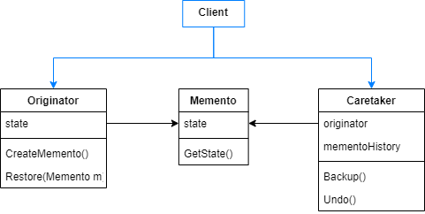
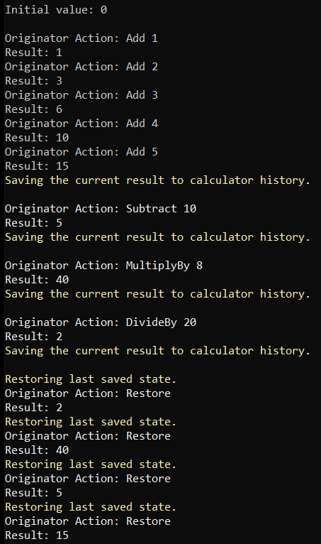

# Memento

Without violating encapsulation, capture and externalize an object's internal state so that the object can be restored to this state later.

The Memento Pattern lets the application saves and restores its objects states, without exposing their implementations. Sometimes objects encapsulate their state, making it inacessible to other objects. Memento provides a way to restore it in these cases.

There are different ways to implement this pattern. The classic implementation consists in:

- An Originator object that requires save and restore functionallities. It uses the memento to restore previous states.
- A Memento object that stores the Originator state without providing external access to it.
- Caretaker stores all mementos objects, but never access its content.

You can also have an interface to deal with memento, to avoid coupling between memento and caretaker.



## Problem

Suppose we want a calculator that stores its results everytime a new operation is performed. We also want the possibility to restore the result to the previous ones.

## Show me the Code

So, the thing we're going to implement is the calculator operations. As the result must be stored, this calculator will be the Originator and the result defined by its _state field. Every math operation should change the _state value to the new result. Additionally, this calculator knows how to create a new memento and how to restore its state to a memento state.

```csharp
    public class Originator
    {
        public double _state;

        public Originator(double @base)
        {
            Console.WriteLine($"\nInitial value: {@base}\n");

            _state = @base;
        }

        public void Add(double operand)
        {
            _state += operand;
            PrintStateChange(nameof(Add), operand);
        }

        public void Subtract(double operand)
        {
            _state -= operand;
            PrintStateChange(nameof(Subtract), operand);
        }

        public void MultiplyBy(double operand)
        {
            _state *= operand;
            PrintStateChange(nameof(MultiplyBy), operand);
        }

        public void DivideBy(double operand)
        {
            _state /= operand;
            PrintStateChange(nameof(DivideBy), operand);
        }

        public IMemento Save() => new ConcreteMemento(_state);

        public void Restore(IMemento memento)
        {
            _state = memento.GetState();
            PrintStateChange(nameof(Restore), null);
        }

        private void PrintStateChange(string action, double? operand)
        {
            Console.WriteLine($"Originator Action: {action} {operand}");
            Console.WriteLine($"State: {_state}\n");

        }
    }
```

The memento is a simple class which consists of a Calculator state, that prevented from changes.
 
```csharp
public class ConcreteMemento : IMemento
{
    private double _state;

    public ConcreteMemento(double state) => _state = state;

    public double GetState() => _state;
}
```

The caretaker is responsible for storing all mementos created from the calculator states. Another caretaker responsibility is to restore the calculator to its previous state. To achieve this functionallities, it keeps a originator reference and a mementos history.

```csharp
public class Caretaker
{
    private readonly Originator _originator;
    private readonly List<IMemento> _mementos = new List<IMemento>();

    public Caretaker(Originator originator)
    {
        _originator = originator;
        Backup();
    }

    public void Backup() => _mementos.Add(_originator.Save());

    public void Undo()
    {
        if (_mementos.Count == 0)
            return;

        CustomConsole.WriteLine(ConsoleColor.Yellow, "Restoring last saved state.");
    
        var memento = _mementos.Last();
        _mementos.Remove(memento);
        _originator.Restore(memento);
    }
}
```

In a simplified implementation, client can instantiate an originator and a caretaker objects. It can backup the result at any execution time just by invoking caretaker backup method. At any time, it can also restore the calculator to the previous result.

```csharp
var originator = new Originator(0);
var caretaker = new Caretaker(originator);

// 1 + 2 + 3 + 4 + 5 = 15 (state)
for (var i = 1; i <= 5; i++) originator.Add(i);
caretaker.Backup();

// 15 - 10 = 5 (state)
originator.Subtract(10);
caretaker.Backup();

// 5 * 8 = 40 (state)
originator.MultiplyBy(8);
caretaker.Backup();

// 40 / 20 = 2 (state)
originator.DivideBy(20);
caretaker.Backup();

for (int i = 0; i <= 10; i++) caretaker.RestorePreviousState();
```

Output:



## Use Cases

Use Memento Pattern when:

- A snapshot of an object must be saved and can be restored in the future.
- You can not break the state encapsulation, but you need to access it.

## Advantages

- Allows an object state to be saved and restored in a way that does not break its encapsulation.
- The state management is removed from the originator and becomes a responsibility of the caretaker.

## Disadvantages

- State changes increases processing consumption.
- Caretaker may produce a high storage usage, maybe it's better to store the mementos in a database.
- Carataker may need to define how much history should be kept.

## Comparisons

Memento looks very similar to Command, but they have some differences.
- Memento stores states while Command stores requests.
- Memento allows states to be stored and restored while Command allows requests to be created and undone.
- Memento goal is to provide a caretaker that stores the state history. Command goal is to store information to perform and undo actions. It also stores the requests history, but it's a side benefit, 

Memento and Command can be used together. 
- Command should be used to perform actions that changes the object state. 
- Memento should be used to store the object state.
- To undo operations, you can revert a command action.
- To rollback to a previous state, you can use Memento's caretaker.

## References

https://refactoring.guru/design-patterns/memento

Pluralsight Course: *Design Patterns in Java: Behavioral - Memento Pattern*. By Bryan Hansen.

Pluralsight Course: *C# Design Patterns: Mediator*. By Steve Michelotti.

Udemy Course: *Design Patterns in C# and .NET - Mediator*. By Dmitri Nesteruk.