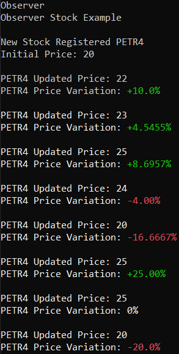
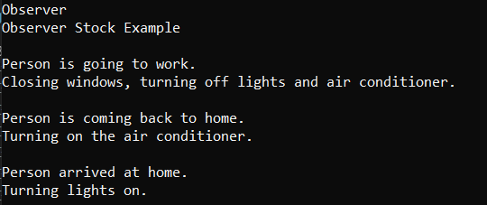
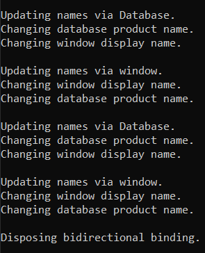

# Observer

Define a one-to-many dependency between objects so that when one object changes state, all its dependents are notified and updated automatically.

The Observer Pattern is useful for solutions in which an object, called subject, controls a list of dependents, called observers, and notifies them every state change. For example: a newspaper publisher starts its own business and sends newspapers for each subscriber. Every new edition, the subscribers will automatically receive the newspaper, as long as the subscription is activated. New subscribers starts receiveing the updates as soon as the subscription is activated.

## Problem

Suppose an application must monitor a generic stock price and update a display every price change.

"Diagrama do observer pattern"

## Show me the code

As the stock is the object we must observe, it'll be designed as the Subject object.

The Stock class implements ISubject interface. It stores the stock identifier and current price value. It contais a list of subscribers (observers) that must be notified. These observers implements IStockPriceObserver, that contains only an Update method. Every price update invokes notification method that invoke the Update method of each subscriber.

```csharp
public interface ISubject
{
    void Attach(IStockPriceObserver observer);
    void Detach(IStockPriceObserver observer);
    void NotifyObservers();
}
```
```csharp
public class Stock : ISubject
{
    private readonly IList<IStockPriceObserver> _observers = new List<IStockPriceObserver>();
    private decimal _price;
    private string _identifier;

    public Stock(decimal initialPrice, string identifier)
    {
        _price = initialPrice;
        _identifier = identifier;
        Console.WriteLine($"\nNew Stock Registered {_identifier}");
        Console.WriteLine($"Initial Price: {decimal.Round(_price,4)}");
    }

    public void Attach(IStockPriceObserver observer)
    {
        if (observer != null)
            _observers.Add(observer);
    }

    public void Detach(IStockPriceObserver observer)
    {
        if (observer != null)
            _observers.Remove(observer);
    }

    public void NotifyObservers()
    {
        foreach (var observer in _observers)
        {
            observer.Update(_price, _identifier);
        }
    }

    public void UpdatePrice(decimal value)
    {
        _price = value;
        NotifyObservers();
    }
}
```

The observers in this examples are two displays, one that shows the current price and other that shows the price variation relative to the last price. Both observers implements IStockPriceObserver. 

```csharp
public interface IStockPriceObserver
{
    void Update(decimal updatedPrice, string identifier);
}
```

```csharp
public class StockPriceDisplay : IStockPriceObserver
{
    public void Update(decimal updatedPrice, string identifier)
    {
        Console.WriteLine($"\n{identifier} Updated Price: {decimal.Round(updatedPrice, 4)}");
    }
}

public class StockPriceVariationDisplay : IStockPriceObserver
{
    private decimal _currentPrice;

    public StockPriceVariationDisplay(decimal initialPrice)
    {
        _currentPrice = initialPrice;
    }

    public void Update(decimal updatedValue, string identifier)
    {
        var priceVariation = CalculateVariationRate(_currentPrice, updatedValue);
        _currentPrice = updatedValue;
        Console.Write($"{identifier} Price Variation: ");
        PrintVariation(priceVariation);
    }

    private decimal CalculateVariationRate(decimal currentValue, decimal newValue)
    {
        var variation = newValue - currentValue;
        var variationRate = variation / currentValue * 100;
        return variationRate;
    }

    private void PrintVariation(decimal variation)
    {
        Console.ForegroundColor = variation.GetConsoleColor();
        var variationAsString = decimal.Round(variation, 4).AsString();
        Console.Write(variationAsString);
        Console.WriteLine("%");
        Console.ForegroundColor = ConsoleColor.White;
    }
}
```

The StockPriceVariationDisplay stores the current price to allow it calculate the variation. It contais two private methods responsible for calculus and print to console.

To simulate a real stock market we'll perform some price updates and check the result via Console. We create a stock with initial price $ 20 and identifier PETR4. We subscribe both displays observer to the subject and all price change will generate a display update.

```csharp
static void Main(string[] args)
{
    Console.WriteLine("Observer");
    Console.WriteLine("Observer Stock Example");

    var stockInitialPrice = 20m;
    var stockIdentifier = "PETR4";
    var petr4Price = new Stock(stockInitialPrice, stockIdentifier);

    var stockValueDisplay = new StockPriceDisplay();
    var stockVariationRateDisplay = new StockPriceVariationDisplay(stockInitialPrice);

    petr4Price.Attach(stockValueDisplay);
    petr4Price.Attach(stockVariationRateDisplay);

    petr4Price.UpdatePrice(22m);
    petr4Price.UpdatePrice(23m);
    petr4Price.UpdatePrice(25m);
    petr4Price.UpdatePrice(24m);
    petr4Price.UpdatePrice(20m);
    petr4Price.UpdatePrice(25m);
    petr4Price.UpdatePrice(25m);
    petr4Price.UpdatePrice(20m);
}
```



## Observable and Observer Interfaces

The Observer Pattern can be implemented using ```IObserve<T>``` and ```IObservable<T>``` generic interfaces. 

The ```Observable<T>``` interface requires a T object that contains the notification information. In this example it contains only the new price value. 

```csharp
public class PriceUpdateEvent
{
    public readonly decimal _newPrice;

    public PriceUpdateEvent(decimal newPrice)
    {
        _newPrice = newPrice;
    }
}
```

Instead of storing Observers instances, in this example we'll store a binding object called Subscription. This object will relate a stock with a display object. It also implements IDisposable to allow the client cancelling subscriptions. In the previous example, the resources usage was not efficient, as the unsubscribed observers could not be erased because they were attached with event. In the below example, the subscription can be collected by Garbage Collector.

```csharp
public class Stock : IObservable<PriceUpdateEvent>
{
    private decimal _price;
    private readonly HashSet<Subscription> _subscriptions = new HashSet<Subscription>();

    public Stock(decimal initialprice)
    {
        _price = initialprice;
    }

    public void NotifyObservers()
    {
        foreach (var subscription in _subscriptions)
        {
            subscription.Observer.OnNext(new PriceUpdateEvent(_price));
        }
    }

    public void UpdatePrice(decimal value)
    {
        _price = value;
        NotifyObservers();
    }

    public IDisposable Subscribe(IObserver<PriceUpdateEvent> observer)
    {
        var subscription = new Subscription(this, observer);
        _subscriptions.Add(subscription);
        return subscription;
    }

    // A subscription instance is stored to allow disposing observers.
    // Is not possible to directly dispose observers, because they are attached to events.
    public class Subscription : IDisposable
    {
        private readonly Stock _stock;
        public IObserver<PriceUpdateEvent> Observer { get; set; }

        public Subscription(Stock stock, IObserver<PriceUpdateEvent> observer)
        {
            _stock = stock;
            Observer = observer;
        }

        public void Dispose()
        {
            _stock._subscriptions.Remove(this);
        }
    }
}
```

The display class will implement ```IObserver<PriceUpdateEvent>```. OnCompleted method could be used to inform the subscriber that the provider will not send notifications. OnError method could be used to inform that the provider experienced errors. The OnNext method is the instructions that the display will execute when a price change notification arrives.

```csharp
public class StockPriceDisplay : IObserver<PriceUpdateEvent>
{
    public void OnCompleted()
    {
    }

    public void OnError(Exception error)
    {
    }

    public void OnNext(PriceUpdateEvent priceUpdateEvent)
    {
        Console.WriteLine($"\nUpdated Price: {decimal.Round(priceUpdateEvent._newPrice, 4)}");
    }
}
```

## Observer Pattern and events

Ofter an application contains events that must be listened and for each listener, perform an action. Consider an smart house designed to automate some repetitives activities of its residents. When its owner goes to work, it must turn off all the lights, the air conditioner and close windows. When the person leaves work, it must turn the air conditioner on to provide a nice climate when the person arrives. This person is so lazy that does not want to turn on the lights so, imediatelly when her arrives, the lights should be turned on.

In this example, the person is the entity that will raise all events and the house will be the listener that handles all of them.

The Person class contais the described events and a method that raises the respective event.

```csharp
public class Person
{
    public event EventHandler LeftHome;
    public event EventHandler ArrivedAtHome;
    public event EventHandler LeftWork;

    public void GoToWork()
    {
        Console.WriteLine("\nPerson is going to work.");
        LeftHome?.Invoke(this, EventArgs.Empty);
    }

    public void LeaveWork()
    {
        Console.WriteLine("\nPerson is coming back to home.");
        LeftWork?.Invoke(this, EventArgs.Empty);
    }

    public void ArriveAtHome()
    {
        Console.WriteLine("\nPerson arrived at home.");
        ArrivedAtHome?.Invoke(this, EventArgs.Empty);
    }
}
```

The air conditioner, windows and lights will be simplified and represented by a class Device.

```csharp
public class Device
{
    public bool IsEnabled { get; set; }
}
```

The SmartHouse is the entity that contains the devices objects and subscribes its functionalities to the respective event of its owner.

```csharp
public class SmartHouse
{
    private readonly Device _windowsControl = new Device();
    private readonly Device _airConditioner = new Device();
    private readonly Device _lights = new Device();

    // Here should exist abstractions to respect Dependency Inversion Principle
    public SmartHouse(Person person)
    {
        person.LeftHome += (s, e) => { DisableAllDevices(s, e); };
        person.LeftWork += (s, e) => { EnableAirConditioner(s, e); };
        person.ArrivedAtHome += (s, e) => { TurnLightsOn(s, e); };
    }

    public void DisableAllDevices(object sender, EventArgs e)
    {
        Console.WriteLine("Closing windows, turning off lights and air conditioner.");
        _windowsControl.IsEnabled = false;
        _airConditioner.IsEnabled = false;
        _lights.IsEnabled = false;
    }

    public void EnableAirConditioner(object sender, EventArgs e)
    {
        Console.WriteLine("Turning on the air conditioner.");
        _airConditioner.IsEnabled = true;
    }

    public void TurnLightsOn(object sender, EventArgs e)
    {
        Console.WriteLine("Turning lights on.");
        _lights.IsEnabled = true;
    }
}
```

So, let's simulate an day in the smarthouse owner life and validate the smarthouse performance. 

```csharp
static void Main(string[] args)
{
    Console.WriteLine("Observer");
    Console.WriteLine("Observer Stock Example");

    var person = new Person();
    var smartHouse = new SmartHouse(person);

    person.GoToWork();
    Thread.Sleep(5000);
    person.LeaveWork();
    Thread.Sleep(5000);
    person.ArriveAtHome();
}
```



## Bidirectional Binding

The next example is quite different from the previous ones. It provides a solution for entities that both must notify and receive notifications. It's a bonus example, as the Observer Pattern is not so related with this scenario.

Consider an application composed by an user interface, called Window, that permits the user to access some Database information. It's just a simple example, but the intention is to pretend we need to synchronize a data that is stored at database, but it's also displayed by a window. The data can be updated both via database queries and manually via the user interface, but it must have the same value at these environments. 

Database class implements INotifyPropertyChanged. This interface contains only an event PropertyChangedEventHandler that should be raised when a property change its value. Set method will perform instructions only in a state change. In other words, if the client tries to set the same value, it'll not perform any action. Otherwise, it'll change the property value and calls OnPropertyChanged(), the event raiser.

The method OnPropertyChanged calls all event handlers, passing as Args the name of the property that called it.


```csharp
public class Database : INotifyPropertyChanged
{
    private string _productName;
    public string ProductName { 
        get => _productName;
        set
        {
            if (value != _productName)
            {
                _productName = value;
                Console.WriteLine("Changing database product name.");
                OnPropertyChanged();
            }
        } 
    }

    public event PropertyChangedEventHandler PropertyChanged;

    protected virtual void OnPropertyChanged([CallerMemberName] string propertyName = null)
    {
        PropertyChanged?.Invoke(this, new PropertyChangedEventArgs(propertyName));
    }
}
```

The window has a structure similar to Database structure.
```csharp
public class Window : INotifyPropertyChanged
{
    private string _displayName;
    public string DisplayName
    {
        get => _displayName;
        set
        {
            if (value != _displayName)
            {
                _displayName = value;
                Console.WriteLine("Changing window display name.");
                OnPropertyChanged();
            }
        }
    }

    public Window(Database product)
    {
        _displayName = product.ProductName;
    }

    public event PropertyChangedEventHandler PropertyChanged;

    protected virtual void OnPropertyChanged([CallerMemberName] string propertyName = null)
    {
        PropertyChanged?.Invoke(this, new PropertyChangedEventArgs(propertyName));
    }
}
```

Finally, the Bidirection Binding class is the followin one. It's a few complex, but let's by parts.

It receives the two observers, Database and Window, that implements INotifyPropertyChanged. 

For each observer, it receives an expression. These expressions will define the properties that will be synchronized. In this case, we want synchronize Database.ProductName and Window.DisplayName. So, we'll consume it passing ```() => database.ProductName``` and ```() => window.DisplayName```.

The first validation will ensure the expressions bodies represents a field or property access. The second validation will ensure that ProductName and DisplayName are properties.

If both validations pass, it subscribes the observers. 

```csharp
public class BidirectionalBinding : IDisposable
{
    private bool _isDisposed;

    public BidirectionalBinding(
        INotifyPropertyChanged firstObserver,
        Expression<Func<object>> firstExpression,
        INotifyPropertyChanged secondObserver,
        Expression<Func<object>> secondExpression)
    {
        if (firstExpression.Body is MemberExpression firstExprBody &&
            secondExpression.Body is MemberExpression secondExprBody)
            if (firstExprBody.Member is PropertyInfo firstProperty &&
                secondExprBody.Member is PropertyInfo secondProperty)
            {
                firstObserver.PropertyChanged += (s, e) =>
                {
                    if (!_isDisposed)
                        secondProperty.SetValue(secondObserver, firstProperty.GetValue(firstObserver));
                };
                
                secondObserver.PropertyChanged += (s, e) =>
                {
                    if (!_isDisposed)
                        firstProperty.SetValue(firstObserver, secondProperty.GetValue(secondObserver));
                };
            }
    }

    public void Dispose()
    {
        Console.WriteLine("\nDisposing bidirectional binding.");
        _isDisposed = true;
    }
}
```

Let's consider the following:

First Observer = Database
First Expression = ```() => database.ProductName```
Second Observer = Window
Second Expression = ```()() => window.DisplayName```

First, if _isDisposed is false, it will subscribe the Window at Database PropertyChanged event. So, every time the event occurs, DisplayName (secondProperty) will receive the value of ProductName (firstProperty) from Database (firstObserver).
The second subscription is the reverse scenario. 

The client can consume as below.

```csharp
static void Main(string[] args)
{
    var database = new Database();
    var window = new Window(database);

    using (var bidirectionalBinding = new BidirectionalBinding(
        database, 
        () => database.ProductName, 
        window, 
        () => window.DisplayName))
    {
        UpdateNameViaDatabase("Name1");
        UpdateNameViaWindow("Name2");
        UpdateNameViaDatabase("Name3");
        UpdateNameViaWindow("Name4");
    }

    void UpdateNameViaDatabase(string name)
    {
        Console.WriteLine("\nUpdating names via Database.");
        database.ProductName = name;
    }
    void UpdateNameViaWindow(string name)
    {
        Console.WriteLine("\nUpdating names via window.");
        window.DisplayName = name;
    }
}
```

