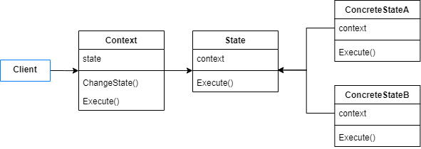
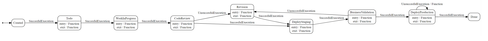
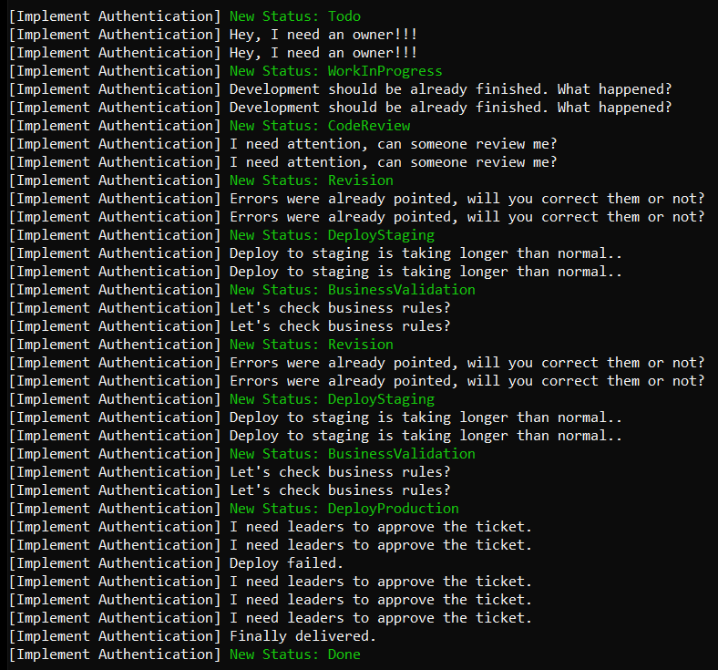

# State

Allow an object to alter its behavior when its internal state changes. The object will appear to change its class.

The state pattern is useful when an object frequently changes its state and, consequently, its behavior. All possible state transitions are defined by a mechanism called State Machine.

The State Pattern can be implemented considering these players:

- The context object has a refence via interface to the state in which it is. It also contains a method to change its state.
- The State interface defines all methods that has different behavior for each state.
- The concrete states have a reference to the related context and implements the interface methods.



## Problem

Suppose you are asked to design an application that provides a scrum task board. All stories defined by a product manager should start at a Created state and pass through a state machine and achieves Done state, as presented by the following diagram.



## Show the Code

So, in this example the context object is a Activity. This activity changes its state as the requirements becomes achieved. Each state contains a timer that emits intermittent alerts to notify the development team that a activity state needs attention. All tasks from a state are executed when the ExecuteCurrentTask method is invoked.

```csharp
public class Activity
{
    public readonly string _name;
    private State _state;

    public Activity(string name)
    {
        _name = name;
        ChangeState(new Todo(this));
    }

    public void ChangeState(State state)
    {
        _state = state;
        _state.InitializeAlertTimer();
        Print($" New Status: {_state.GetType().Name}");
    }

    public void ExecuteCurrentTask(int elapsedTime, bool withErrors = false)
    {
        Thread.Sleep(elapsedTime);
        _state.Execute(withErrors);
    }

    private void Print(string stateChangeMessage)
    {
        Console.Write($"[{_name}]");
        Console.ForegroundColor = ConsoleColor.Green;
        Console.WriteLine(stateChangeMessage);
        Console.ForegroundColor = ConsoleColor.White;
    }
}
```

The following abstract State class contains a reference to the related activity object. It also configures its respective alert timer and provide abstract methods, like OnTimedEvent and Execute, that should be overriden by its derived classes. The OnTimedEvent method must declare the instructions to alert the team, in each different state. The Execute method must specify all instructions to execute all required tasks of a state.

```csharp
public abstract class State
{
    protected readonly Activity _activity;
    protected static Timer _timer;

    public State(Activity activity, double alertInterval)
    {
        _activity = activity;
        ConfigureAlertTimer(alertInterval);
    }

    public abstract void OnTimedEvent(object source, ElapsedEventArgs e);

    private void ConfigureAlertTimer(double alertInterval)
    {
        if (alertInterval <= 0)
            return;

        _timer = new Timer(alertInterval)
        {
            AutoReset = true,
        };

        _timer.Elapsed += OnTimedEvent;
    }

    public void InitializeAlertTimer() => _timer.Start();

    public abstract void Execute(bool withErrors = false);
}
```

The following classes are the States implementation. We should not spend much effort with the business implementations, as it's not part of the pattern and varies for different applications.

```csharp
public class Todo : State
{
    public Todo(Activity activity) : base(activity, 3000)
    {
    }

    public override void OnTimedEvent(object source, ElapsedEventArgs e)
    {
        Console.WriteLine($"[{_activity._name}] Hey, I need an owner!!!");
    }

    public override void Execute(bool withErrors = false)
    {
        _timer.Dispose();
        _activity.ChangeState(new WorkInProgress(_activity));
    }
}
```
```csharp
public class WorkInProgress : State
{
    public WorkInProgress(Activity activity) : base(activity, 3000)
    {
    }

    public override void OnTimedEvent(object source, ElapsedEventArgs e)
    {
        Console.WriteLine($"[{_activity._name}] Development should be already finished. What happened?");
    }

    public override void Execute(bool withErrors = false)
    {
        _timer.Dispose();
        _activity.ChangeState(new CodeReview(_activity));
    }
}
```
```csharp
public class CodeReview : State
{
    public CodeReview(Activity activity) : base(activity, 3000)
    {
    }

    public override void OnTimedEvent(object source, ElapsedEventArgs e)
    {
        Console.WriteLine($"[{_activity._name}] I need attention, can someone review me?");
    }

    public override void Execute(bool withErrors = false)
    {
        _timer.Dispose();

        if (withErrors)
        {
            _activity.ChangeState(new Revision(_activity));
            return;
        }

        _activity.ChangeState(new DeployStaging(_activity));
    }
}
```
```csharp
public class Revision : State
{
    public Revision(Activity activity) : base(activity, 3000)
    {
    }

    public override void OnTimedEvent(object source, ElapsedEventArgs e)
    {
        Console.WriteLine($"[{_activity._name}] Errors were already pointed, will you correct them or not?");
    }

    public override void Execute(bool withErrors = false)
    {
        _timer.Dispose();
        _activity.ChangeState(new DeployStaging(_activity));
    }
}   
```
```csharp
public class DeployStaging : State
{
    public DeployStaging(Activity activity) : base(activity, 3000)
    {
    }

    public override void OnTimedEvent(object source, ElapsedEventArgs e)
    {
        Console.WriteLine($"[{_activity._name}] Deploy to staging is taking longer than normal..");
    }

    public override void Execute(bool withErrors = false)
    {
        _timer.Dispose();
        _activity.ChangeState(new BusinessValidation(_activity));
    }
}
```
```csharp
public class BusinessValidation : State
{
    public BusinessValidation(Activity activity) : base(activity, 3000)
    {
    }

    public override void OnTimedEvent(object source, ElapsedEventArgs e)
    {
        Console.WriteLine($"[{_activity._name}] Let's check business rules?");
    }

    public override void Execute(bool withErrors = false)
    {
        _timer.Dispose();

        if (withErrors)
        {
            _activity.ChangeState(new Revision(_activity));
            return;
        }

        _activity.ChangeState(new DeployProduction(_activity));
    }
}
```
```csharp
public class DeployProduction : State
{
    public DeployProduction(Activity activity) : base(activity, 3000)
    {
    }

    public override void OnTimedEvent(object source, ElapsedEventArgs e)
    {
        Console.WriteLine($"[{_activity._name}] I need leaders to approve the ticket.");
    }

    public override void Execute(bool withErrors = false)
    {
        if (withErrors)
        {
            Console.WriteLine($"[{_activity._name}] Deploy failed.");
            return;
        }

        _timer.Dispose();
        _activity.ChangeState(new Done(_activity));
    }
}
```
```csharp
public class Done : State
{
    public Done(Activity activity) : base(activity, 0)
    {
        _timer.Dispose();
        Console.WriteLine($"[{_activity._name}] Finally delivered.");
    }

    public override void OnTimedEvent(object source, ElapsedEventArgs e)
    {
        Console.WriteLine($"[{_activity._name}] I'm already done.");
    }

    public override void Execute(bool withErrors = false)
    {
    }
}
```
So, when we simulate a activity workflow successively invokes ExecuteCurrentTask it will execute all tasks of each state, until it gets at Done state.

```csharp
var activity = new Activity("Implement Authentication");

// Move to Work In Progress
activity.ExecuteCurrentTask(8000);

// Move to Code Review
activity.ExecuteCurrentTask(8000);

// Move to Revision (errors at code review result in revision need)
activity.ExecuteCurrentTask(8000, true);

// Move to Deploy Staging
activity.ExecuteCurrentTask(8000);

// Move to Business Validation
activity.ExecuteCurrentTask(8000);

// Move to Revision (errors at business validation result in revision need)
activity.ExecuteCurrentTask(8000, true);

// Move to Deploy Staging
activity.ExecuteCurrentTask(8000);

// Move to Business Validation
activity.ExecuteCurrentTask(8000);

// Move to Deploy Production
activity.ExecuteCurrentTask(8000);

// Move to Done (errors at deploy result in no change)
activity.ExecuteCurrentTask(10000, true);

// Move to Done
activity.ExecuteCurrentTask(10000);
```
 
 Notice that each state has its specific way to alert the development team.

 Output:



## Use cases

Use State Pattern when:

- Must configure behaviors of an object that changes with it states.
- When you must implement a state machine to process some object.
- An object is full of conditional statements that defines its behavior and they can be represented by states.

## Advantages

- Allows the object to achieve new states without modifying the existing ones, satisfying Open/Closed Principle.
- An object can change its behavior at runtime depending on states.
- The state conditional definitions are separated, each one in the respective state class, which avoids large and complex conditional statements.
- Protects the objects from inconsistent internal states.
- Makes state changes more explicity, as the states should receive semantic names.

## Disadvantages

- If an object has a few number of states and simple behavior, the state pattern would increase the number of classes and perhaps would not provide so much gain.

## References

https://refactoring.guru/design-patterns/state

https://github.com/dotnet-state-machine/stateless

Pluralsight Course: *Design Patterns in Java: Behavioral - State Pattern*. By Bryan Hansen.

Pluralsight Course: *C# Design Patterns: State*. By Marc Gilbert.

Udemy Course: *Design Patterns in C# and .NET - State*. By Dmitri Nesteruk.