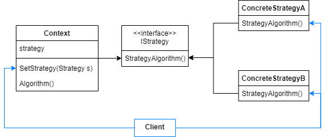
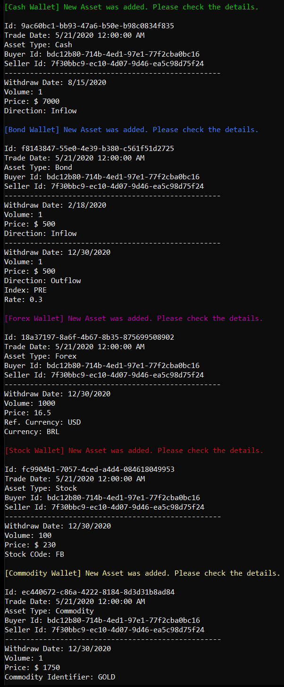

# Strategy

Define a family of algorithms, encapsulate each one, and make them interchangeable. Strategy lets the algorithm vary independently from clients that use it.

In Strategy Pattern, an object behavior can vary as the strategy it's using. The strategies can be selected at runtime and they consist of the possible algorithms that an object can execute to achieve something.

Commonly, is defined a strategy interface with the methods which behavior should vary. An object receives an implementation of this interface, called concrete strategy, and use it to execute the strategy specific algorithms. The concrete strategy is defined by the client, it can be at runtime. 

The Strategy Pattern most common implementation consists of these players:

- The context object has a reference to the strategy that was set by the client.
- The Strategy interface defines all strategy specific methods.
- The concrete strategies implement the algorithms that should be executed by each one of them.



## Problem

To exemplify this pattern we'll present an example which designs a multiple wallet asset register. A financial team must register all executed asset operations segregating them by their asset type, which can be cash, bond, forex, stock or commodity.

Each kind of asset will be handled by a particular strategy that knows how to process it and register at the correct wallet.

## Show Me The Code

So, let's introduce the contexts objects.

All asset types have a common structure that is defined by the Asset class. However, each type contains a particular movement structure, that's why it is generalized. As well as the movement structure, the strategy varies with the asset type.

```csharp
public class Asset<TMovement> where TMovement : Movement
{
    public Guid Id { get; set; }
    private readonly string _assetType;
    private readonly Guid _buyer;
    private readonly Guid _seller;
    private readonly DateTime _tradeDate;
    private readonly IList<TMovement> _movements = new List<TMovement>();
    private readonly IWalletStrategy<TMovement> _walletStrategy;

    public Asset(Guid buyer, Guid seller, DateTime tradeDate, IWalletStrategy<TMovement> walletStrategy)
    {
        _assetType = typeof(TMovement).Name.Replace(nameof(Movement), string.Empty);
        _buyer = buyer;
        _seller = seller;
        _tradeDate = tradeDate;
        _walletStrategy = walletStrategy;
    }

    public void AddMovement(TMovement movement) => _movements.Add(movement);

    public void AddAssetToWallet() => _walletStrategy.AddAsset(this);

    public void PrintDetails()
    {
        Console.WriteLine($"\nId: {Id}");
        Console.WriteLine($"Trade Date: {_tradeDate}");
        Console.Write("Asset Type: ");
        Console.WriteLine($"{_assetType}");
        Console.WriteLine($"Buyer Id: {_buyer}");
        Console.WriteLine($"Seller Id: {_seller}");

        foreach (var mov in _movements)
            mov.PrintDetails();
    }
}
```

An abstract movement is derived by each movement type. The only difference between each movement type are their fields, they behave the same.

```csharp
public abstract class Movement
{
    protected readonly DateTime _withdrawDate;
    protected readonly decimal _price;
    protected readonly decimal _volume;

    protected Movement(DateTime withdrawDate, decimal price, decimal volume)
    {
        _withdrawDate = withdrawDate;
        _price = price;
        _volume = volume;
    }

    public abstract void PrintDetails();
}
```

To simplify the example, we'll consider that the strategy specific algorithm is to add an asset to the corresponding wallet and nothing else.

```csharp
public interface IWalletStrategy<TMovement> where TMovement : Movement
{
    void AddAsset(Asset<TMovement> asset);
}
```

Following we'll show the abstract movement and the strategy interface implementations. They do not deserve much attention, as it's a particular implementation of this example, but we'll show them for the curious ones.

```csharp
public class CashMovement : Movement
{
    protected readonly Direction _direction;

    public CashMovement(DateTime withdrawDate, decimal price, Direction direction, decimal volume)
        : base(withdrawDate, price, volume)
    {
        _direction = direction;
    }

    public override void PrintDetails()
    {
        Console.WriteLine("---------------------------------------------------");
        Console.WriteLine($"Withdraw Date: {_withdrawDate.ToShortDateString()}");
        Console.WriteLine($"Volume: {_volume}");
        Console.WriteLine($"Price: $ {_price}");
        Console.WriteLine($"Direction: {_direction}");
    }
}
```
```csharp
public class BondMovement : Movement
{
    protected readonly Direction _direction;
    protected readonly BondIndex _index;
    protected readonly decimal? _rate;

    public BondMovement(DateTime withdrawDate, decimal price, Direction direction, decimal volume)
        : base(withdrawDate, price, volume)
    {
        _direction = direction;
        _index = BondIndex.Undefined;
        _rate = null;
    }

    public BondMovement(DateTime withdrawDate, decimal price, Direction direction, BondIndex index, decimal rate, decimal volume) 
        : base(withdrawDate, price, volume)
    {
        _direction = direction;
        _index = index;
        _rate = rate;
    }

    public override void PrintDetails()
    {
        Console.WriteLine("---------------------------------------------------");
        Console.WriteLine($"Withdraw Date: {_withdrawDate.ToShortDateString()}");
        Console.WriteLine($"Volume: {_volume}");
        Console.WriteLine($"Price: $ {_price}");
        Console.WriteLine($"Direction: {_direction}");

        if (_index == BondIndex.Undefined)
            return;

        Console.WriteLine($"Index: {_index}");
        Console.WriteLine($"Rate: {_rate}");
    }
}
```
```csharp
public class ForexMovement : Movement
{
    protected readonly Currencies _referenceCurrency;
    protected readonly Currencies _currency;

    public ForexMovement(DateTime withdrawDate, decimal price, Currencies referenceCurrency, Currencies currency, decimal volume)
        : base(withdrawDate, price, volume)
    {
        _referenceCurrency = referenceCurrency;
        _currency = currency;
    }

    public override void PrintDetails()
    {
        Console.WriteLine("---------------------------------------------------");
        Console.WriteLine($"Withdraw Date: {_withdrawDate.ToShortDateString()}");
        Console.WriteLine($"Volume: {_volume}");
        Console.WriteLine($"Price: {_price}");
        Console.WriteLine($"Ref. Currency: {_referenceCurrency}");
        Console.WriteLine($"Currency: {_currency}");
    }
}
```
```csharp
public class CommodityMovement : Movement
{
    protected readonly CommodityIdentifier _commodityIdentifier;

    public CommodityMovement(DateTime withdrawDate, decimal price, CommodityIdentifier commodityIdentifier, decimal volume)
        : base(withdrawDate, price, volume)
    {
        _commodityIdentifier = commodityIdentifier;
    }

    public override void PrintDetails()
    {
        Console.WriteLine("---------------------------------------------------");
        Console.WriteLine($"Withdraw Date: {_withdrawDate.ToShortDateString()}");
        Console.WriteLine($"Volume: {_volume}");
        Console.WriteLine($"Price: $ {_price}");
        Console.WriteLine($"Commodity Identifier: {_commodityIdentifier}");
    }
}
```
```csharp
public class StockMovement : Movement
{
    protected readonly StockCode _stockCode;

    public StockMovement(DateTime withdrawDate, decimal price, StockCode stockCode, decimal volume)
        : base(withdrawDate, price, volume)
    {
        _stockCode = stockCode;
    }

    public override void PrintDetails()
    {
        Console.WriteLine("---------------------------------------------------");
        Console.WriteLine($"Withdraw Date: {_withdrawDate.ToShortDateString()}");
        Console.WriteLine($"Volume: {_volume}");
        Console.WriteLine($"Price: $ {_price}");
        Console.WriteLine($"Stock COde: {_stockCode}");
    }
}
```
The wallets strategies implementations:

```csharp
public class CashWalletStrategy : IWalletStrategy<CashMovement>
{
    private readonly IList<Asset<CashMovement>> _cashAssets = new List<Asset<CashMovement>>();

    public void AddAsset(Asset<CashMovement> asset)
    {
        asset.Id = Guid.NewGuid();
        _cashAssets.Add(asset);

        CustomConsole.WriteLine("\n[Cash Wallet] New Asset was added. Please check the details.", ConsoleColor.Green);
        asset.PrintDetails();
    }
}
 ```   
```csharp
public class BondWalletStrategy : IWalletStrategy<BondMovement>
{
    private readonly IList<Asset<BondMovement>> _bondAssets = new List<Asset<BondMovement>>();

    public void AddAsset(Asset<BondMovement> asset)
    {
        asset.Id = Guid.NewGuid();
        _bondAssets.Add(asset);
        
        CustomConsole.WriteLine("\n[Bond Wallet] New Asset was added. Please check the details.", ConsoleColor.Blue);
        asset.PrintDetails();
    }
}
```
```csharp
public class ForexWalletStrategy : IWalletStrategy<ForexMovement>
{
    private readonly IList<Asset<ForexMovement>> _forexAssets = new List<Asset<ForexMovement>>();

    public void AddAsset(Asset<ForexMovement> asset)
    {
        asset.Id = Guid.NewGuid();
        _forexAssets.Add(asset);

        CustomConsole.WriteLine("\n[Forex Wallet] New Asset was added. Please check the details.", ConsoleColor.Magenta);
        asset.PrintDetails();
    }
}
```
```csharp
public class CommodityWalletStrategy : IWalletStrategy<CommodityMovement>
{
    private readonly IList<Asset<CommodityMovement>> _commodityAssets = new List<Asset<CommodityMovement>>();

    public void AddAsset(Asset<CommodityMovement> asset)
    {
        asset.Id = Guid.NewGuid();
        _commodityAssets.Add(asset);

        CustomConsole.WriteLine("\n[Commodity Wallet] New Asset was added. Please check the details.", ConsoleColor.Yellow);
        asset.PrintDetails();
    }
}
```
```csharp
public class StockWalletStrategy : IWalletStrategy<StockMovement>
{
    private readonly IList<Asset<StockMovement>> _stockAssets = new List<Asset<StockMovement>>();

    public void AddAsset(Asset<StockMovement> asset)
    {
        asset.Id = Guid.NewGuid();
        _stockAssets.Add(asset);

        CustomConsole.WriteLine("\n[Stock Wallet] New Asset was added. Please check the details.", ConsoleColor.DarkRed);
        asset.PrintDetails();
    }
}
```

Let's create some Assets and check the different strategies behaviors.

```csharp
var cashAsset = new Asset<CashMovement>(buyerId, sellerId, DateTime.Today, new CashWalletStrategy());
cashAsset.AddMovement(new CashMovement(new DateTime(2020, 08, 15), 7000, Inflow, 1));

var bondAsset = new Asset<BondMovement>(buyerId, sellerId, DateTime.Today, new BondWalletStrategy());
bondAsset.AddMovement(new BondMovement(new DateTime(2020, 02, 18), 500, Inflow, 1));
bondAsset.AddMovement(new BondMovement(new DateTime(2020, 12, 30), 500, Outflow, PRE, 0.3m, 1));

var forexAsset = new Asset<ForexMovement>(buyerId, sellerId, DateTime.Today, new ForexWalletStrategy());
forexAsset.AddMovement(new ForexMovement(new DateTime(2020, 12, 30), 16.5m, USD, BRL, 1000));

var stockAsset = new Asset<StockMovement>(buyerId, sellerId, DateTime.Today, new StockWalletStrategy());
stockAsset.AddMovement(new StockMovement(new DateTime(2020, 12, 30), 230m, FB, 100));

var commodityAsset = new Asset<CommodityMovement>(buyerId, sellerId, DateTime.Today, new CommodityWalletStrategy());
commodityAsset.AddMovement(new CommodityMovement(new DateTime(2020, 12, 30), 1750m, GOLD, 1));

cashAsset.AddAssetToWallet();
bondAsset.AddAssetToWallet();
forexAsset.AddAssetToWallet();
stockAsset.AddAssetToWallet();
commodityAsset.AddAssetToWallet();
```
Output:



## Use cases

Use Strategy Pattern when:

- You must provide many variations for an object algorithm that should be interchangeable at runtime.
- You want to vary an object behavior without exposing algorithm details to the client.
- An object contain multiple conditionals to define its behaviors. 

## Advantages

- A family of algorithms is provided for the object to reuse.
- A composition of strategy avoids creating an inheritance just to solve behavior variation.
- New strategies can be added without modifying the previous one and the context.
- Simplifies multiple conditionals rules.

## Disadvantages

- Strategies must be chosen by the client, different from state, so it must know every strategy meaning.
- Sometimes the cost of creating many strategies classes is not worth.

## References

https://refactoring.guru/design-patterns/strategy

https://www.dofactory.com/net/strategy-design-pattern

https://www.tutorialspoint.com/design_pattern/strategy_pattern.htm

Pluralsight Course: *Design Patterns in Java: Behavioral - Strategy Pattern*. By Bryan Hansen.

Pluralsight Course: *C# Design Patterns: State*. By  Filip Ekberg.

Udemy Course: *Design Patterns in C# and .NET - Strategy*. By Dmitri Nesteruk.