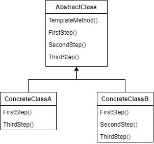
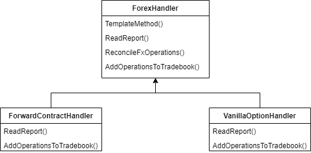
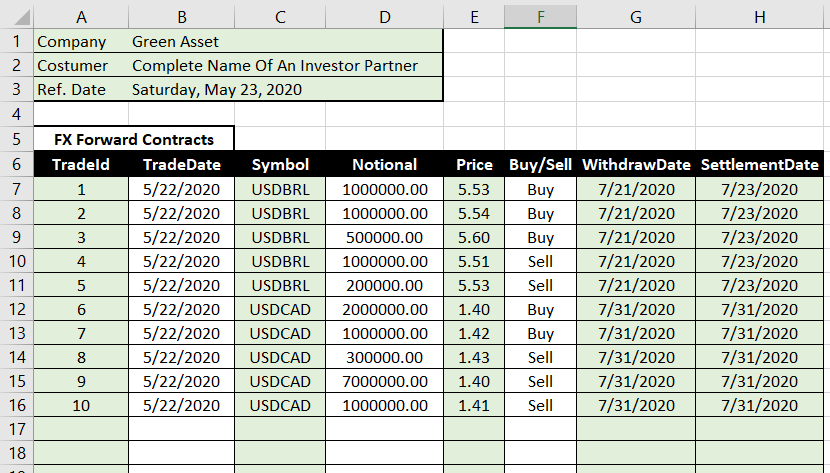
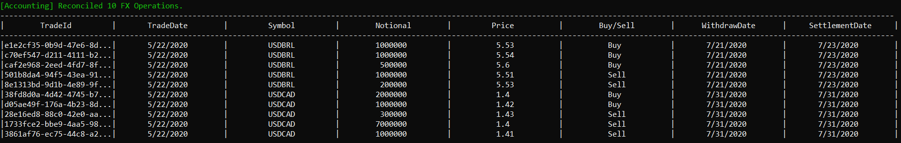
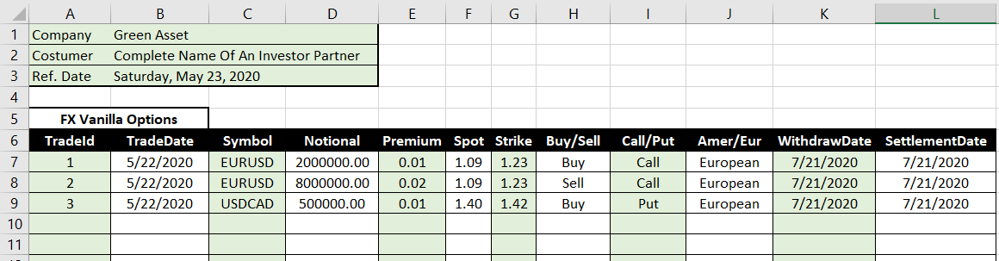
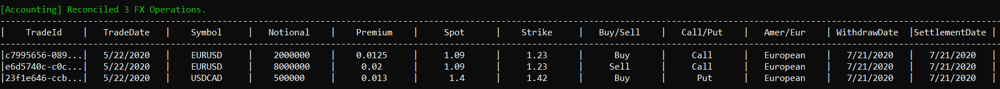

# Template Method

Define the skeleton of an algorithm in an operation, deferring some steps to subclasses. Template Method lets subclasses redefine certain steps of an algorithm without changing the algorithm's structure.

It suggests that you segregate an algorithm in some steps that can be overriden. Each step can have a default implementation or be defined as abstract requiring a specific implementation. This pattern will not be overriden, it'll consist of the instructions to invoke each step, that are shared by different classes. 

So, it can be implementated as following.



## Problem

In this article, we'll see an example which goal is to solve the following problem: a financial analyst, everyday, must do the same steps in his job:

- Open spreadsheets that contain all the forex operations that were executed.
- Map them and send an e-mail/file to the Accounting team, in order to reconcile the forex operations.
- Register each operation in a Tradebook that is a source for the company analysis and keeps the forex operations history.

There is a relevant point here: the analyst must deal with two types of FX operations: FX forward contracts and FX vanilla options. It's not the intention of this article to explain both of them, but have in mind that they're received in different spreadsheets, consist of different information and each one have its specific Tradebook. Although the steps for both kind of operations are similar, the execution is different. 

So, it looks like a template method should invoke these steps. For each step we'll be able to execute a default or a particular implementation.



## Show me the code

First, let's see the Fx operation base contract. It contains forex operations common information, a method to define the operation id and a auxiliar method to print the details to a console window.

```csharp
public abstract class FxOperation
{
    protected Guid _id;
    protected readonly DateTime _tradedate;
    protected readonly CurrencyPair _currencypair;
    protected readonly double _notional;
    protected readonly Direction _direction;
    protected readonly DateTime _withdrawdate;
    protected readonly DateTime _settlementdate;

    protected FxOperation(DateTime tradedate, CurrencyPair currencypair, double notional, 
        Direction direction, DateTime withdrawdate, DateTime settlementdate)
    {
        _tradedate = tradedate;
        _currencypair = currencypair;
        _notional = notional;
        _direction = direction;
        _withdrawdate = withdrawdate;
        _settlementdate = settlementdate;
    }

    public void SetId(Guid id) => _id = id;

    public abstract void Print();
}
```

Forward contract and vanilla option inherits the previous abstract class and contains its specific fields and a print implementation.

```csharp
public class FxForwardContract : FxOperation
{
    private readonly double _price;
    public FxForwardContract(DateTime tradedate, CurrencyPair currencypair, double notional, 
        double price, Direction direction, DateTime withdrawdate, DateTime settlementdate) 
        : base(tradedate, currencypair, notional, direction, withdrawdate, settlementdate)
    {
        _price = price;
    }

    public override void Print()
    {
        CustomConsole.PrintRow(_id.ToString(), _tradedate.ToShortDateString(), _currencypair.ToString(), 
            _notional.ToString(), _price.ToString(), _direction.ToString(), 
            _withdrawdate.ToShortDateString(), _settlementdate.ToShortDateString());
    }
}
```
```csharp
public class FxVanillaOption : FxOperation
{
    private readonly double _premium;
    private readonly double _spot;
    private readonly double _strike;
    private readonly OptionType _type;
    private readonly ExecutionType _executiontype;

    public FxVanillaOption(DateTime tradedate, CurrencyPair currencypair, double notional,
        double premium, double spot, double strike, OptionType type, ExecutionType executiontype,
        Direction direction, DateTime withdrawdate, DateTime settlementdate)
        : base(tradedate, currencypair, notional, direction, withdrawdate, settlementdate)
    {
        _premium = premium;
        _spot = spot;
        _strike = strike;
        _type = type;
        _executiontype = executiontype;
    }

    public override void Print()
    {
        CustomConsole.PrintRow(_id.ToString(), _tradedate.ToShortDateString(), _currencypair.ToString(),
            _notional.ToString(), _premium.ToString(), _spot.ToString(), _strike.ToString(), _direction.ToString(),
            _type.ToString(), _executiontype.ToString(), _withdrawdate.ToShortDateString(), _settlementdate.ToShortDateString());
    }
}
```

To execute the analyst job steps we'll use a ForexHandler. The following class has a default implementation for reconciling operations which instructions are the same for both forward and options operations. The ReadReport and AddOperationsToTradebook abstract methods do not require a default implementation, as each kind of operation has its particularity. Now, the key point of the pattern: a template method is defined as successive invokations of each step, which methods will be overriden by the concrete handlers.

```csharp
public abstract class ForexHandler
{
    public void TemplateMethod() 
    {
        var mappedFxOperations = ReadReport();
        var fxOperations = ReconcileFxOperations(mappedFxOperations);
        AddOperationsToTradebook(fxOperations);
    }

    protected abstract List<FxOperation> ReadReport();

    public List<FxOperation> ReconcileFxOperations(List<FxOperation> fxOperations)
    {
        Console.ForegroundColor = ConsoleColor.Green;
        Console.WriteLine($"\n[Accounting] Reconciled {fxOperations.Count} FX Operations.");
        Console.ForegroundColor = ConsoleColor.White;

        fxOperations.ForEach(o => o.SetId(Guid.NewGuid()));
        return fxOperations;
    }

    protected abstract void AddOperationsToTradebook(List<FxOperation> fxOperations);
}
```

Each concrete handler specifies its own implementations for reading a report and adding operations to tradebook.

```csharp
public class ForwardContractHandler : ForexHandler
{
    protected override List<FxOperation> ReadReport()
    {
        var forwardsReader = new ForwardContractReader();
        return forwardsReader.ReadReport();
    }

    protected override void AddOperationsToTradebook(List<FxOperation> fxOperations)
    {
        var forwardTradebook = new ForwardContractTradebook();
        forwardTradebook.AddRange(fxOperations);
    }
}
```
```csharp
public class VanillaOptionHandler : ForexHandler
{
    protected override List<FxOperation> ReadReport()
    {
        var optionsReader = new VanillaOptionReader();
        return optionsReader.ReadReport();
    }

    protected override void AddOperationsToTradebook(List<FxOperation> fxOperations)
    {
        var optionTradebook = new VanillaOptionTradebook();
        optionTradebook.Notify(fxOperations);
    }
}
```

So, when the client invokes the template Method, the specific steps will be executed as defined by the concrete handler and the common step will be executed as defined by the abstraction.

Let's execute it for reading a forward contract report.

```csharp
var forwardHandler = new ForwardContractHandler();
forwardHandler.TemplateMethod();
```

Here is an example of a FX Forward Contracts report.



Output:



Now we'll do the same for reading a vanilla option report. We only need to change the handler we're using.

```csharp
var vanillaOptionHandler = new VanillaOptionHandler();
vanillaOptionHandler.TemplateMethod();
```

Here is an example of a FX Vanilla Option report.



Output:



The implementation details to read reports and insert operations to tradebook were not presented in this article because they're not relevant to the pattern understanding.

## Use cases

Use Template Method Pattern when:

- Multiple classes contain a lot of similar algorithms, with specific variations.
- Your class contains variants of particular step in it algorithms.

## Advantages

- Reduces code duplication.
- Creates an abstraction for the client to handle the template method object.
- Segregates an algorithm in well defined steps. 
- The client is unaware about the steps design and implementation, it only knows the template Method.

## Disadvantages

- Does not provide a behavior change at runtime, as it's an inheritance based pattern.
- Increases complexity with a new hierarchy.

## Comparisons

### Strategy

The Strategy Pattern provides a way to change an object behavior by creating algorithms variants using composition. The focus is not to vary an algorithm, but a whole object behavior. It's not a segregation of common and particular steps. The composition structure also allows a behavior to change at runtime. One the other hand, the Template Method Pattern focus one defining particular steps implementations via inheritance structure and, consequently, it's a static variation, it cannot be changed at runtime.

## References

https://refactoring.guru/design-patterns/template-method

https://www.dofactory.com/net/template-method-design-pattern

https://github.com/ExcelDataReader/ExcelDataReader

Pluralsight Course: *Design Patterns in Java: Behavioral - Template Method Pattern*. By Bryan Hansen.    
    
Pluralsight Course: *Design Patterns in Swift: Behavioral - Template Method*. By Karoly Nyisztor.

Udemy Course: *Design Patterns in C# and .NET - Template Method*. By Dmitri Nesteruk.