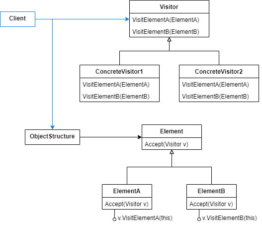
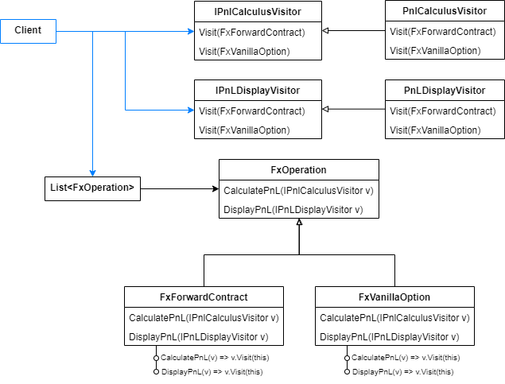
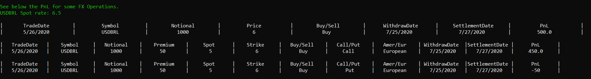

# Visitor

Represent an operation to be performed on the elements of an object structure. Visitor lets you define a new operation without changing the classes of the elements on which it operates.

When you have a structure like a collection, tree, hierarchy and each element has its own way of executing an action, you can use this pattern to define these behaviours at a single place and keep the elements clean.

The players involved in this solution are the following.

- Visitor: it's an abstraction that declares a Visit operation for each concrete element of an object structure. Each operation signature identifies the element that will send Visit requests.
- ConcreteVisitor: implements each operation declared by Visitor. Each implementation consists of the algorithm defined for the corresponding element of the structure. This object usually stores the element state.
- Element: has an Accept method uses a visitor to be executed.
- ConcreteElement: implement the accept method.



## Problem

Suppose a financial institution has a wallet containing forex exchange operations. Among these operations, there are forward contracts and vanilla options (see the references for business information). Consider that the financial team needs an automatic way of calculating the PnL for each operation. The problem is that each kind of operation has its particular rules to calculate the PnL.

We'll present a possible solution that is based on Visitor Pattern. 

- Structure: will be simplified as a list. 
- Elements: FxOperation. It declares a method for calculating the PnL and a method for Displaying it. 
- Concrete elements: FxForwardContracts and FxVanillaOption. Implements the FxOperation methods. They receive the visitors and executes the corresponding Visit method.
- Visitors interfaces: declares methods to support both kinds of operations.
- Concrete visitors: defines the PnL calculus and display algorithms for both kinds of operations.



## Show me the code

The following classes contain the algorithms for calculating and displaying the PnL. They're the visitors.

```csharp
public interface IPnlCalculusVisitor
{
    decimal Visit(FxForwardContract fxForwardContract);
    decimal Visit(FxVanillaOption fxVanillaOption);
}

public class PnLCalculusVisitor : IPnlCalculusVisitor
{
    private readonly decimal _spotRate;
    public PnLCalculusVisitor(decimal spotRate) => _spotRate = spotRate;

    public decimal Visit(FxForwardContract fxForwardContract)
    {
        var result = (_spotRate - fxForwardContract.Price) * fxForwardContract.Notional;

        return fxForwardContract.Direction == Sell ? -result : result;
    }

    public decimal Visit(FxVanillaOption fxVanillaOption)
    {
        var sellFactor = fxVanillaOption.Direction == Sell ? -1 : 1;

        // Business rules specify that there are only these two options, that's why we're not worried about scalability now.
        // Calculus methods are not showed in this article, but are available in the project repository.
        if (fxVanillaOption.Type == Call) return CalculateCallOptionPnL(fxVanillaOption) * sellFactor;
        if (fxVanillaOption.Type == Put) return CalculatePutOptionPnL(fxVanillaOption) * sellFactor;
        return default;
    }
}
```
```csharp
public interface IPnLDisplayVisitor
{
    void Visit(FxForwardContract fxForwardContract);
    void Visit(FxVanillaOption fxVanillaOption);
}

public class PnLDisplayVisitor : IPnLDisplayVisitor
{
    private readonly decimal _pnlValue;
    public PnLDisplayVisitor(decimal pnlValue) => _pnlValue = pnlValue;

    public void Visit(FxForwardContract fxForwardContract)
    {
        // FxForwardContract display algorithm.
    }

    public void Visit(FxVanillaOption fxVanillaOption)
    {
        // FxVanillaOption display algorithm.
    }
}
```

Here, are the operations of the FX wallet. Their methods invokes the Visit methods which contain the specific algorithms, as previously presented.

```csharp
public abstract class FxOperation
{
    public DateTime Tradedate { get; set; }
    public CurrencyPair Currencypair { get; set; }
    public decimal Notional { get; set; }
    public Direction Direction { get; set; }
    public DateTime Withdrawdate { get; set; }
    public DateTime Settlementdate { get; set; }

    protected FxOperation(DateTime tradedate, CurrencyPair currencypair, decimal notional, 
        Direction direction, DateTime withdrawdate, DateTime settlementdate)
    {
        Tradedate = tradedate;
        Currencypair = currencypair;
        Notional = notional;
        Direction = direction;
        Withdrawdate = withdrawdate;
        Settlementdate = settlementdate;
    }

    public abstract decimal CalculatePnL(IPnlCalculusVisitor visitor);
    public abstract void DisplayPnL(IPnLDisplayVisitor visitor);
}
```
```csharp
public class FxForwardContract : FxOperation
{
    public decimal Price{ get; private set; }

    public FxForwardContract(DateTime tradedate, CurrencyPair currencypair, decimal notional, 
        decimal price, Direction direction, DateTime withdrawdate, DateTime settlementdate) 
        : base(tradedate, currencypair, notional, direction, withdrawdate, settlementdate)
    {
        Price = price;
    }

    public override decimal CalculatePnL(IPnlCalculusVisitor visitor) => visitor.Visit(this);
    public override void DisplayPnL(IPnLDisplayVisitor visitor) => visitor.Visit(this);
}
```
```csharp
public class FxVanillaOption : FxOperation
{
    public decimal Premium { get; set; }
    public decimal Spot { get; set; }
    public decimal Strike { get; set; }
    public OptionType Type { get; set; }
    public ExecutionType Executiontype { get; set; }

    public FxVanillaOption(DateTime tradedate, CurrencyPair currencypair, decimal notional,
        decimal premium, decimal spot, decimal strike, OptionType type, ExecutionType executiontype,
        Direction direction, DateTime withdrawdate, DateTime settlementdate)
        : base(tradedate, currencypair, notional, direction, withdrawdate, settlementdate)
    {
        Premium = premium;
        Spot = spot;
        Strike = strike;
        Type = type;
        Executiontype = executiontype;
    }

    public override decimal CalculatePnL(IPnlCalculusVisitor visitor) => visitor.Visit(this);

    public override void DisplayPnL(IPnLDisplayVisitor visitor) => visitor.Visit(this);
}
```

When the client must traverse a structure executing an action for each element, it can simply deal with the element abstraction and pass a visitor instance for the element methods.

```csharp
var fxOperations = new List<FxOperation>
{
    new FxForwardContract(DateTime.UtcNow, USDBRL, 1000, 6m, Buy,
        DateTime.UtcNow.AddDays(60), DateTime.UtcNow.AddDays(62)),

    new FxVanillaOption(DateTime.UtcNow, USDBRL, 1000, 50, 5m, 6m, Call, European, Buy,
        DateTime.UtcNow.AddDays(60), DateTime.UtcNow.AddDays(62)),

    new FxVanillaOption(DateTime.UtcNow, USDBRL, 1000, 50, 5m, 6m, Put, European, Buy,
        DateTime.UtcNow.AddDays(60), DateTime.UtcNow.AddDays(62))
};

var spotRate = 6.5m;
fxOperations.ForEach(f => GeneratePnlForOperation(f, spotRate));
```
```csharp
private static void GeneratePnlForOperation(FxOperation fxOperation, decimal spotRate)
{
    var calculatePnl = fxOperation.CalculatePnL(new PnLCalculusVisitor(spotRate));
    fxOperation.DisplayPnL(new PnLDisplayVisitor(calculatePnl));
}
```
Note that the forward and option operations have different algorithms to calculate the PnL and to display it. Each operation used the corresponding Visit method. 

Using this pattern, we traversed the collection without worring about the particular algorithms.

Output:



## Use cases

Use Visitor Pattern when:

- Your application contains a structure in which each element has its particular way if executing a common action.
- Visitor can be used at any structure of objects, not only hierarchy and trees.
- You want to provide a specific behavior to classes methods without polluting them.

## Advantages

- Adds particular behavior to a range of different classes, without adding complexity to them. All bevaviours are defined in a single point of the code.
- You can set specific behaviours only for classes in which they're necessary. The rest of the structure classes doesn't need be visitable.
- In contrast to the Strategy, Visitor allows setting a behavior at compile time, preventing a class from owning another class bevahior.

## Disadvantages

- When a new element is added to structure, you'll probably have to change the visitor interface and implementations to add the visitor specific method.
- The classic implementation can damage an object encapsulation, as the visitor may access the object methods and fields. In these cases, you may pass only the required values to visit method.
- Visitor are stateful objects, so a new instance must be passed everytime.

## Comparisons

### Strategy 

The Strategy can be used when you have one type of object and you want to apply multiple operations to it. You can set and reset strategies at runtime, so the object can change its behavior dinamically. On the other hand, Visitor is used when you have a structure of elements and each element has its particular algorithm. You specify the Visit method at compile time, so it avoids an element from using the other's method.

## References

https://www.investopedia.com/terms/f/forward-exchange-contract.asp

https://www.investopedia.com/terms/v/vanillaoption.asp

https://refactoring.guru/design-patterns/visitor

Pluralsight Course: *C# Design Patterns: Visitor*. By Harrison Ferrone.    
    
Pluralsight Course: *Design Patterns in Java: Behavioral - Visitor Pattern*. By Bryan Hansen.

Pluralsight Course: *Tactical Design Patterns in .NET: Managing Responsibilities - Visitor Design Pattern and Encapsulation*. By Zoran Horvat.

Udemy Course: *Design Patterns in C# and .NET - Visitor*. By Dmitri Nesteruk.

## Todo

Refatoring Guru comparisons
