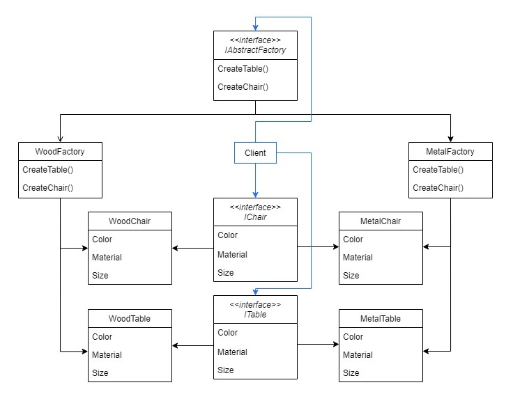

# Abstract Factory

The Abstract Factory Pattern is a creational design pattern that provides a interface to encapsulate the creation of related objects  families without specifying their concrete classes.

## Problem

Suppose a home and kitchen utilities store. The store catalog is composed by differents products manufactured from differents materials. For a simple example, consider the catalog contains two products, tables and chairs, made from two materials, wood and metal.

Let's exemplify the Abstract Factory pattern.

- List all products families and all products they must contain
Families: Wood Products & Metal Products
Products: Chairs & Tables

 -  Matrix of products and families

|       			| Wood      		| Metal      	|
|-------			|-----------		|------------	|
| **Chair** 	| WoodChair 	| MetalChair 	|
| **Table** 	| WoodTable 	| MetalTable 	|

 - Make a diagram with abstract and concretes factories and products



## Show me the code

- The **Abstract Product** is an interface or an abstract class that contains the properties and behaviours of the concrete products.

```
public abstract class Chair
{
    public Color Color { get; set; }
    public ProductSize Size { get; set; }
    public ProductMaterial Material { get; set; }
}
```
```
public abstract class Table
{
    public Color Color { get; set; }
    public ProductSize Size { get; set; }
    public ProductMaterial Material { get; set; }
}
```

- **Concrete products** classes must implement or derive from the abstract products.

```
public class WoodChair : Chair
{
    public WoodChair(Color color, ProductSize size)
    {
        Color = color;
        Size = size;
        Material = ProductMaterial.Wood;
    }
}

public class MetalChair : Chair
{
    public MetalChair(Color color, ProductSize size)
    {
        Color = color;
        Size = size;
        Material = ProductMaterial.Metal;
    }
}
```
```
public class WoodTable : Table
{
    public WoodTable(Color color, ProductSize size)
    {
        Color = color;
        Size = size;
        Material = ProductMaterial.Wood;
    }
}

public class MetalTable : Table
{
    public MetalTable(Color color, ProductSize size)
    {
        Color = color;
        Size = size;
        Material = ProductMaterial.Metal;
    }
}
```

- The **Abstract Factory** is an interface or abstract class that contains de methods signatures needed to create the products

```
public interface IHomeAndKitchenFactory
{
    Chair CreateChair(Color color, ProductSize size);
    Table CreateTable(Color color, ProductSize size);
}
```

- For each product family there is a **Concrete Factory** that implements or override the Abstract Factory methods with the products creation instructions.

```
public class WoodFactory : IHomeAndKitchenFactory
{
    public Chair CreateChair(Color color, ProductSize size)
    {
        return new WoodChair(color, size);
    }

    public Table CreateTable(Color color, ProductSize size)
    {
        return new WoodTable(color, size);
    }
}
```
```
public class MetalFactory : IHomeAndKitchenFactory
{
    public Chair CreateChair(Color color, ProductSize size)
    {
        return new MetalChair(color, size);
    }

    public Table CreateTable(Color color, ProductSize size)
    {
        return new MetalTable(color, size);
    }
}
```

- At the client side, the application chooses products family according to the configuration or system environment. So, it initializes the concrete factory of this family. Client uses only interfaces declared by Abstract Factory and Abstract Products.

```
static void Main(string[] args)
{
    Console.WriteLine("Abstract Factory");
    Console.WriteLine("Home and Kitchen Example");

    var metalFactory = new MetalFactory();
    var woodFactory = new WoodFactory();

    Console.WriteLine("\nBlue, small and wood chair:");
    CreateChair(woodFactory, Color.Blue, ProductSize.Small);
    Console.WriteLine("\nBlack, medium and wood table:");
    CreateTable(woodFactory, Color.Black, ProductSize.Medium);

    Console.WriteLine("\nRed, small and metal chair:");
    CreateChair(metalFactory, Color.Red, ProductSize.Small);
    Console.WriteLine("\nWhite, large and metal table:");
    CreateTable(metalFactory, Color.White, ProductSize.Large);
}

private static void CreateChair(IHomeAndKitchenFactory factory, Color color, ProductSize size)
{
    var chair = factory.CreateChair(color, size);
    PrintProductDetails(chair.Color, chair.Material, chair.Size);
}

private static void CreateTable(IHomeAndKitchenFactory factory, Color color, ProductSize size)
{
    var table = factory.CreateTable(color, size);
    PrintProductDetails(table.Color, table.Material, table.Size);
}

private static void PrintProductDetails(Color color, ProductMaterial material, ProductSize size)
{
    Console.WriteLine($"Color: {color.Name} - Size: {size} - Material: {material}");
}
```

## Use cases

Use an Abstract Factory when:

You can have multiple product families creation.
The application should use only one of these families at a given time.
Products from differents families should not be used together and should be unrelated.
A family of a product is designed to be used together and this contraint must be enforced.
Products creation, composition and representation are not relevant for the client.
You need to provide a library of products but you need to reveal only their interfaces, not their implementation.

## Advantages

The Abstract Factory encapsultes details of product creation and clients deal only with factories and products abstractions.
Avoids coupling between concrete products creation and client code.
Open/Closed Principle: new product families can be introduced by adding a new Concrete Factory that implements or derives from the Abstract Factory.
Single Responsibility Principle: each Concrete Product creation is extracted to a single place, the Concrete Factory. Any necessary change would be performed at this place.
The Concrete Factory is instantiated in a single place. It makes easy to change the product family an application uses.
Consistency among products is granted as all of them must belong to the same family.

## Disadvantages

Product creation methods parameters must be the same for all the families. The method `WoodFactory.CreateChair` must have the same parameters as `MetalFactory.CreateChair`.
A large number of concrete products would result in complexity when adding a new product family.
New products requires all factories, including the abstract, to have a new method for their creation.

## Tips
If our application requires a single instance of a ConcreteFactory, we should implement it as Singleton, in order to reuse the same instance.

## References

https://medium.com/@hitherejoe/design-patterns-abstract-factory-39a22985bdbf

https://refactoring.guru/design-patterns/abstract-factory

Pluralsight Course: *Tactical Design Patterns in .NET: Creating Objects*. By Zoran Horvat.

## TODOs

Topic "Relations with Other Patterns" from https://refactoring.guru/design-patterns/abstract-factory

Last tip from https://medium.com/@hitherejoe/design-patterns-abstract-factory-39a22985bdbf talks about prototype pattern