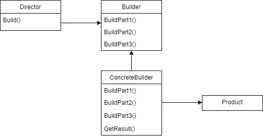
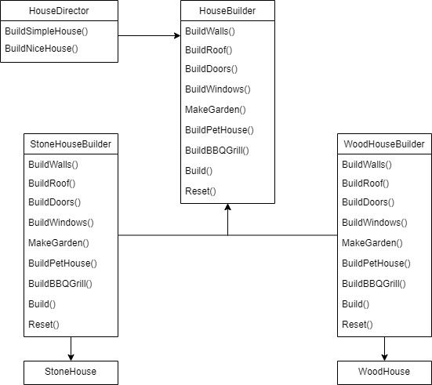

# Builder

Builder is a design pattern that allows the creation of differents types and representations of an object reusing the same construction code. It makes easy to create objects that contain many and nested properties as it provides a step-by-step construction, a composition mechanism. The final result of Builder pattern is a concrete product construction, not an abstract product.

## Problem

Suppose someone needs to construct a house. There are several steps for getting the house done. Consider we have these mandatory steps: BuildWalls, BuildRoof, BuildDoors and BuildWindows. You can also have these optional steps: MakeGarden, BuildPetHouse and InstallBBQGrill.

## Example

The Builder Pattern suggests the following rules for creating a new product.

 - List all data that each builder must generate.
```
public class House
{
    public int WallsBuilt { get; set; }
    public int DoorsBuilt { get; set; }
    public int WindowsBuilt { get; set; }
    public bool HasRoof { get; set; }
    public bool HasGarden { get; set; }
    public bool HasPetHouse { get; set; }
    public bool HasBBQGrill { get; set; }
}
```

 - Builder Pattern Diagram:



 - Extracts the product construction code to a new class named **builders**. Products ocassionally have variants in their construction, for example, a house can be constructed from wood as well as stone and each step of the construction process can differ according to the material. In these cases, specific builder can be created for each variant of the product construction. A builder defines and keep track (at the object field inside builder) of the created representation. Also, create an abstract interface of these builders.

```
public interface IHouseBuilder
{
    void BuildWalls(int wallsNumber);
    void BuildRoof();
    void BuildDoors(int doorsNumbers);
    void BuildWindows(int windowsNumber);
    void MakeGarden();
    void BuildPetHouse();
    void BuildBBQGrill();
}
```
```
public class StoneHouseBuilder : IHouseBuilder
{
    private House _stoneHouse;

    public IHouseBuilder BuildBBQGrill()
    {
        _stoneHouse.HasBBQGrill = true;
        return this;
    }

    public IHouseBuilder BuildDoors(int doorsNumbers)
    {
        // Doors for stone house
        _stoneHouse.DoorsBuilt = doorsNumbers;
        return this;
    }

    public IHouseBuilder BuildPetHouse()
    {
        _stoneHouse.HasPetHouse = true;
        return this;
    }

    public IHouseBuilder BuildRoof()
    {
        _stoneHouse.HasRoof = true;
        return this;
    }

    public IHouseBuilder BuildWalls(int wallsNumber)
    {
        // Doors for stone house
        _stoneHouse.WallsBuilt = wallsNumber;
        return this;
    }

    public IHouseBuilder BuildWindows(int windowsNumber)
    {
        // Doors for stone house
        _stoneHouse.WindowsBuilt = windowsNumber;
        return this;
    }

    public IHouseBuilder MakeGarden()
    {
        _stoneHouse.HasGarden = true;
        return this;
    }

    public House Build()
    {
        House stoneHouse = _stoneHouse;
        Reset();
        stoneHouse.Material = HouseMaterial.Stone;
        return stoneHouse;
    }

    public void Reset()
    {
        _stoneHouse = new House();
    }
}
```
```
public class WoodHouseBuilder : IHouseBuilder
{
    private House _woodHouse;

    public IHouseBuilder BuildBBQGrill()
    {
        _woodHouse.HasBBQGrill = true;
        return this;
    }

    public IHouseBuilder BuildDoors(int doorsNumbers)
    {
        // Doors for wood house
        _woodHouse.DoorsBuilt = doorsNumbers;
        return this;
    }

    public IHouseBuilder BuildPetHouse()
    {
        _woodHouse.HasPetHouse = true;
        return this;
    }

    public IHouseBuilder BuildRoof()
    {
        _woodHouse.HasRoof = true;
        return this;
    }

    public IHouseBuilder BuildWalls(int wallsNumber)
    {
        // Walls for wood house
        _woodHouse.WallsBuilt = wallsNumber;
        return this;
    }

    public IHouseBuilder BuildWindows(int windowsNumber)
    {
        // Windows for wood house
        _woodHouse.WindowsBuilt = windowsNumber;
        return this;
    }

    public IHouseBuilder MakeGarden()
    {
        _woodHouse.HasGarden = true;
        return this;
    }

    public House Build()
    {
        House woodHouse = _woodHouse;
        Reset();
        woodHouse.Material = HouseMaterial.Wood;
        return woodHouse;
    }

    public void Reset()
    {
        _woodHouse = new House();
    }
}
```

- Frequently, builder methods are called recurrently in the same order and with the same parameter values. To avoid replicating builder invocations code, you can use **Directors**. A Director is a class that defines the order in which to execute the building steps. It also hides the construction implementation from the client.

```
public class HouseDirector
{
    private IHouseBuilder _houseBuilder;

    public void SetBuilder(IHouseBuilder houseBuilder)
    {
        houseBuilder.Reset();
        _houseBuilder = houseBuilder;
    }

    public IHouseBuilder BuildSimpleHouse()
    {
        return _houseBuilder
            .BuildWalls(4)
            .BuildDoors(1)
            .BuildWindows(1)
            .BuildRoof();
    }

    public IHouseBuilder BuildNiceHouse()
    {
        return _houseBuilder
            .BuildWalls(16)
            .BuildDoors(4)
            .BuildWindows(6)
            .BuildRoof()
            .MakeGarden()
            .BuildPetHouse()
            .BuildBBQGrill();
    }
}
```

- Finally, the client can use the Director class to create a Product without worrying about construction implementation. The Director defines the order and parameters of the execution and the builder executes it. In this example, the client can create a simple stone house as follows.

```
var houseDirector = new HouseDirector();
var stoneHouseBuilder = new StoneHouseBuilder();

houseDirector.SetBuilder(stoneHouseBuilder);
houseDirector.BuildSimpleHouse();

var simpleStoneHouse = stoneHouseBuilder.Build();
```



## Use cases

Use a Builder when:

You need to construct multiple representations of an object.
The client should be independent of the parts that make an object.

## Advantages

Provides construction of differents object representations.

Hides product construction details.

The construction code of each object part is written once and is reused by different builders.

Builder pattern can be used also to prevent a client to create an inconsistent object. Construction rules can be defined at the Builder methods.

## Disadvantages

Sometimes Builder pattern is overkill for some classes construction. Consider using it for high complexity construction classes. If a class has a constructor with too many instructions, probably Builder pattern is a nice idea.

## Tips

No abstract class is necessary for products. As the representations differs from each other, there is no relevant gain in creating abstractions.

The final result of Builder pattern is a concrete product, not an abstraction. Type safety is granted and avoids polymorphism troubles.


The difference of Builder and Abstract Factory is that the first one focus in complex objects step-by-step construction while the second emphasize in constructing family related products (simple or complex).

## Adding Finite State Machine to Builder

During an object construction process, builders eventually will throw exceptions when construction inconsistency occurs, that means imperative validations are occurring at Builder methods. To avoid this, a finite state machine can be added to control and validate the object construction.

See a simple example of a Builder.

```
public class Person
{
    public string Name { get; set; }

    public Person(string name)
    {
        if (string.IsNullOrEmpty(Name))
            throw new ArgumentException();
        Name = name;
    }
}

public class PersonBuilder
{
    private string _name;

    public PersonBuilder SetName(string name)
    {
        if (string.IsNullOrEmpty(name))
            throw new ArgumentException();
        _name = name;
        return this;
    }

    public Person Build()
    {
        return new Person(_name);
    }
}
```

Note that, if the client calls Build() method without calling SetName(), Build() would find an ArgumentException, as new Person(string name) does not accept null nor empty values.

To avoid throwing an axception from a Builder method, we can add a Finite State Machine (State Pattern) that will be responsible for throwing this exception.

Here we added a NameState machine which first state is 'UnitializedName'.

 ```
public class PersonBuilder
{
    private INameState _nameState = new UnitializedNameState();

    public PersonBuilder SetName(string name)
    {
        _nameState = _nameState.Set(name);
        return this;
    }

    public Person Build()
    {
        return new Person(_nameState.Get());
    }
}
```

If we call Build method without calling SetName instructions, it will return an InvalidOperationException.

```
public interface INameState
{
    INameState Set(string name);
    string Get();
}
```
```
public class UnitializedNameState : INameState
{
    public INameState Set(string name) => new InitializedNameState(name);
    public string Get() => throw new InvalidOperationException();
}
```

When we call SetName, 'Name' state changes from 'UnitializedNameState' to 'InitializedNameState' and, at this state, the name value is stored at the Infinite Machine State in a field called _name. Note that at this state change, a validation is performed to check value is not null nor empty.

If we call SetName again, it will continue at InitializedNameState, but storing the new name value.

```
public class InitializedNameState : INameState
{
    private string _name;

    public InitializedNameState(string name)
    {
        if (string.IsNullOrWhiteSpace(name))
            throw new ArgumentException();
        _name = name;
    }

    public INameState Set(string name) => new InitializedNameState(name);

    public string Get() => _name;
}
```

If the client tries to build a person with no name, the NameState machine will throw an InvalidOperationException. In other words, the Infite State Machine decided to throw this exception, not the Builder.

## Builder Inheritance with Recursive Generics

Ocasionally it'll be necessary to create an inheritance from existing builder. If you just try to inherit the super class builder, it will not work, because the super class methods do not return the derived builder type.

Suppose we have the following scenario: an entity Person with name, age and job position.
For building a person object with name and age we have a PersonInfoBuilder. But, we want to build a person with also a job position value. So we have a derived PersonJobBuilder. We can not just derive, because PersonInfoBuilder.WithName() would return a PersonInfoBuilder, not a PersonJobBuilder.

```
public class Person
{
    public string Name { get; set; }
    public int Age { get; set; }
    public string Position { get; set; }
}
```
```
public abstract class PersonBuilder
{
    protected Person _person;

    public PersonBuilder()
    {
        _person = new Person();
    }

    public Person Build()
    {
        return _person;
    }
}
```
```
public class PersonInfoBuilder<TBuilder> : PersonBuilder
    where TBuilder : PersonInfoBuilder<TBuilder>
{
    public TBuilder WithName(string name)
    {
        _person.Name = name;
        return (TBuilder) this;
    }

    public TBuilder WithAge(int age)
    {
        _person.Age = age;
        return (TBuilder) this;
    }
}
```

Note that we added a recursive generic constraint for PersonInfoBuilder. The generic parameter TBuilder will be an anemic Auxiliary Builder class, that will be returned by all methods from all builders classes of the inheritance tree.

The derived PersonJobBuilder will necessary inherits from PersonInfoBuilder of TBuilder as defined in the above constraint.

```
public class PersonJobBuilder<TBuilder> : PersonInfoBuilder<TBuilder>
    where TBuilder : PersonJobBuilder<TBuilder>
{
    public TBuilder WorkAs(string position)
    {
        _person.Position = position;
        return (TBuilder) this;
    }
}
```

Note that we replicated the recursive generic in PersonJobBuilder class. So, we can still continue the inheritance tree from this class. We'll now create the PersonAuxiliaryBuilder class (to use as TBuilder) that inherits from PersonJobBuilder of PersonAuxiliaryBuilder.

```
public class PersonAuxiliaryBuilder : PersonJobBuilder<PersonAuxiliaryBuilder>
{
}
```

The class called PersonAuxiliaryBuilder is just a auxiliary class that will be used as builders return type.
Client can now create a new Person object by calling the PersonAuxiliaryBuilder classes.

```
var person = new PersonAuxiliaryBuilder()
    .WithName("Leandro")
    .WithAge(25)
    .WorkAs("Developer")
    .Build();
```

To create a new derived builder just continue with the recursive generic mechanism.

## References

https://refactoring.guru/design-patterns/builder

https://refactoring.guru/design-patterns/builder/csharp/example

Pluralsight Course: *Tactical Design Patterns in .NET: Creating Objects - Returning to Concrete Classes with the Builder Pattern*. By Zoran Horvat.

Udemy Course: *Design Patterns in C# and .NET - Fluent Builder Inheritance with Recursive Generics*. By Dmitri Nesteruk.

## TODOs

Check functional building and facade building from Dmitri Nesteruk course.