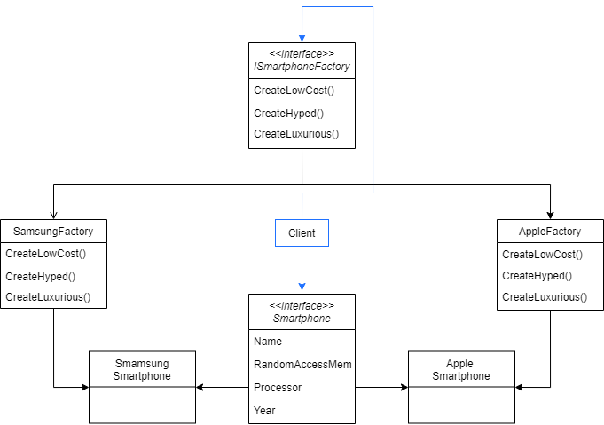

# FactoryMethod

The Factory Method Pattern defines an interface or an abstract class for creating an object, but lets subclasses (concrete classes) decide which class to instantiate. Factory Method lets a class defer instantiation to subclasses.

## Problem

To explain this pattern we will create an example of a Smartphone factory. This factory is responsible for creating new smartphones from both Samsung and Apple brand. Each brand has it own way of constructing a smartphone, that will be defined by the factory method.

## Example

Following Factory method definition, we have an ISmartphoneFactory that will be the abstraction between the client and the implementation of smartphone construction. This abstraction defers smartphones instantiation to the concrete factories SamsungFactory and AppleFactory.

The abstraction exposes Smartphone object to the client, while concrete factories deal with SamsungSmartphone and AppleSmartphone objects. This structure decouples the Smartphone objects creation from the client.

The diagram resumes what was said above.



## Show me the code

 - The factory abstraction contains methods signatures for creating three (just to enrich the example) different categories smartphones. So, for a specific brand, the client can create an instance of a low cost, a hyped and a luxurious smartphone. These interface methods will have a specific implementation for each concrete factory. They are called factory methods.

 - Factory methods return an abstraction of the product for the client. These methods can also have a default implementation.

```csharp
public interface ISmartphoneFactory
{
    Smartphone CreateLowCost();
    Smartphone CreateHyped();
    Smartphone CreateLuxurious();
}
```

 - For each brand there is a concrete factory that is responsible for instantiating smartphones and for the factory methods implementation. The concrete factory is used to be accessed by the client via the abstraction. But, it can also be invoked directly if applicable.

 - Note that we have three factory methods, one for each product variation. Another implementation would have a single method that receives a parameter indicating each variation of the product it should create.

```csharp
public class AppleSmartphoneFactory : ISmartphoneFactory
{
    public Smartphone CreateLowCost() => new AppleSmartphone("IPhone 5C", 1, 1.3f, 2013);

    public Smartphone CreateHyped() => new AppleSmartphone("IPhone XS", 4, 10f, 2018);

    public Smartphone CreateLuxurious() => new AppleSmartphone("IPhone 11 PRO MAX", 4, 13f, 2019);
}
```
```csharp
public class SamsungSmartphoneFactory : ISmartphoneFactory
{
    public Smartphone CreateLowCost() => new SamsungSmartphone("Samsung J7", 2, 1.6f, 2018);

    public Smartphone CreateHyped() => new SamsungSmartphone("Samsung S10+", 8, 14f, 2019);

    public Smartphone CreateLuxurious() => new SamsungSmartphone("Samsung S20", 8, 17f, 2020);
}
```

 - As the client must deal only with product abstraction, we create Smarphone abstract class. The concrete products derive from the abstract class and only the respective concrete factory deals with the concrete product.

```csharp
public abstract class Smartphone
{
    public string Name { get; set; }
    public int RandomAccessMemory { get; set; }
    public float Processor { get; set; }
    public int Year { get; set; }

    public Smartphone(string name, int randomAccessMemory, float processor, int year)
    {
        Name = name;
        RandomAccessMemory = randomAccessMemory;
        Processor = processor;
        Year = year;
    }
}

public class AppleSmartphone : Smartphone
{
    public AppleSmartphone(string name, int randomAccessMemory, float processor, int year)
        : base(name, randomAccessMemory, processor, year)
    {
    }
}

public class SamsungSmartphone : Smartphone
{
    public SamsungSmartphone(string name, int randomAccessMemory, float processor, int year)
        : base(name, randomAccessMemory, processor, year)
    {
    }
}
```

 - Finally, the client can create smartphones using the factories abstraction used at the CreateAllSmartphones method and deal with the product abstraction as the PrintSmartphoneInfo does.

```csharp
static void Main(string[] args)
{
    var appleSmartphoneFactory = new AppleSmartphoneFactory();
    CreateAllSmartphones(appleSmartphoneFactory);
    var samsungSmartphoneFactory = new SamsungSmartphoneFactory();
    CreateAllSmartphones(samsungSmartphoneFactory);
}

private static void CreateAllSmartphones(ISmartphoneFactory smartphoneFactory)
{
    var lowCostSmartphone = smartphoneFactory.CreateLowCost();
    PrintSmartphoneInfo(lowCostSmartphone);
    var hypedSmartphone = smartphoneFactory.CreateHyped();
    PrintSmartphoneInfo(hypedSmartphone);
    var luxuriousSmartphone = smartphoneFactory.CreateLuxurious();
    PrintSmartphoneInfo(luxuriousSmartphone);
}

private static void PrintSmartphoneInfo(Smartphone smartphone)
{
    // Instruct to print smartphone details
}
```

## Use cases

Use a Factory Method when:

 - A class can't anticipate the class of objects it must create. For example, according to an enumerator value it will use a specific factory method.

 - You need an abstraction for differents implementations of an object construction.

 - Often, Factory Method is implemented joining Abstract Factory pattern. When you have multiple Product abstractions that should be created you can catch yourself applying factory method pattern for each one of them. If the products can be grouped into families, maybe it's a better ideia to use Abstract Factory. For example, instead of having one Factory method for SamsungSmartphone, one for SamsungNotebook and one for SamsungTelevision, you should have a SamsungFactory that creates all the three products.

## Advantages

- The client is totally decoupled from the product creation and deals only with factory and product abstractions.

- The factory method of a concrete product is defined in a single place, following the Single Responsibility Principle rules.

- New product variants can be introduced just by implementing the abstract factory and the product abstraction. It means that no modification to existing code will be done. These consequences agrees with Open/Closed principle.

## Disadvantages

- To create a single variant product it can be overkill, as we will introduce abstractions that result in new point of code evolution.

## References

https://www.codeproject.com/Articles/35789/Understanding-Factory-Method-and-Abstract-Factory

https://refactoring.guru/design-patterns/factory-method

Pluralsight Course: *Tactical Design Patterns in .NET: Creating Objects - Factory Method by the Book*. By Zoran Horvat.

Pluralsight Course: *Design Patterns in Java Creational - Demo: Factory*. By Bryan Hansen.

Udemy Course: *Design Patterns in C# and .NET - Factories Methods*. By Dmitri Nesteruk.