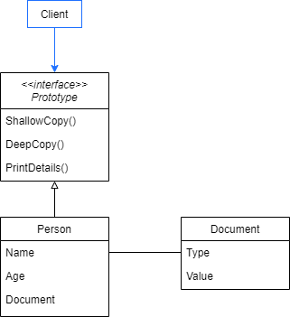
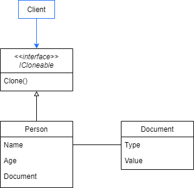
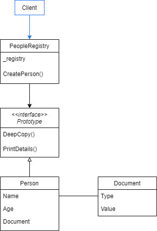

# Prototype

Specify the kinds of objects to create using a prototypical instance, and create new objects by copying this prototype.

## Problem

Suppose the client of your code asks for creating new a Person registry. You can create a new class Person and set each one of your characteristics. But, you could also have a Person prototype and use it as starting point to create a new Person. By definition, a prototype is a first, typical or preliminary model of something. So then, you can clone the prototype and modifty the deep copy with the new Person information.

We'll present different ways to implement the Prototype pattern and solve the above problem.

The Prototype pattern suggests the below diagram implementation.



## Show me the code

- First we create the abstraction called Prototype, that contains only methods related to the clone process. In most cases, it’s a single clone method, but in this example we'll have show different types of clone.

```
public abstract class Prototype
{
    public abstract Prototype ShallowCopy();
    public abstract Prototype DeepCopy();
    public abstract void PrintDetails();
}
```

- Here is the class Person that the client wants to create. It derives from Prototype and implements the cloning methods. The Person class is responsible for defining the steps to make a shallow and a deep copy of an existing instance and return a new one.

- Shallow copy just calls MemberwiseClone and cast the result. To perform a deep copy we also need to modify each nested object. This process would be tedious for instances of complex classes. Later in this article, we'll present an alternative for it.

```
public class Person : Prototype
{
    public string Name { get; set; }
    public int Age { get; set; }
    public Document Document { get; set; }

    public override Prototype ShallowCopy() => (Person) this.MemberwiseClone();

    public override Prototype DeepCopy()
    {
        var newPerson = (Person) this.MemberwiseClone();
        newPerson.Name = Name;
        newPerson.Document = new Document(Document.Type, Document.Value);
        return newPerson;
    }

    public override void PrintDetails()
    {
        Console.WriteLine($"Name: {Name}");
        Console.WriteLine($"Age: {Age}");
        Console.WriteLine($"DocumentType: {Document.Type}");
        Console.WriteLine($"DocumentValue: {Document.Value}");
    }
}

public class Document
{
    public DocumentType Type { get; set; }
    public string Value { get; set; }

    public Document(DocumentType type, string value)
    {
        Type = type;
        Value = value;
    }
}

public enum DocumentType
{
    CPF,
    CNPJ
}
```

- The client can now create new instances of any object that derives from Prototype. He calls the existing object cloning methods and receive the respective prototype. Then, he can modify it to get the desired object instance. Note that in this example we have two ways for generating a prototype: shallow and deep copy. If we make a shallow copy, modifications made in the new instance are reflected at the original instance. Frequently it's a not desired behavior that could be avoided using a deep copy.

```
static void Main(string[] args)
{
    Console.WriteLine("Prototype");
    Console.WriteLine("Person Prototype Example");

    var originalPerson = new Person()
    {
        Name = "Hara",
        Age = 25,
        Document = new Document(DocumentType.CPF, "xxx.xxx.xxx-xx")
    };

    var shallowCopy = originalPerson.ShallowCopy();
    var deepCopy = originalPerson.DeepCopy();
    Console.WriteLine("\nPerson copies before update");
    PrintOutput();

    originalPerson.Name = "Hara LTDA.";
    originalPerson.Age = 0;
    originalPerson.Document.Type = DocumentType.CNPJ;
    originalPerson.Document.Value = "xx.xxx.xxx/xxxx-xx";
    Console.WriteLine("\nPerson copies after update");
    PrintOutput();

    void PrintOutput()
    {
        Console.WriteLine($"\nShallow copy");
        shallowCopy.PrintDetails();

        Console.WriteLine($"\nDeep copy");
        deepCopy.PrintDetails();
    }
}
```

## IClonable

Frequently an IClonable interface is used at the Prototype Pattern. The interface has a single Clone() method that return an object.

The Prototype pattern using IClonable example follows the below diagram.



 - The implementation is similar to the previous example, but we have a single cloning method. You can decided between shallow and deep copy implementation.

```
public class Person : ICloneable
{
    public string Name { get; set; }
    public int Age { get; set; }
    public Document Document { get; set; }

    public object Clone() => this.MemberwiseClone();

    public void PrintDetails()
    {
        Console.WriteLine($"Name: {Name}");
        Console.WriteLine($"Age: {Age}");
        Console.WriteLine($"DocumentType: {Document.Type}");
        Console.WriteLine($"DocumentValue: {Document.Value}");
    }
}
```

- When the client invokes the cloning method, he receives an Object instance. So, casting the result is necessary.

```
static void Main(string[] args)
{
    Console.WriteLine("Prototype");
    Console.WriteLine("Clonable Person Example");

    var originalPerson = new Person()
    {
        Name = "Hara",
        Age = 25,
        Document = new Document(DocumentType.CPF, "xxx.xxx.xxx-xx")
    };

    var clonePerson = (Person) originalPerson.Clone();

    Console.WriteLine("\nPerson clone before update");
    clonePerson.PrintDetails();

    originalPerson.Name = "Hara LTDA.";
    originalPerson.Age = 0;
    originalPerson.Document.Type = DocumentType.CNPJ;
    originalPerson.Document.Value = "xx.xxx.xxx/xxxx-xx";

    Console.WriteLine("\nPerson clone after update");
    clonePerson.PrintDetails();
}
```

Some considerations of IClonable implementation:

- It requires looking at the implementation to realize each kind of copy it's performing. It's not explicity if the cloning method performs a shallow or a deep copy.

- The result of cloning method is an Object instance. So, casting the result is necessary and the client gets coupled to the concrete class.

## Prototype Registry

The previous examples uses an instance passed by the client to generate a prototype for a new instance. Often it's interesting to create pre-built prototypes that are ready to be cloned. This example presents a Prototype Registry, that contains a set of pre defined prototypes and provide it to the client.



- We still have a Prototype abstraction, but it performs only deep copies.

```
public abstract class Prototype
{
    public abstract Prototype DeepCopy();
    public abstract void PrintDetails();
}
```

- Person class implements the cloning method using a generic DeepCopy() method invocation that is an object extension. This method performs a serializing through deep copy. It's a way to deep copy an object without the complexity of setting each nested object a new value.

```
public class Person : Prototype
{
    public string Name { get; set; }
    public int Age { get; set; }
    public Document Document { get; set; }

    public override Prototype DeepCopy() =>this.DeepCopy<Person>();

    public override void PrintDetails()
    {
        Console.WriteLine($"Name: {Name}");
        Console.WriteLine($"Age: {Age}");
        Console.WriteLine($"DocumentType: {Document.Type}");
        Console.WriteLine($"DocumentValue: {Document.Value}");
    }
}

public static class ObjectExtensions
{
    public static T DeepCopy<T>(this T data)
    {
        var serializeSettings = new JsonSerializerSettings
        {
            ObjectCreationHandling = ObjectCreationHandling.Replace,
            ReferenceLoopHandling = ReferenceLoopHandling.Ignore,
            TypeNameHandling = TypeNameHandling.All
        };

        return JsonConvert.DeserializeObject<T>(
            JsonConvert.SerializeObject(data, serializeSettings),
            serializeSettings);
    }
}
```

 - Now, we'll show you the PeopleRegistry. A people registry initializes loading a set of pre-built prototype instances of Person. In this example, we have a male and a female prototype stored at a Dictionary where the keys are respectively "male" and "female".

```
public class PeopleRegistry
{
    private readonly Dictionary<string, Person> _registry = new Dictionary<string, Person>();

    public PeopleRegistry() => LoadPeopleRegistry();

    public Person CreatePerson(string registryName)
    {
        return _registry.GetValueOrDefault(registryName).DeepCopy<Person>();
    }

    private void LoadPeopleRegistry()
    {
        var malePerson = new Person()
        {
            Name = "Male Name",
            Age = 99,
            Document = new Document(DocumentType.CPF, "xxx.xxx.xxx-xx")
        };

        var femalePerson = new Person()
        {
            Name = "Female Name",
            Age = 99,
            Document = new Document(DocumentType.CPF, "xxx.xxx.xxx-xx")
        };

        _registry.Add("male", malePerson);
        _registry.Add("female", femalePerson);
    }
}
```

- Then, the client can use PeopleRegistry to create a new Prototype Instance by passing the prototype identifier. As the cloning method performs a deep copy, the new instance can be modified without modifying the stored prototype.

```
static void Main(string[] args)
{
    Console.WriteLine("Prototype");
    Console.WriteLine("Prototype Complete Example");

    var peopleRegistry = new PeopleRegistry();

    var malePerson = peopleRegistry.CreatePerson("male");
    Console.WriteLine("\nMale template");
    malePerson.PrintDetails();

    malePerson.Name = "Hara";
    malePerson.Age = 25;
    malePerson.Document.Value = "123.456.789.99";
    Console.WriteLine("\nMale Person");
    malePerson.PrintDetails();

    var femalePerson = peopleRegistry.CreatePerson("female");
    Console.WriteLine("\nFemale template");
    femalePerson.PrintDetails();

    femalePerson.Name = "Anne";
    femalePerson.Age = 30;
    femalePerson.Document.Value = "987.654.321.11";
    Console.WriteLine("\nFemale person");
    femalePerson.PrintDetails();
}
```

## Use cases

Use prototype when:

- The system should be independent of how the products are created, composed and represented.

- When the classes to instantiate are specified at run-time, so the Prototype pattern turns code independent on the concrete classes.

- When the instances of a class have a few combination of states. It may be more convenient to install a corresponding number of prototypes and clone them rather than instantiating the class manually,
each time with the appropriate state.

## Advantages

- New prototypes products are easily added by implementing the Prototype interface.

- Provides a set of pre-built prototypes that can be cloned avoiding manually object creations and repeated initialization code.

- Avoids factories classes inheritance to construct a complex object.

## Disadvantages

- Overkill for systems that uses very few objects initialization.

- Complexity growths if the object has a high number of states.

## References

https://refactoring.guru/design-patterns/prototype

Pluralsight Course: *Design Patterns in Java Creational - Demo: Prototype*. By Bryan Hansen.

Pluralsight Course: *C# Design Patterns: Prototype*. By Harrison Ferrone.

Udemy Course: *Design Patterns in C# and .NET - Prototype*. By Dmitri Nesteruk.