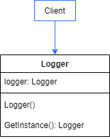

# Singleton

The Singleton Patterns ensures a class only has one instance, and provide a global point of access to
it.

## Problem

The first thing Singleton Pattern sets out to solve is creating a single object instance. Some objects of an application can be instantiated only one time. Some of these objects are thread pools, caches, objects that handle preferences and registry settings, loggers and drivers to external devices. In most cases, these objects must be acessible by many points of the code, so the Singleton Patterns also ensures global access for them.

## Show me the code

Let's start with a simple example. Suppose an application requires a Logger service that will be reused by the code.



- We create the Logger service class. Its constructor cannot be public, otherwise the client will be able to create new Logger instances. The method that calls the private constructor is a static method which ensures that, one time initialized, the Logger class will always return the same instance. This instance is stored at a private static field named _logger.

```
public class Logger
{
    private static Logger _logger;

    private Logger() { }

    public static Logger GetInstance()
    {
        if (_logger is null)
            _logger = new Logger();

        return _logger;
    }
}
```

- Note that if we never call GetInstance method, the Logger class will never be initialized. This is called Lazy Initialization.

- The Logger service can be consumed as below.

```
static void Main(string[] args)
{
    var firstInstance = Logger.GetInstance();
    var secondInstance = Logger.GetInstance();

    Console.WriteLine($"\nHas Logger.GetInstance generated a single instance? {firstInstance == secondInstance}");
}
```

## Multithread Example

Considering the previous example, if two different threads simultaneously invoke GetInstance method, maybe Logger can be initialized twice and the first instance would be overridden.

- The following example shows a singleton thread safe Database implementation. The GetInstance method locks all threads which intend to initialize the Database. The first thread will succesfully initialize the fields _instance and _countriesPopulation. The next threads, will fail at execution of the second ```if (_instance is null)``` statement. This ensures that only the first thread will be able to initialize the Database.

```
public class SingletonDatabase
{
    private static SingletonDatabase _instance;
    private static IDictionary<string, CountryPopulation> _countriesPopulation;
    private static readonly object _lock = new Object();

    public static SingletonDatabase GetInstance()
    {
        if (_instance is null)
        {
            lock (_lock)
            {
                if (_instance is null)
                {
                    _instance = new SingletonDatabase();
                    Console.WriteLine("\nDatabase Initialized.");
                }
            }
        }

        return _instance;
    }

    public CountryPopulation GetPopulationFor(string name)
    {
        _countriesPopulation.TryGetValue(name, out var result);

        return result;
    }

    private SingletonDatabase()
    {
        _countriesPopulation = CreateDataSet();
        Console.WriteLine("Data Set Initialized.\n");
    }

    private Dictionary<string, CountryPopulation>  CreateDataSet()
    {
        return
            new Dictionary<string, CountryPopulation>
            {
                { "Japan", new CountryPopulation("Japan", 126476461) },
                { "China", new CountryPopulation("China", 1439323776) },
                { "India", new CountryPopulation("India", 1380004385) },
                { "United States", new CountryPopulation("United States", 331002651) },
                { "Brazil", new CountryPopulation("Brazil", 212559417) }
            };
    }
}
```
```
    public class CountryPopulation
    {
        public string CountryName { get; set; }
        public int PopulationAmount { get; set; }

        public CountryPopulation(string countryName, int populationAmount)
        {
            CountryName = countryName;
            PopulationAmount = populationAmount;
        }
    }
```

- Then, the client can invoke GetInstance static method that will return the instance. If it's not the first execution, a cached instance will be returned.

```
static void Main(string[] args)
{
    var database = SingletonDatabase.GetInstance();
    var brazilPopulation = database.GetPopulationFor("Brazil");

    Console.WriteLine($"Brazil info:");
    Console.WriteLine($"CountryName: {brazilPopulation.CountryName}");
    Console.WriteLine($"Population: {brazilPopulation.PopulationAmount}");

    var databaseSecondInstance = SingletonDatabase.GetInstance();
    Console.WriteLine($"\nHas SingletonDatabase.GetInstance generated a single instance? {database == databaseSecondInstance}");
}
```

## Dependency Injection Example

- One of the issues developers can find during Singleton Pattern implementation is the complexity of testing objects initilization. Using Dependency Injection makes easier to mock these objects behavior.

- Suppose an application contains a CountryReader responsible for reading data stored at database. This reader will receive the database interface via injection.

```
public interface IDatabase
{
    CountryPopulation GetPopulationFor(string countryName);
}

public class CountryReader
{
    private IDatabase _database;

    public CountryReader(IDatabase database)
    {
        _database = database;
        Console.WriteLine("\nCountry Reader Initialized.");
    }

    public int GetTotalPopulationFor(IEnumerable<string> countries)
    {
        int result = 0;
        foreach (var country in countries)
            result += _database.GetPopulationFor(country).PopulationAmount;
        return result;
    }
}
```

- The SingletonDatabase will now have a public constructor used at the Dependency Injection setup. It will not be necessary to control thread safety because the way we add services to service collection will ensure multthread scenarios.

```
public class SingletonDatabase : IDatabase
{
    private static IDictionary<string, CountryPopulation> _countriesPopulation;

    public SingletonDatabase()
    {
        _countriesPopulation = CreateDataSet();
        Console.WriteLine("\nDatabase and Data Set Initialized.");
    }

    public CountryPopulation GetPopulationFor(string name)
    {
        _countriesPopulation.TryGetValue(name, out var result);

        return result;
    }

    private Dictionary<string, CountryPopulation>  CreateDataSet()
    {
        return
            new Dictionary<string, CountryPopulation>
            {
                { "Japan", new CountryPopulation("Japan", 126476461) },
                { "China", new CountryPopulation("China", 1439323776) },
                { "India", new CountryPopulation("India", 1380004385) },
                { "United States", new CountryPopulation("United States", 331002651) },
                { "Brazil", new CountryPopulation("Brazil", 212559417) }
            };
    }
}
```

- So, both CountryReader and Database services can be added to service collection by ```AddSingleton<TService>``` and ```AddSingleton<TService, TImplementation>```. These methods ensure thread safety, but will not go into details as it's not the article scope.

```
static void Main(string[] args)
{
    var serviceProvider = new ServiceCollection()
        .AddSingleton<IDatabase, SingletonDatabase>()
        .AddSingleton<CountryReader>()
        .BuildServiceProvider();

    var database = serviceProvider.GetService<IDatabase>();
    var brazilPopulation = database.GetPopulationFor("Brazil");
    var japanPopulation = database.GetPopulationFor("Japan");
    Console.WriteLine($"Brazil Population: {brazilPopulation.PopulationAmount}");
    Console.WriteLine($"Japan Population:  {japanPopulation.PopulationAmount}");

    var countryReader = serviceProvider.GetService<CountryReader>();
    var totalPopulation = countryReader.GetTotalPopulationFor(new List<string> { "Brazil", "Japan" });
    Console.WriteLine($"Total Population:  {totalPopulation}");

    var secondCountryReader = serviceProvider.GetService<CountryReader>();
    var secondDatabase = serviceProvider.GetService<IDatabase>();
    Console.WriteLine(
        $"\nHas ServiceProvider.GetService<CountryReader> generated a single instance? {countryReader == secondCountryReader}");
    Console.WriteLine(
        $"Has ServiceProvider.GetService<IDatabase> generated a single instance? {database == secondDatabase}");
}
```

## Use cases

Use Singleton Pattern when:

- Your application contains objects that need a single instance with global access, for example, database repository,object factory, thread pools, caches, dialog boxes, objects that handle preferences and registry settings, objects used for logging, and objects that act as device drivers to devices like printers and graphics cards.

## Advantages

- Ensure single instances avoiding objects state inconsistence.

- Ensure global access for all points of the application.

- Can be implemented using Lazy initialization to save resources.

- Can be useful at Abstract factories, builders and prototypes implementation.

## Disadvantages

- Sometimes considered an antipattern, due to frequent incorrect implementations.

- Violates Single Responsibility Principle as it must ensure an object has a single instance and also provide it global access.

- Requires special treatment in multithread environment.

- Some implementations makes the testing process difficult and complex with no need.

## Tips

- Singleton does not requires dependency injection.

## References

https://refactoring.guru/design-patterns/singleton

Udemy Course: *Design Patterns in C# and .NET - Singleton*. By Dmitri Nesteruk.

Pluralsight Course: *Design Patterns in Java Creational - Singleton Pattern*. By Bryan Hansen.
