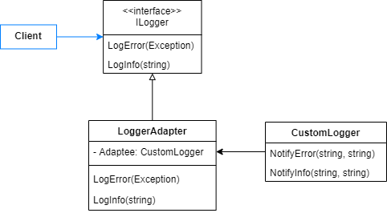
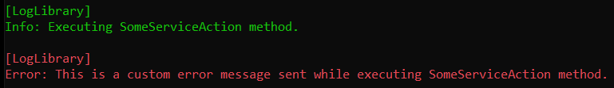
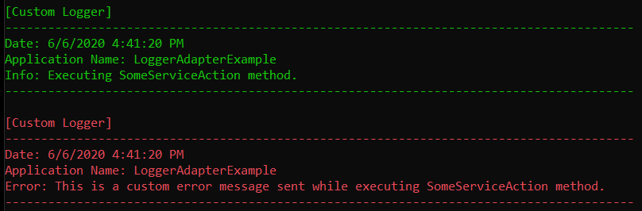

# Adapter

Convert the interface of a class into another interface clients expect. Adapter lets classes work together that couldn't otherwise because of incompatible interfaces.

Sometimes a service that is designed for reuse is not reusable only because its methods signatures are not compatible with the interface an application requires. So, the adapter can act as an intermediate, that translate messages between classes, making them able to communicate.

- Target: is an interface that the client knows and uses to access the service. 
- Adapter: is a translator between the target and the service, it communicates with both of them. When the client send a message via the target interface, the adapter translate and forward it to the service. It's a wrapper of the service.
- Service: a class that is not accessible to the client.

There are two common ways to place the previous elements: class adapter and object adapter.

Class Adapter: it's based on inheritance. The adapter derives both from target and adaptee, and internally executes translation and adaptee action.


Object Adapter: it's based on composition. The adapter has a reference to the adaptee object. It translates the request and the result is forwarded to the adaptee object.


## Problem

Let's see an example in which an application uses a LogLibrary to log its information and errors. This library is not meeting our needs, so we need to replace it with a new one. The problem is that this new library has different signatures, so we need to adapt it, so that the consumers are not affected by the replacement.

Until now, the client service consumes the library via an interface, called ILogger, that defines LogError e LogInfo methods.


So, you've decided to implement an adapter that contains a reference to the new library (CustomLogger), the adaptee object. It also implements ILogger interface, so the client service can use it without being modified.



## Show me the code

Let's first look at the client service, which is the one that consumes the ILogger interface. It's just a simplified class for us to test LogInfo and LogError behaviors.

```csharp
public class ClientService
{
    private readonly ILogger _logger;
    public ClientService(ILogger logger)
    {
        _logger = logger;
    }

    public void SomeServiceAction()
    {
        try
        {
            _logger.LogInfo($"Executing {nameof(SomeServiceAction)} method.");
            throw new ArgumentException(
                $"This is a custom error message sent while executing {nameof(SomeServiceAction)} method.");
        }
        catch (Exception exception)
        {
            _logger.LogError(exception);
        }
    }
}
```
```csharp
public interface ILogger
{
    void LogInfo(string message);
    void LogError(Exception exception);
}
```

The LogLibrary that is currently being used implements the ILogger interface (methods bodies were hidden to simplify the article).

```csharp
public class LogLibrary : ILogger
{
    public void LogError(Exception exception)
    {
        // Instructions to log an error
    }

    public void LogInfo(string message)
    {
        // Instructions to log some info
    }
}
```

So, the output of the client service execution is this.

```csharp
var deprecatedService = new ClientService(new LogLibrary());
deprecatedService.SomeServiceAction();
```

Output:



The new CustomLogger library is showed below (method body was hidden to simplify the article). 

```csharp
public class CustomLogger
{
    public void NotifyError(string error, string applicationName)
    {
        // New instructions to log an error
    }

    public void NotifyInfo(string info, string applicationName)
    {
        // New instructions to log some information
    }
}
```

The LoggerAdapter class is the key point of the pattern. Notice that it implements the ILogger interface, so ClientService can consume it. It just translate requests so that the CustomLogger can receive them.

```csharp
public class LoggerAdapter : ILogger
{
    private readonly CustomLogger _customLogger;
    private readonly string _applicationName = Assembly.GetExecutingAssembly().GetName().Name;

    public LoggerAdapter(CustomLogger commandCenterLogger)
    {
        _customLogger = commandCenterLogger;
    }

    public void LogError(Exception exception) => 
        _customLogger.NotifyError(exception.Message, _applicationName);

    public void LogInfo(string message) => 
        _customLogger.NotifyInfo(message, _applicationName);
}
```

With this implemetation the client service is able to use the adapter to log and emit alerts.

```csharp
var newService = new ClientService(new LoggerAdapter(new CustomLogger()));
newService.SomeServiceAction();
```

Output:



## Legacy Code Example

Often developers must deal with legacy code. It's not uncommon to find some complex algorithms that tend to break the SOLID principles. 

Let's see one legacy code example: a complex calculus static class which content should be reusable. You should be able to consume the Calculate method, without coupling your application to ComplexFinancialCalculus. You should also be able to mock its results, in order to perform unit tests.

The problem is that static classes cannot have abstractions, like an interface, and mocking it is painful.

```csharp
public static class ComplexFinancialCalculus
{
    public static decimal Calculate(decimal amount, decimal rate, DateTime initialDate, DateTime finalDate)
    {
        decimal result = default;
        Console.WriteLine("Executing some complex instructions to perform the calculus");
        return result;
    }
}
```

To avoid code coupling, our client should consume the calculus method via an abstraction: the IComplexFinancialCalculus interface.

```csharp
public interface IComplexFinancialCalculus
{
    decimal Calculate(decimal amount, decimal rate, DateTime initialDate, DateTime finalDate);
}
```

But, as told before, static classes cannot implement it. One possible solution to fight this problem is to add a reusable adapter object. It implements the interface by calling the static method.

```csharp
public class ComplexFinancialCalculusAdapter : IComplexFinancialCalculus
{
    public decimal Calculate(decimal amount, decimal rate, DateTime initialDate, DateTime finalDate)
        => ComplexFinancialCalculus.Calculate(amount, rate, initialDate, finalDate);
}
```

So, the client service can consume the calculus method via an interface, as its instance knows an adapter instance.

```csharp
public class Service
{
    private readonly IComplexFinancialCalculus _complexFinancialCalculus;
    public Service(IComplexFinancialCalculus complexFinancialCalculus)
    {
        _complexFinancialCalculus = complexFinancialCalculus;
    }

    public void Execute() =>
        _complexFinancialCalculus.Calculate(1000, 0.5m, DateTime.Today.AddDays(-10), DateTime.Today.AddDays(10));
}
```
```csharp
var service = new ClientService(new ComplexFinancialCalculusAdapter());

service.Execute();
```

And, this service could also be tested mocking the interface result.

```csharp
[Fact]
public void Should_execute_calculus()
{
    // Arrange
    var complexFinancialCalculusMock = new Mock<IComplexFinancialCalculus>();

    complexFinancialCalculusMock
        .Setup(x => x.Calculate(
            It.IsAny<decimal>(), It.IsAny<decimal>(), It.IsAny<DateTime>(), It.IsAny<DateTime>()))
        .Returns(1m);

    var service = new ClientService(complexFinancialCalculusMock.Object);
    
    // Act
    service.Execute();

    // Assert
    complexFinancialCalculusMock
        .Verify(x => x.Calculate(
            It.IsAny<decimal>(), It.IsAny<decimal>(), It.IsAny<DateTime>(), It.IsAny<DateTime>()), Times.Once);
}
```

## Use cases

Use Adapter Pattern when:

- You want to consume an existing class/service and its interface is not compatible with the one you need.
- You want to create a reusable class that does not depend on the interface signatures.
- You want to mock a class which does not allows this feature.
- If you need to add functionallity to the adapter, may be it's not the appropriate pattern to solve your problem.

## Advantages

- Avoids coupling to third party dependencies
- The application reduces complexity of tests.
- Can be used both for services and objects.

## Disadvantages

- Increase code complexity, so it should be used only when you cannot modify the adaptee.

## Comparisons

## References

https://refactoring.guru/design-patterns/adapter

Pluralsight Course: *C# Design Patterns: Adapter*. By Steve Smith.    
    
Pluralsight Course: *Design Patterns in Java: Structural - Adapter Pattern*. By Bryan Hansen.

Udemy Course: *Design Patterns in C# and .NET - Adapter*. By Dmitri Nesteruk.

## Todo

Comparisons