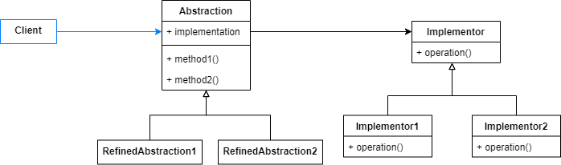
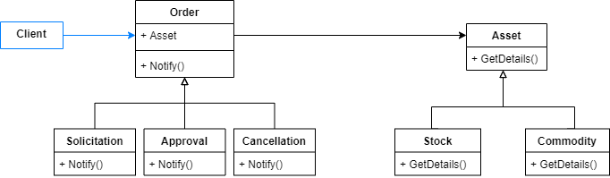

# Bridge

Decouple an abstraction from its implementation so that the two can vary independently.

It allows a class or a business logic to have an orthogonal variation. It means that new abstractions can be created, without modifying the implementations, and vice versa.

The implementation classes define their own operations. The abstractions consume them to execute these specific operations.

- Abstraction: the abstraction defines the content of the principal dimension variants.
- Refined Abtraction: implements the abstraction signatures.
- Implementor: defines the implentation operations of the secondary dimension variants.
- Concrete Implementor: implements the specific operations.



## Problem

In this article we'll analyse an example where a service handles different types of orders from different types of assets.



An order is a note that contains all information related to an asset and its operation details. When someone buy or sell an asset, a solicitation order is created. Throughout its life cycle, this operation can generate many types of orders. Let's simplify and restrict them to just approval and cancellation orders.

As the diagram presents, we can have multiple order types such as multiple asset types. It's clearly an orthogonal variation, where an order is composed of an asset.

## Show me the code

The implemetations structure is defined by the implementor class Asset, all Asset variants inherit from it.

```csharp
public abstract class Asset
{
    protected readonly Guid _id = Guid.NewGuid();
    protected readonly DateTime _date;
    protected readonly decimal _price;
    protected readonly decimal _volume;

    public Asset(DateTime date, decimal price, decimal volume)
    {
        _date = date;
        _price = price;
        _volume = volume;
    }

    public abstract void NotifyDetails();
}
```
```csharp
public class Commodity : Asset
{
    private readonly Commodities _product;

    public Commodity(DateTime date, decimal price, decimal volume, Commodities product) 
        : base(date, price, volume)
    {
        _product = product;
    }

    public override void NotifyDetails()
    {
        // Commodity notification instructions
    }
}

public enum Commodities { GOLD, OIL, WHEAT }
```
```csharp
public class Stock : Asset
{
    private readonly StockCodes _code;

    public Stock(DateTime date, decimal price, decimal volume, StockCodes code)
        : base(date, price, volume)
    {
        _code = code;
    }

    public override void NotifyDetails()
    {
        // Stock notification instructions
    }
}

public enum StockCodes { FB, AMZN, MSFT }
```

The abstractions rules are defined by Order class, all order variant derive from it, so they contain a reference to the related Asset.

```csharp
public abstract class Order
{
    protected readonly Asset _asset;

    public Order(Asset asset) => _asset = asset;
    
    public abstract void Notify();
}
```
```csharp
public class Solicitation : Order
{
    public Solicitation(Asset asset) : base(asset)
    {
    }

    public override void Notify()
    {
        // Solicitation notification instructions
    }
}
```
```csharp
public class Approval : Order
{
    private readonly string _approvedBy;
    private readonly DateTime _approvedAt;

    public Approval(Asset asset, string approvedBy, DateTime approvedAt) : base(asset)
    {
        _approvedBy = approvedBy;
        _approvedAt = approvedAt;
    }

    public override void Notify()
    {
        // Approval notification instructions
    }
}
```
```csharp
public class Cancellation : Order
{
    private readonly string _cancelledBy;
    private readonly DateTime _cancelledAt;
    private readonly string _reason;

    public Cancellation(Asset asset, string cancelledBy, DateTime cancelledAt, string reason) : base(asset)
    {
        _cancelledBy = cancelledBy;
        _cancelledAt = cancelledAt;
        _reason = reason;
    }

    public override void Notify()
    {
        // Cancellation notification instructions
    }
}
```

The previous abstractions and implementations can be combined by the client to achieve the desired order and asset combination. For example, it can create all kind of order for both commodity and stock assets.

```csharp
static void Main(string[] args)
{
    var commodity = new Commodity(new DateTime(2020, 05, 30), 1700m, 1m, GOLD);
    var stock = new Stock(new DateTime(2020, 03, 30), 230M, 1m, FB);

    NotifyOrders(commodity);
    NotifyOrders(stock);
}

private static void NotifyOrders(Asset asset)
{
    var solicitation = new Solicitation(asset);
    var approval = new Approval(asset, "Approver", DateTime.UtcNow);
    var cancellation = new Cancellation(asset, "Canceler", DateTime.UtcNow, "Incorrect order.");

    solicitation.Notify();
    approval.Notify();
    cancellation.Notify();
}
```

This code allows a new type of order to be added without modifying any other class. For example, creating an Execution order it's just simple as creating a new class that inherits from the Order abstraction.

The same benefit is provided for a new asset type. To create a Forex asset, for example, you only need to create a new class that inherits from the Asset implementor.

## Use cases

Use Bridge Pattern when:

- You want to increase flexibility to create new variants of a single class that is getting complex.
- The class can vary in multiple dimensions, resulting in multiple hierarchies that evolute independently.
- A class can vary its implementation at runtime.
- Change a variant does not affect any other variant from any dimension.
- You want to share an implementation among multiple abstractions.

## Advantages

- New variants can be added without having to modify the existing classes.
- The abstractions and the implementations are decoupled and vary independently.

## Disadvantages

- You increase the number of classes and establish new relationships (between an abstraction and a implementation).
- Sometimes is difficult to identify and plan the abstraction and implementation.

## Comparisons

### Adapter

- Bridge is an upfront design pattern, which allows you to make objects orthogonal variations easier. The adapter intention is to solve existing compatibility issues. 

- Bridge ensures new variants for both sides (new abstractions and implementations) while the adapter does not intent on adding new functionalities, it's just a plug for the existing ones.

## References

https://refactoring.guru/design-patterns/bridge

Pluralsight Course: *Design Patterns in Java: Structural - Bridge*. By Bryan Hansen.

Udemy Course: *Design Patterns in C# and .NET - Bridge*. By Dmitri Nesteruk.

## Todo

Comparisons