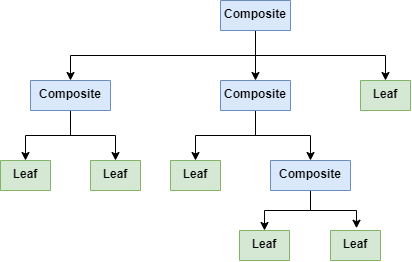
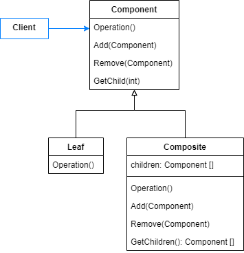
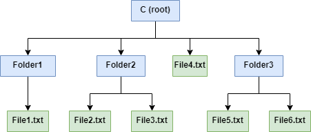
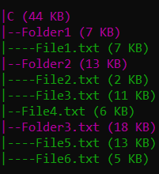
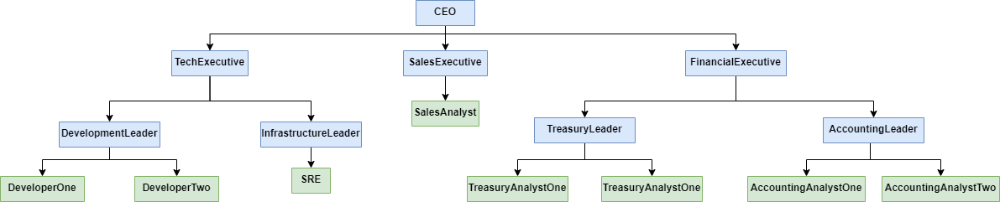
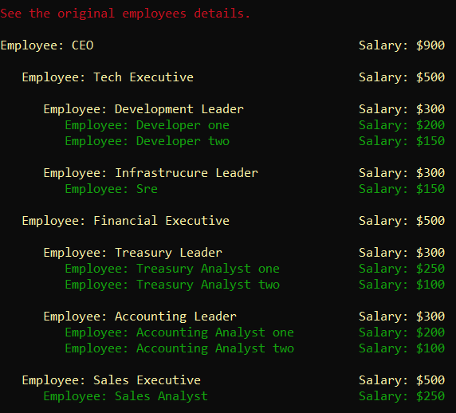
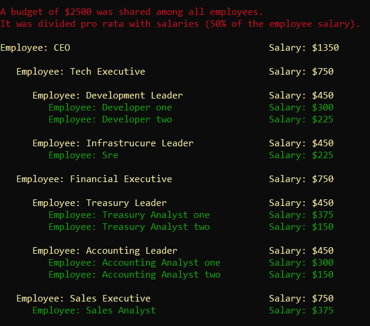

# Composite

Compose objects into tree structures to represent part-whole hierarchies. Composite lets clients treat individual objects and compositions of objects uniformly.

An Object Tree is a structure composed by nodes that can be of two different types:

- Leaf: consists of a single object.
- Composite: a container that stores other nodes.



The Composite Pattern provides an abstraction so that the client can use it to interact with nodes of an Object Tree. If the node is a Leaf, the request is handled directly. If the recipient is a Composite, the request is redirected to its child nodes.



## Problem

Suppose a you need to print a file system structure, showing the name and size of each folder and file. 

Applying the concepts of the pattern we can consider that folders behave like Composites and files like leafs, and together they compose a tree.



## Show me the code

To achieve the goal of this example we need to traverse the Object Tree. The FileSystemComponent class provides an abstraction to the client interact with each node.

```csharp
public abstract class FileSystemComponent
{
    protected readonly string _name;

    public FileSystemComponent(string name) => _name = name;
    
    public abstract void Print(int depth = 0);

    public abstract int GetSize();

    protected void PrintComponentDetails(int depth, ConsoleColor color)
    {
        // Instructions to print a component details
    }
}
```

Directory class is the Composite element. It contains some additional methods like Add and Remove, that are responsible for manipulating its children. At Gang of Four book, these methods are defined by the Component abstraction, like presented at the Pattern Diagram. I personally prefer to define it only at the Composite element, because they are not applicable for the Leaf element.

```csharp
public class Directory : FileSystemComponent
{
    protected readonly List<FileSystemComponent> _children = new List<FileSystemComponent>();

    public Directory(string name) : base(name)
    {
    }

    public override void Print(int depth = 0)
    {
        PrintComponentDetails(depth, ConsoleColor.Magenta);
        _children.ForEach(c => c.Print(depth + 1));
        Console.ForegroundColor = ConsoleColor.White;
    }

    public void Add(FileSystemComponent child) => _children.Add(child);
    public void Remove(FileSystemComponent child) => _children.Remove(child);

    public override int GetSize() => _children.Sum(c => c.GetSize());
}
```

The Leaf element is the File class.

```csharp
public class File : FileSystemComponent
{
    protected readonly int _sizeInKB;

    public File(string name, int sizeInKB) : base(name)
    {
        _sizeInKB = sizeInKB;
    }

    public override void Print(int depth = 0)
    {
        PrintComponentDetails(depth, ConsoleColor.DarkGreen);
        Console.ForegroundColor = ConsoleColor.White;
    }

    public override int GetSize() => _sizeInKB;
}
```

So, the client can create new Composites and Leafs, and combine them to generate a tree. A file system is generated below.

```csharp
var folder1 = new Directory("Folder1");
folder1.Add(new File("File1.txt", 7));

var folder2 = new Directory("Folder2");
folder2.Add(new File("File2.txt", 2));
folder2.Add(new File("File3.txt", 11));

var folder3 = new Directory("Folder3.txt");
folder3.Add(new File("File5.txt", 13));
folder3.Add(new File("File6.txt", 5));

var file4 = new File("File4.txt", 6);

var root = new Directory("C");
root.Add(folder1);
root.Add(folder2);
root.Add(file4);
root.Add(folder3);

root.Print();
```

Output:



## Composite, Visitor and Builder 

In the next example we'll see a way to cooperatively use Composite with other patterns.

We need to solve the following problem: an enterprise application should be able to show its employees salaries and also upgrade their salaries, distributing a budget among all of them. Each employee should receive a raise proportional to its salary.

The company hierarchy consists of leader-led relationships. A leader is responsible for one or multiple employees. 



Each leader is responsible for calculating the budget fraction intended for each employee.

The company hierarchy suggests a tree structure modeling. We can use Composites to represent leaders and Leafs to represent leds, so then each of them is a Component (employee) from the structure.

As leaders and leds have different behaviors (to upgrade salary for example), we can use Visitor Pattern to place them into a separate class. Each Component of the structure should use the corresponding Visit method.

So, let's see the code.

A employee is a Component of the tree. It contains a reference to its parent (will explain after).

```csharp
    public abstract class Employee
    {
        public Leader Parent { get; set; }
        public decimal Salary { get; set; }
        
        public readonly string _name;

        protected readonly UpgradeSalaryVisitor _upgradeSalaryVisitor;
        protected readonly PrintDetailsVisitor _printDetailsVisitor;

        public Employee(string name, decimal salary, UpgradeSalaryVisitor upgradeSalaryVisitor, 
            PrintDetailsVisitor printDetailsVisitor, Leader parent)
        {
            _name = name;
            Salary = salary;
            _upgradeSalaryVisitor = upgradeSalaryVisitor;
            _printDetailsVisitor = printDetailsVisitor;
            Parent = parent;
        }

        public abstract decimal GetTotalSalary();
        public abstract void UpgradeSalary(decimal budget);
        public abstract void PrintDetails(int depth = 0);
    }
```

The Leader (Composite) contains a list of its leds. GetTotalSalary implementation returns its own salary added to the total salary of its leds.

```csharp
    public class Leader : Employee
    {
        protected readonly List<Employee> _employees = new List<Employee>();

        public Leader(string name, decimal salary, UpgradeSalaryVisitor upgradeSalaryVisitor,
            PrintDetailsVisitor printDetailsVisitor, Leader parent = default)
            : base(name, salary, upgradeSalaryVisitor, printDetailsVisitor, parent)
        {
        }

        public override void UpgradeSalary(decimal budget)
            => _upgradeSalaryVisitor.Visit(this, budget);

        public override void PrintDetails(int depth = 0)
            => _printDetailsVisitor.Visit(this, depth);
   
        public override decimal GetTotalSalary() 
            => Salary + _employees.Sum(e => e.GetTotalSalary());

        public List<Employee> GetEmployees() => _employees;

        public void Add(Employee employee)
        {
            _employees.Add(employee);
            employee.Parent = this;
        }

        public void Remove(Employee employee) => _employees.Remove(employee);
    }
```

The Analyst (Leaf) also implements GetTotalSalary, but the return is just its own salary.

```csharp
public class Analyst : Employee
{
    public Analyst(string name, decimal salary, UpgradeSalaryVisitor upgradeSalaryVisitor, 
        PrintDetailsVisitor printDetailsVisitor, Leader parent = default) 
        : base(name, salary, upgradeSalaryVisitor, printDetailsVisitor, parent)
    {
    }

    public override decimal GetTotalSalary() => Salary;

    public override void PrintDetails(int depth = 0)
        => _printDetailsVisitor.Visit(this, depth);

    public override void UpgradeSalary(decimal budget)
}
```

The UpgradeSalaryVisitor has the algorithms used by Leaders and Analysts to upgrade salaries.

```csharp
public class UpgradeSalaryVisitor
{
    public void Visit(Analyst analyst, decimal budget) => analyst.Salary += budget;

    public void Visit(Leader leader, decimal budget)
    {
        var employees = leader.GetEmployees();

        var totalSalary = leader.GetTotalSalary();

        leader.Salary += CalculateBudget(budget, leader.Salary, totalSalary);

        foreach (var employee in employees)
        {
            var employeeBudget = CalculateBudget(budget, employee.GetTotalSalary(), totalSalary);
            employee.UpgradeSalary(employeeBudget);
        }
    }

    private decimal CalculateBudget(decimal totalBudget, decimal employeeSalary, decimal totalSalary)
        => totalBudget * employeeSalary / totalSalary;
}
```

We also have a PrintDetailsVisitor to display employees details at a console window.

```csharp
    public class PrintDetailsVisitor
    {
        public void Visit(Analyst analyst, int depth = 0)
            => PrintEmployeeDetails(analyst, depth, ConsoleColor.DarkGreen);

        public void Visit(Leader leader, int depth = 0)
        {
            PrintEmployeeDetails(leader, depth, ConsoleColor.Yellow);
            leader.GetEmployees().ForEach(c => c.PrintDetails(depth + 1));
        }

        private void PrintEmployeeDetails(Employee employee, int depth, ConsoleColor color)
        {
            // Instructions to print employee details
        }
    }
```

Now, we need to generate the tree structure based on the company hierarchy. We could manually do it, but it would not provide a reusable code. If a builder is capable of generating the hierarchy, it can be used by multiple services.

The following builder generates the company hierarchy. It initializes with a root component, the CEO. The builder usage is described below.

- Initialize builder providing CEO information.
- When a leader creation is started, the _currentEmployee receives the leader reference.
- When an analyst is added, the _currentEmployee adds the analyst reference to leds.
- When a leader creation is ended, the _currentEmployee receives the leader parent reference.


```csharp
public class CompanyHierachyBuilder
{
    private readonly Leader _root;
    private Leader _currentEmployee;

    public CompanyHierachyBuilder(string ceoName, decimal ceoSalary)
    {
        _root = new Leader(ceoName, ceoSalary, new UpgradeSalaryVisitor(), new PrintDetailsVisitor());
        _currentEmployee = _root;
    }

    public CompanyHierachyBuilder StartLeaderCreation(string leaderName, decimal leaderSalary)
    {
        var newLeader = new Leader(leaderName, leaderSalary, 
            new UpgradeSalaryVisitor(), new PrintDetailsVisitor(), _currentEmployee);

        _currentEmployee.Add(newLeader);
        _currentEmployee = newLeader;
        return this;
    }

    public CompanyHierachyBuilder AddAnalyst(string analystName, decimal analystSalary)
    {
        _currentEmployee.Add(
            new Analyst(analystName, analystSalary, new UpgradeSalaryVisitor(), new PrintDetailsVisitor(), _currentEmployee));

        return this;
    }

    public CompanyHierachyBuilder EndLeaderCreation()
    {
        _currentEmployee = _currentEmployee.Parent;
        return this;
    }

    public Leader Build() => _root;
}
```

The company hierarchy can be created using the builder as below.

```csharp
public static Employee Generate()
{
    var hierarchy = new CompanyHierachyBuilder("CEO", 900);
    hierarchy
        // Tech Team
        .StartLeaderCreation("Tech Executive", 500)
            .StartLeaderCreation("Development Leader", 300)
                .AddAnalyst("Developer one", 200)
                .AddAnalyst("Developer two", 150)
            .EndLeaderCreation()
            .StartLeaderCreation("Infrastrucure Leader", 300)
                .AddAnalyst("Sre", 150)
            .EndLeaderCreation()
        .EndLeaderCreation()
        // Financial Team
        .StartLeaderCreation("Financial Executive", 500)
            .StartLeaderCreation("Treasury Leader", 300)
                .AddAnalyst("Treasury Analyst one", 250)
                .AddAnalyst("Treasury Analyst two", 100)
            .EndLeaderCreation()
            .StartLeaderCreation("Accounting Leader", 300)
                .AddAnalyst("Accounting Analyst one", 200)
                .AddAnalyst("Accounting Analyst two", 100)
            .EndLeaderCreation()
        .EndLeaderCreation()
        // Sales Team
        .StartLeaderCreation("Sales Executive", 500)
            .AddAnalyst("Sales Analyst", 250)
        .EndLeaderCreation();
    
    return hierarchy.Build();
}
```

```csharp
var hierarchy = CompanyHierarchy.Generate();
hierarchy.PrintDetails();
```

Output:



So, we can upgrade salary of each employee as below. We'll distributed a budget of $2500 among all of them.

```csharp
hierarchy.UpgradeSalary(2500);
hierarchy.PrintDetails();
```

Output:



## Use cases

Use Composite Pattern when:

- Many objects are related in a tree structure that consists of leaves and composites.
- Clients should be able to interact with each node of the tree regardless it's a container or a single object.

## Advantages

- New leaves and containers can be created in a easy way.
- Client doesn't need to know if it is handling an object or a group of objects.

## Disadvantages

- Some Component operations, like Add and Remove, don't make sense for Leaf. You should decide whether to override it or to scope only to Composites.
- When the Composite children order is important, you must design access to manage their sequence.

## Comparisons

## References

https://refactoring.guru/design-patterns/composite

Pluralsight Course: *C# Design Patterns: Composite*. By Steve Michelotti.

Udemy Course: *Design Patterns in C# and .NET - Composite*. By Dmitri Nesteruk.

## Todo

Comparisons