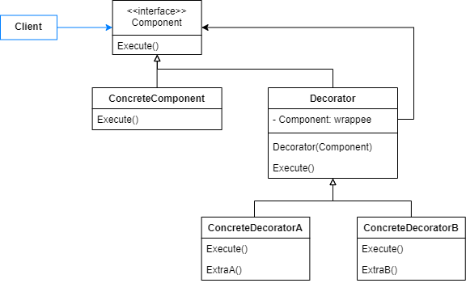
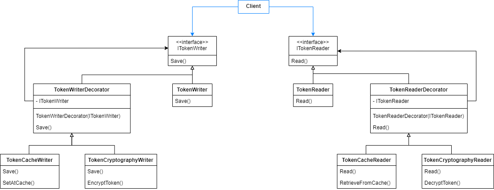
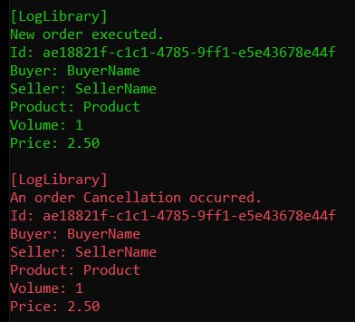
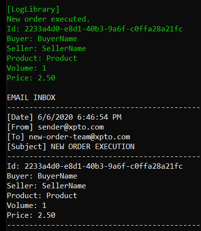
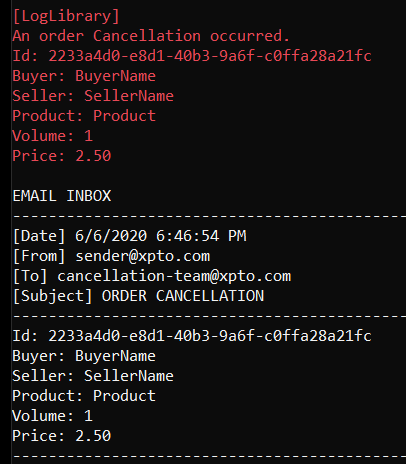

# Decorator

Attach additional responsibilities to an object dynamically. Decorators provide a flexible alternative to subclassing for extending functionality.

It's used to add responsibilities to individual objects (not to an entire class). Different from inheritance, it provides flexibility for new behaviors to be added at runtime.

Components are often enclosed with a decorator that implements the component interface, so that its presence is transparent for the client. It performs some additional instructions and forwards the request to the component. Its transparency lets you nest decorators recursively to provide many additional instructions.



## Problem

Suppose an application has a simple authentication management that stores tokens for its user. When a user saves a new token, its previous token is overriden. The problem is that the application is requiring some security and performance improvements. Because of that, you're asked to implement caching and cryptography features, to store encrypted tokens values.

To save a new token, you should encrypt it, set its value to a memory cache and also save in a database. To retrieve it, you should search first at the memory cache and after in database, then you should decrypt it.

We'll create decorators to perform cryptography and caching instructions. They will enclose TokenReader and TokenWriter class, in order to extend their behavior.



## Show me the code

Both components and decorators should share the same interfaces.

```csharp
public interface ITokenWriter
{
    void Save(Guid userId, string accessToken);
}
```
```csharp
public interface ITokenReader
{
    string Read(Guid userId);
}
```

The following TokenWriter and TokenReader components are independents, they are able to write and read tokens by themselves.

```csharp
public class TokenWriter : ITokenWriter
{
    private readonly AuthenticationTokenContext _context;
    
    public TokenWriter(AuthenticationTokenContext context)
    {
        _context = context;
    }

    public void Save(Guid userId, string accessToken)
    {
        _context.Tokens[userId] = accessToken;
    }
}
```
```csharp
public class TokenReader : ITokenReader
{
    private readonly AuthenticationTokenContext _context;

    public TokenReader(AuthenticationTokenContext context)
    {
        _context = context;
    }

    public string Read(Guid userId)
    {
        _context.Tokens.TryGetValue(userId, out var accessToken);
        
        return accessToken;
    }
}
```
```csharp
public class AuthenticationTokenContext
{
    public readonly IDictionary<Guid, string> Tokens = new Dictionary<Guid, string>();
}
```

Up to now we're able to persist and retrieve token values. Now we need to implement the required improvements. First we'll create base decorators. They implement the same interfaces as the components do.

```csharp
public abstract class TokenWriterDecorator : ITokenWriter
{
    protected readonly ITokenWriter _tokenWriter;

    public TokenWriterDecorator(ITokenWriter tokenWriter)
    {
        _tokenWriter = tokenWriter;
    }

    public abstract void Save(Guid userId, string accessToken);
}
```
```csharp
public abstract class TokenReaderDecorator : ITokenReader
{
    protected readonly ITokenReader _tokenReader;

    public TokenReaderDecorator(ITokenReader tokenReader)
    {
        _tokenReader = tokenReader;
    }

    public abstract string Read(Guid userId);
}
```

For caching, we use the following decorators.

```csharp
public class TokenCacheWriter : TokenWriterDecorator
{
    private readonly IMemoryCache _memoryCache;

    public TokenCacheWriter(ITokenWriter tokenWriter, IMemoryCache memoryCache) 
        : base(tokenWriter)
    {
        _memoryCache = memoryCache;
    }

    public override void Save(Guid userId, string accessToken)
    {
        _memoryCache.Set(userId, accessToken);
        _tokenWriter.Save(userId, accessToken);
    }
}
```
```csharp
public class TokenCacheReader : TokenReaderDecorator
{
    private readonly IMemoryCache _memoryCache;

    public TokenCacheReader(ITokenReader tokenReader,IMemoryCache memoryCache) 
        : base(tokenReader)
    {
        _memoryCache = memoryCache;
    }

    public override string Read(Guid userId)
    {
        _memoryCache.TryGetValue<string>(userId, out var accessToken);
        return accessToken ?? _tokenReader.Read(userId);
    }
}
```

For cryptography, we use the following decorators.

```csharp
public class TokenCryptographyWriter : TokenWriterDecorator
{
    public TokenCryptographyWriter(ITokenWriter tokenWriter) : base(tokenWriter)
    {
    }

    public override void Save(Guid userId, string accessToken)
    {
        var encryptedToken = Convert.ToBase64String(Encoding.Unicode.GetBytes(accessToken));
        _tokenWriter.Save(userId, encryptedToken);
    }
}
```
```csharp
public class TokenCryptographyReader : TokenReaderDecorator
{
    public TokenCryptographyReader(ITokenReader tokenReader) : base(tokenReader)
    {
    }

    public override string Read(Guid userId)
    {
        var accessToken = _tokenReader.Read(userId);
        var decryptedToken = Encoding.Unicode.GetString(Convert.FromBase64String(accessToken));
        return decryptedToken;
    }
}
```

So, let's consume it. Following you can see a simplified setup done just to run the example.

```csharp
var context = new AuthenticationTokenContext();
var memoryCache = new MemoryCache(new MemoryCacheOptions());
var token = "ewzesdw4efa498we4fw4ef98a4f984we98f4w9e8f4";
var userId = Guid.NewGuid();
```

To save a token with all requirements previously described:

```csharp
var tokenWriter = 
    new TokenCryptographyWriter(
        new TokenCacheWriter(
            new TokenWriter(context), memoryCache));

tokenWriter.Save(userId, token);
```

Output:


To read a token:

```csharp
var tokenReader = 
    new TokenCryptographyReader(
        new TokenCacheReader(
            new TokenReader(context), memoryCache));
var retrievedToken = tokenReader.Read(userId);
```

Output:


## Decorator and Adapter Example

Suppose an store application manages product orders. These orders can be executed and cancelled. When any of these operations happens, a message is logged. But, one day this store gets bigger and two teams are created, one responsible for executions and other for cancellations. So, when these operations happen, in addition to logs, teams should receive emails.

At this moment, client interacts with LogLibrary via an IOrderNotifier interface in order to notify Orders operations.

```csharp
public interface IOrderNotifier
{
    void NotifyExecution(Order order);
    void NotifyCancellation(Order order);
}
```
```csharp
public class LogLibrary : IOrderNotifier
{
    public void NotifyCancellation(Order order)
    {
        // Instructions to notify a cancellation log
    }

    public void NotifyExecution(Order order)
    {
        // Instructions to notify an execution log
    }
}
```

The application already contains an EmailNotifier. You want to use this service to send order operations emails.

```csharp
public class EmailNotifier
{
    public void SendEmail(Email email)
    {
        // Instructions to send an email
    }
}
```
```csharp
public class Email
{
    public string Subject { get; set; }
    public string Sender { get; set; }
    public string Destination { get; set; }
    public string Message { get; set; }

    public Email(string subject, string sender, string destination, string message)
    {
        Subject = subject;
        Sender = sender;
        Destination = destination;
        Message = message;
    }
}
```

To avoid affecting the client and the LogLibrary, you can use a Decorator to extend LogLibrary and include emails to the notification process. But, you want to decouple it from the LogLibrary and EmailNotifier, because in the future a new kind of notification can be added.

To solve this problem, decorator must interact with all notifiers via a common interface (IOrderNotifier). 

So, EmailNotifier must be adapted to implement the interface.

```csharp
public class EmailNotifierAdapter : IOrderNotifier
{
    private readonly EmailNotifier _emailNotifier;

    public EmailNotifierAdapter(EmailNotifier emailNotifier)
    {
        _emailNotifier = emailNotifier;
    }

    public void NotifyExecution(Order order)
    {
        var orderMessage = OrderMessage.Create(order);

        _emailNotifier.SendEmail(new Email(
            "NEW ORDER EXECUTION", "sender@xpto.com", "new-order-team@xpto.com", orderMessage));
    }

    public void NotifyCancellation(Order order)
    {
        var orderMessage = OrderMessage.Create(order);

        _emailNotifier.SendEmail(new Email(
            "ORDER CANCELLATION", "sender@xpto.com", "cancellation-team@xpto.com", orderMessage));
    }
}
```

Finally, the decorator can be created. Its responsibility is to invoke email notifier in addition to LogLibrary. Notice that it interacts with both LogLibrary and EmailNotifierAdapter via IOrderNotifier.

```csharp
public class OrderNotifierDecorator : IOrderNotifier
{
    private readonly IOrderNotifier _logger;
    private readonly IOrderNotifier _emailNotifier;

    public OrderNotifierDecorator(IOrderNotifier logger, IOrderNotifier emailNotifier)
    {
        _logger = logger;
        _emailNotifier = emailNotifier;
    }

    public void NotifyExecution(Order order)
    {
        _logger.NotifyExecution(order);
        _emailNotifier.NotifyExecution(order);
    }

    public void NotifyCancellation(Order order)
    {
        _logger.NotifyCancellation(order);
        _emailNotifier.NotifyCancellation(order);
    }
}
```

Before the implementation, order operations were notified as below.

```csharp
var order = new Order(Guid.NewGuid(), "Product", "BuyerName", "SellerName", 2.50m, 1);

new LogLibrary().NotifyExecution(order);
new LogLibrary().NotifyCancellation(order);
```

Output:



Now, the notifications occur as below.

```csharp
var orderNotifier = new OrderNotifierDecorator(
    new LogLibrary(),
    new EmailNotifierAdapter(new EmailNotifier()));
```

- Execution 

```csharp
orderNotifier.NotifyExecution(order);
```



- Cancellation 

```csharp
orderNotifier.NotifyCancellation(order);
```




## Use cases

Use Decorator Pattern when:

- Individual objects should take/lose responsibilities dinamically without affecting others.
- Inheritance is not allowed/desired.

## Advantages

- Behaviors can be added, removed and combined at runtime.
- A complex object can be composed by many simple decorators that, when combined, provides the desired behavior, without creating complex classes.


## Disadvantages

- Increase the number of indirections. A code with many decorators may be boring to debug.

## Comparisons

## References

https://refactoring.guru/design-patterns/decorator

Pluralsight Course: *C# Design Patterns: Decorator*. By David Berry.

Pluralsight Course: *C# Design Strategies: Composition with the Decorator*. By Jon Skeet.

Udemy Course: *Design Patterns in C# and .NET - Decorator*. By Dmitri Nesteruk.

## Todo

Comparisons