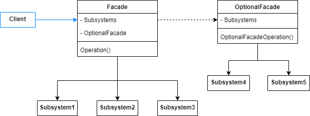
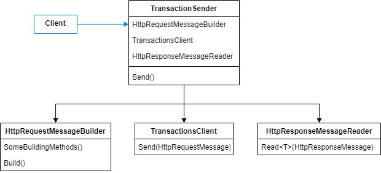

# Facade

Provide a unified interface to a set of interfaces in a subsystem. Facade defines a higher-level interface that makes the subsystem easier to use.

A common design goal is to minimize the complexity of the system by reducing interactions and dependencies among subsystems. This pattern helps achieving this goal by providing a single and simplified interface to the more general facilities of a subsystem. However, it limits the subsystems functionality, exposing just the necessary ones.

The pattern diagram is quite simple.

- Facade: delegates client requests to appropriate subsystem.
- Subsystem: has no knowledge about the facade, it just handle requests assigned by the facade.
- Optional facade: sometimes you need multiple facade objects to reuse general facilities and reduce subsystems complexity.



## Problem

A functionality commonly found on APIs is to execute requests in order to communicate with external services. Usually, systems create a request message, send it and process the response. In this example we'll show an HTTP communication, that involves the three operations previously described.

Suppose the client send a request that contains a Transaction information. Creating a request message, sending it and reading the response are operations executed together. We want the client to interact with an interface that hides all these behaviors, so the client would be decoupled from the HTTP communication implementation.



## Show me the code

The HTTP communication is executed by the following subsystems.

A Builder creates the request message.

```csharp
public class HttpRequestMessageBuilder
{
    private readonly HttpRequestMessage _httpRequestMessage = new HttpRequestMessage();

    // Some other methods to build a http request message.

    public HttpRequestMessage Build()
    {
        Console.WriteLine("Building an Http Request Message.");
        return _httpRequestMessage;
    }
}
```

A transactions client configures the communication with the external service and sends the message.

```csharp
public class TransactionsClient
{
    public HttpResponseMessage Send(HttpRequestMessage requestMessage)
    {
        // Instructions to define retry policies.
        Console.WriteLine("Sending request to the specified destination.");
        return new HttpResponseMessage();
    }
}
```

A reader deserializes the received response message and extract the relevant data.

```csharp
public class HttpResponseMessageReader
{
    public T Read<T>(HttpResponseMessage responseMessage) where T : new()
    {
        // Instructions to deserialize the http response message to a T
        Console.WriteLine("Deserializing Http Response Message.");
        return new T();
    }
}
```

Now, we should create a Facade to allow the client to send Transactions to another API, without knowing all these classes. The TransactionSender defines the required steps and provides a simplified signature, so that the client consumes it, passing the Transaction to be sent.

```csharp
public interface ITransactionSender
{
    TransactionStatus Send(Transaction transaction);
}
```
```csharp
public class TransactionSender : ITransactionSender
{
    private readonly HttpRequestMessageBuilder _httpRequestMessageBuilder;
    private readonly TransactionsClient _transactionsClient;
    private readonly HttpResponseMessageReader _httpResponseMessageReader;

    public TransactionSender()
    {
        // In a real world scenario it would be dependency injection.
        _httpRequestMessageBuilder = new HttpRequestMessageBuilder();
        _transactionsClient = new TransactionsClient();
        _httpResponseMessageReader = new HttpResponseMessageReader();
    }

    public TransactionStatus Send(Transaction transaction)
    {
        var requestMessage = _httpRequestMessageBuilder.Build();
        var responseMessage = _transactionsClient.Send(requestMessage);
        var transactionResponse = _httpResponseMessageReader.Read<TransactionStatus>(responseMessage);
        return transactionResponse;
    }
}
```

So, at client side, a transaction can be sent as simple as following.

```csharp
var transaction = new Transaction(Guid.NewGuid(), Guid.NewGuid(), 1000, DateTime.UtcNow);
var transactionSender = new TransactionSender();
var transactionStatus = transactionSender.Send(transaction);
```

## Use cases

Use Facade Pattern when:

- You need to group some subsystem behavior in order to perform a common action.
- You don't want your client to know all necessary subsystems.
- Your system evolves and generates a complex subsystems communication.

## Advantages

- Provides a default view of susbsystems that is good enough for most client.
- Decouples the client from subsystems, making them interchangeable.
- Allows accessing subsystem both via Facade or directly invoking them.

## Disadvantages

- Actions can not be customizable via Facade, as it provide a default action.
- Facade objects can also become complex.

## Comparisons

## References

https://refactoring.guru/design-patterns/facade

Pluralsight Course: *C# Design Patterns: Facade*. By David Starr.

Udemy Course: *Design Patterns in C# and .NET - Facade*. By Dmitri Nesteruk.

## Todo

Comparisons