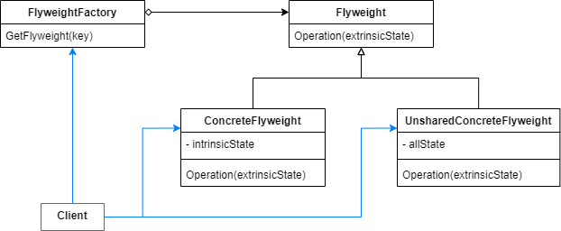
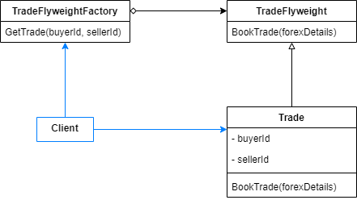
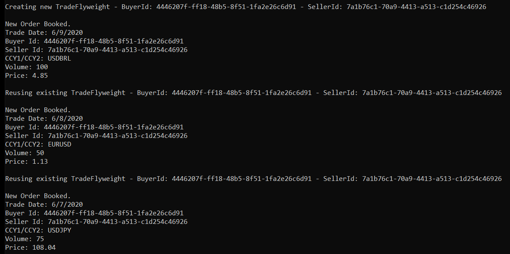

# Flyweight

Use sharing to support large numbers of fine-grained objects efficiently.

Some objects states can be segregated into two pieces: extrinsic and intrinsic states. Intrinsic contains the information that does not change during an object lifecycle, while extrinsic consists of mutable information. As the intrinsic state does not change, it can be reused by different representations of the same object. A flyweight is an object that contains the intrinsic data of an object.

The flyweight reusability lets the application storing intrinsic data, so that it can be shared by multiple object instances.

The pattern structure consists of the following elements:

- Flyweight: interface that defines a method to receive an extrinsic state and use it to perform some operation.
- ConcreteFlyweight: implements the Flyweight interface and stores intrinsic data.
- UnsharedConcreteFlyweight*: stores both extrinsic and intrinsic states that are not shareable.
- FlyweightFactory: manages flyweight objects. When client requests a flyweight, it returns an existing one or create a new, if none exists.

*The pattern allows sharing intrinsic data, but it's not an obligation. It can provide unshared concrete instances. Although they're not shareable, they can consume extrinsic data, because they implement the Flyweight interface.



## Problem

Suppose an application should book a huge number of FX trades. A FX Trade object contains intrinsic information like buyer and seller ids. All operations between two entities contain the same intrinsic data. The FX Trade object also contains extrinsic data, that is different for each operation, like currency pair, volume, price and trade date. 

Using the pattern suggestion we can design this examples as below.



## Show me the code

A TradeFlyweight stores the intrinsic information and also consumes extrinsic data to book a trade.

```csharp
public abstract class TradeFlyweight
{
    public abstract void BookTrade(TradeOperation tradeOperation);
}
```
```csharp
public class Trade : TradeFlyweight
{
    public Guid BuyerId { get; set; }
    public Guid SellerId { get; set; }
    
    public Trade(Guid buyerId, Guid sellerId)
    {
        BuyerId = buyerId;
        SellerId = sellerId;
    }

    public override void BookTrade(TradeOperation tradeOperation)
    {
        // Instructions to book a trade.
    }
}
```

TradeOperation represents the extrinsic state of each trade object.

```csharp
public class TradeOperation
{
    public CurrencyPairs CurrencyPair { get; set; }
    public decimal Volume { get; set; }
    public decimal Price { get; set; }
    public DateTime TradeDate { get; set; }
    public bool Booked { get; set; }
}

public enum CurrencyPairs { USDBRL, USDJPY, EURUSD, USDCAD }
```

When multiple trades must be created to the same buyer/seller relationship, the factory manages the flyweights and reuse them.

```csharp
public class TradeFlyweightFactory
{
    private Dictionary<Tuple<Guid, Guid>, Trade> _trades = 
        new Dictionary<Tuple<Guid, Guid>, Trade>();
    
    public TradeFlyweight GetTrade(Guid buyerId, Guid sellerId)
    {
        var key = Tuple.Create(buyerId, sellerId);

        var trade = _trades.GetValueOrDefault(key);

        if (trade != null)
        {
            Console.WriteLine($"\nReusing existing Trade - BuyerId: {buyerId} - SellerId: {sellerId}");
            return trade;
        }

        Console.WriteLine($"\nCreating new Trade - BuyerId: {buyerId} - SellerId: {sellerId}");
 
        trade = new Trade(buyerId, sellerId);
        _trades.Add(key, trade);

        return trade;
    }
}
```

So, the client can consume the factory flyweights in order to book trades.

```csharp
public class Client
{
    private readonly TradeFlyweightFactory _factory = new TradeFlyweightFactory();

    public void BookTrade(
        Guid buyerId, Guid sellerId, CurrencyPairs currencyPair, decimal volume, decimal price, DateTime date)
    {
        var trade = _factory.GetTrade(buyerId, sellerId);

        var tradeOperation = new TradeOperation(currencyPair, volume, price, date);

        trade.BookTrade(tradeOperation);
    }
}
```



## Use cases

Use Flyweight Pattern when:

- An application handles lots of objects, making storage costs high.
- Many groups of objects can be replaced by a few shared ones, reusing intrinsic states.

## Advantages

- Reduces memory costs by reusing flyweights.
- Manages the intrinsic details at a single place.

## Disadvantages

- Searching for flyweights increases run-time costs.
- Increases code complexity, new classes and relationships are created.

## Comparisons

## References

https://refactoring.guru/design-patterns/flyweight

Pluralsight Course: *C# Design Patterns: Flyweight*. By Harrison Ferrone.

Udemy Course: *Design Patterns in C# and .NET - Facade*. By Dmitri Nesteruk.

## Todo

Comparisons