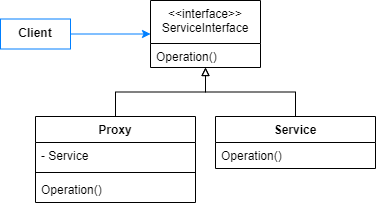
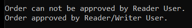

# Proxy

Provide a surrogate or placeholder for another object to control access to it.

A Proxy is an element responsible for configuring an object access.

Some kind of operations that can be handled: accessing a remote object, caching object information, defining access permissions, controlling objects life cycle.

The following diagram shows how elements are structured. Proxy implements ServiceInterface, so it can replace the service without affecting it consumers.



## Problem

Consider an application provides a feature for orders approvals. When an order gets approved, it stores the approver identifier and the approval time. But, it also verifies the approver role. Orders can only be approved by members with Writer role.

## Show me the code

So, all users of the application are defined by the Member class.

```csharp
public class Member
{
    public Guid Id { get; set; }
    public string Name { get; set; }
    public Role Role { get; set; }

    public Member(Guid id, string name, Role role)
    {
        Id = id;
        Name = name;
        Role = role;
    }
}

public enum Role { Reader, Writer, ReaderWriter }
```

Each Order is responsible for setting its own approval. 

```csharp
public class Order
{
    public decimal Volume { get; set; }
    public decimal Price { get; set; }
    public string Product { get; set; }
    public OrderApproval Approval { get; set; }

    public Order(decimal volume, decimal price, string product)
    {
        Volume = volume;
        Price = price;
        Product = product;
    }

    public void Approve(Member approver)
    {
        Console.WriteLine($"Order approved by {approver.Name}.");
        Approval = new OrderApproval(approver.Id, DateTime.UtcNow);
    }  
}

public class OrderApproval
{
    public Guid Approver { get; set; }
    public DateTime ApprovedAt { get; set; }

    public OrderApproval(Guid approver, DateTime approvedAt)
    {
        Approver = approver;
        ApprovedAt = approvedAt;
    }
}
```

So, with this implementation any user is able to approve orders. But we still need access control, to forbid some roles to approve. OrderProxy has this responsibility. If a role is allowed, the request is forwarded to the Order. If it's not, the request has no action.

```csharp
public class OrderProxy
{
    private readonly Order _order;

    public OrderProxy(Order order)
    {
        _order = order;
    }

    public void Approve(Member approver)
    {
        if (approver.Role != Role.ReaderWriter && approver.Role != Role.Writer)
        {
            Console.WriteLine($"Order can not be approved by {approver.Name}.");
            return;
        }

        _order.Approve(approver);
    }
}
```

Then clients can consume proxies via an IOrder interface. To validate it, we'll try to approve first with a Reader role and after with a ReaderWriter role.

```csharp
static void Main(string[] args)
{
    var orderWithProxy = CreateOrderWithProxy();

    var readerUser = new Member(Guid.NewGuid(), "Reader User", Role.Reader);
    orderWithProxy.Approve(readerUser);

    var readerWriterUser = new Member(Guid.NewGuid(), "Reader/Writer User", Role.ReaderWriter);
    orderWithProxy.Approve(readerWriterUser);
}

private static IOrder CreateOrderWithProxy()
{
    var order = new Order(2m, 100m, "Product");
    return new OrderProxy(order);
}
```

Output:



## Use cases

Use Proxy Pattern when:

- Remote Proxy: an object must be accessed but it belongs to another address space (remote server).
- Virtual Proxy: expensive objects must be created on demand (lazy loading).
- Protection Proxy: an object access must be controlled by defining different access rights.
- Smart Reference: adds operations to objects access, like disposing when no client use it anymore, caching, locking.

## Advantages

- Access management can be implemented without modifying objects.
- Proxies can be added without modifying clients.
- A proxy allows an object to get rid of the accessing management, so each one has a single responsibility. 
- Some proxy variants can provide more security, performance and facilities to an object access.


## Disadvantages

- A new level of indirection is introduced when accessing an object.

## Comparisons

## References

https://refactoring.guru/design-patterns/proxy

Pluralsight Course: *C# Design Patterns: Proxy*. By Steve Smith.

Udemy Course: *Design Patterns in C# and .NET - Proxy*. By Dmitri Nesteruk.

## Todo

Comparisons